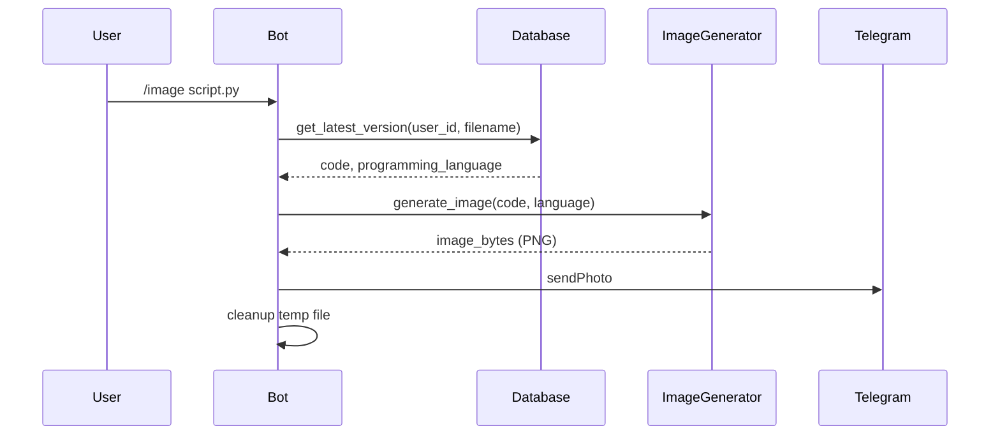

# 📋 מדריך מימוש מלא – יצירת תמונות קוד לשיתוף (מיושר לקוד)

מסמך מקיף זה מיישר את המדריך מול הקוד הקיים, משמר את כל הסעיפים המקוריים (סקירה, דרישות, ארכיטקטורה, מימוש מפורט, תכונות מתקדמות, דוגמאות, בדיקות, ביצועים, אבטחה, קונפיג וניטור) ומדגיש התאמות הכרחיות לקוד בריפו. המדריך מוגש כ‑Design Doc מפורט שמצריך מימוש.

## 📑 תוכן עניינים
1. [סקירה כללית](#-סקירה-כללית)
2. [דרישות מוקדמות](#-דרישות-מוקדמות)
3. [ארכיטקטורה](#-ארכיטקטורה)
4. [מימוש מפורט](#-מימוש-מפורט)
5. [תכונות מתקדמות](#-תכונות-מתקדמות)
6. [דוגמאות קוד](#-דוגמאות-קוד)
7. [בדיקות ו-QA](#-בדיקות-ו-qa)
8. [שיקולי ביצועים](#-שיקולי-ביצועים)
9. [אבטחה ו-Best-Practices](#-אבטחה-ו-best-practices)
10. [קונפיגורציה וניטור](#-קונפיגורציה-וניטור)
11. [Roadmap ו-TL;DR](#-roadmap-ו-tldr)

---

## 📌 סקירה כללית

### מטרת הפרויקט
הוספת פקודה `/image <filename>` שמייצרת תמונת PNG מהקוד עם:
- ✅ הדגשת תחביר (syntax highlighting)
- ✅ רקע נקי ומקצועי
- ✅ מספרי שורות
- ✅ לוגו קטן בפינה
- ✅ שליחה ישירה לצ’אט

### יעדים עיקריים
1. שיתוף קוד באיכות גבוהה.
2. תאימות לכל פלטפורמה (Telegram, X, LinkedIn וכו’).
3. ביצועים: < 2 שניות לתמונה קלאסית.
4. איכות וקריאות גבוהה.

הערה חשובה ליישור מול הריפו:
- אנו מתחילים מ‑MVP אמין: Pygments ImageFormatter + Pillow (כבר מותקנים). WeasyPrint/Playwright יישארו אופציונליים להמשך.
- בקוד קיים שימוש מועדף ב‑HTML להודעות; ניישר accordingly.
- RateLimiter הקיים הוא אסינכרוני (`check_rate_limit`) – חשוב לעדכן בדוגמאות.

---

## ⚙️ דרישות מוקדמות

### תשתית נדרשת (מיושרת לריפו)
```yaml
python: ">=3.11"
dependencies:
  - Pillow        # קיים (requirements/base.txt)
  - pygments      # קיים (requirements/base.txt)
  - cairosvg      # קיים (requirements/base.txt) – אופציונלי למסלול HTML→SVG→PNG
optional:
  - weasyprint    # לא מותקן – אופציונלי לרינדור HTML מתקדם
  - playwright    # לא מותקן – אופציונלי, דורש דפדפן headless
```

### ספריות קיימות בקוד
- ✅ `Pillow`, ✅ `pygments`, ✅ `cairosvg`
- ⛔ `weasyprint`/`playwright` – לא קיימים כברירת מחדל

### הכנות בקוד הקיים
- ✅ `services/code_service.py` – עוטף את `code_processor` להיילייטינג HTML
- ✅ `bot_handlers.py` – יש תשתית פקודות (אין עדיין `/image`/`/preview`/`/image_all`)
- ✅ `database` – `db.get_latest_version(user_id, file_name)` זמין

---

## 🎨 ארכיטקטורה

### 1) זרימת פקודה בסיסית
```mermaid
graph LR
    A[User: /image file.py] --> B[Parse Command]
    B --> C{File Exists?}
    C -->|No| D[Error: File Not Found]
    C -->|Yes| E[Get Code from DB]
    E --> F[Detect Language]
    F --> G[Render to PNG (ImageFormatter)]
    G --> H[Add Optional Logo]
    H --> I[Save Temp File]
    I --> J[Send Photo]
    J --> K[Cleanup]
```

הרחבה עתידית: מסלול HTML (WeasyPrint/Playwright) ניתן להוסיף ללא שבירת ה‑MVP.

### 2) מבנה מודולים בפועל
```
/workspace/
├── bot_handlers.py
├── services/
│   └── image_generator.py   # חדש
└── config/
    └── image_settings.yaml  # אופציונלי
```

### 3) זרימת יצירת תמונה (MVP)


---

## 🏗️ מימוש מפורט

### שלב 1: יצירת מודול `services/image_generator.py`

מימוש MVP באמצעות Pygments ImageFormatter (קל, מהיר, ללא תלות נוספת):

```python
# services/image_generator.py
from __future__ import annotations
import io
from typing import Optional
from pygments import highlight  # type: ignore
from pygments.lexers import get_lexer_by_name  # type: ignore
from pygments.formatters import ImageFormatter  # type: ignore

class CodeImageGenerator:
    """מחולל תמונות קוד – MVP (Pygments ImageFormatter)."""
    def __init__(self, style: str = 'monokai') -> None:
        self.style = style

    def generate_image(
        self,
        code: str,
        language: str = 'text',
        font_name: str = 'DejaVu Sans Mono',
        font_size: int = 14,
        line_numbers: bool = True,
    ) -> bytes:
        if not isinstance(code, str) or not code:
            raise ValueError('Code cannot be empty')
        try:
            lexer = get_lexer_by_name(language or 'text')
        except Exception:
            lexer = get_lexer_by_name('text')

        formatter = ImageFormatter(
            style=self.style,
            font_name=font_name,
            font_size=font_size,
            line_numbers=line_numbers,
            image_format='PNG',
        )
        out = io.BytesIO()
        highlight(code, lexer, formatter, outfile=out)
        return out.getvalue()
```

הערות:
- מספרי השורות מובנים ב‑ImageFormatter.
- ניתן להדביק לוגו קטן לאחר מכן באמצעות Pillow (להמשך).

גרסת Advanced (אופציונלית): רינדור HTML → PNG (WeasyPrint/Playwright/cairosvg). להשאיר לשלב הבא כדי לא להוסיף תלויות.

### שלב 2: קובץ קונפיגורציה (אופציונלי)

`config/image_settings.yaml` – ברירות מחדל ותצורת Preview/Batch:

```yaml
image_generation:
  default_style: monokai
  font_size: 14
  preview:
    enabled: true
    max_lines: 50
  batch:
    max_files: 20
    confirm_threshold: 10
```

טעינה מתוך `bot_handlers.py` (נתיב נכון):

```python
from pathlib import Path
import yaml

def load_image_config() -> dict:
    path = Path(__file__).parent / 'config' / 'image_settings.yaml'
    if path.exists():
        with open(path, 'r') as f:
            return yaml.safe_load(f).get('image_generation', {})
    return {}

IMAGE_CONFIG = load_image_config()
```

### שלב 3: הוספת פקודות לבוט

רישום ב‑`setup_advanced_handlers`:

```python
# בתוך AdvancedBotHandlers.setup_advanced_handlers
self.application.add_handler(CommandHandler("image", self.image_command))
self.application.add_handler(CommandHandler("preview", self.preview_command))
self.application.add_handler(CommandHandler("image_all", self.image_all_command))
```

Rate limiting בהתאם למחלקה הקיימת:

```python
from rate_limiter import RateLimiter
image_rate_limiter = RateLimiter(max_per_minute=10)

# בתוך הפקודה (async)
if not await image_rate_limiter.check_rate_limit(user_id):
    await update.message.reply_text("⏱️ יותר מדי בקשות. אנא נסה שוב בעוד דקה.")
    return
```

מינימל של `/image` (דמו מנחה, HTML עקבי, tmp בטוח):

```python
# בתוך מחלקת AdvancedBotHandlers
from telegram import InputFile
from telegram.constants import ParseMode
from services.image_generator import CodeImageGenerator
import tempfile, os, html

async def image_command(self, update, context):
    user_id = update.effective_user.id
    if not context.args:
        await update.message.reply_text(
            "🖼️ <b>יצירת תמונת קוד</b>\n" \
            "שימוש: <code>/image &lt;file_name&gt;</code>",
            parse_mode=ParseMode.HTML,
        )
        return

    # rate limit
    if not await image_rate_limiter.check_rate_limit(user_id):
        await update.message.reply_text("⏱️ יותר מדי בקשות. אנא נסה שוב בעוד דקה.")
        return

    file_name = " ".join(context.args)
    file_data = db.get_latest_version(user_id, file_name)
    if not file_data:
        await update.message.reply_text(
            f"❌ קובץ <code>{html.escape(file_name)}</code> לא נמצא.",
            parse_mode=ParseMode.HTML,
        )
        return

    code = str(file_data.get('code') or '')
    language = str(file_data.get('programming_language') or 'text')
    if not code:
        await update.message.reply_text("❌ הקובץ ריק.")
        return

    gen = CodeImageGenerator(style=IMAGE_CONFIG.get('default_style', 'monokai'))
    image_bytes = gen.generate_image(
        code=code,
        language=language,
        font_size=int(IMAGE_CONFIG.get('font_size', 14)),
    )

    tmp_path = None
    try:
        with tempfile.NamedTemporaryFile(delete=False, suffix='.png') as tmp:
            tmp.write(image_bytes)
            tmp_path = tmp.name
        with open(tmp_path, 'rb') as f:
            await update.message.reply_photo(
                photo=InputFile(f, filename=f"{file_name}.png"),
                caption=f"🖼️ <b>תמונת קוד</b>: <code>{html.escape(file_name)}</code>",
                parse_mode=ParseMode.HTML,
            )
    finally:
        try:
            if tmp_path and os.path.exists(tmp_path):
                os.unlink(tmp_path)
        except Exception:
            pass
```

`/preview` (חיתוך שורות):

```python
async def preview_command(self, update, context):
    user_id = update.effective_user.id
    if not context.args:
        await update.message.reply_text(
            "👁️ <b>תצוגה מקדימה</b> – <code>/preview &lt;file&gt;</code>",
            parse_mode=ParseMode.HTML,
        )
        return

    file_name = " ".join(context.args)
    file_data = db.get_latest_version(user_id, file_name)
    if not file_data:
        await update.message.reply_text(f"❌ קובץ <code>{html.escape(file_name)}</code> לא נמצא.", parse_mode=ParseMode.HTML)
        return

    code = str(file_data.get('code') or '')
    language = str(file_data.get('programming_language') or 'text')

    max_lines = int(IMAGE_CONFIG.get('preview', {}).get('max_lines', 50))
    lines = code.splitlines()
    if len(lines) > max_lines:
        code = '\n'.join(lines[:max_lines]) + '\n...'

    gen = CodeImageGenerator(style=IMAGE_CONFIG.get('default_style', 'monokai'))
    image_bytes = gen.generate_image(code, language=language)

    tmp_path = None
    try:
        with tempfile.NamedTemporaryFile(delete=False, suffix='.png') as tmp:
            tmp.write(image_bytes)
            tmp_path = tmp.name
        with open(tmp_path, 'rb') as f:
            await update.message.reply_photo(
                photo=InputFile(f, filename=f"preview_{file_name}.png"),
                caption=f"👁️ תצוגה מקדימה: <code>{html.escape(file_name)}</code>",
                parse_mode=ParseMode.HTML,
            )
    finally:
        try:
            if tmp_path and os.path.exists(tmp_path):
                os.unlink(tmp_path)
        except Exception:
            pass
```

`/image_all` (ללא callbacks לא ממומשים):

```python
async def image_all_command(self, update, context):
    user_id = update.effective_user.id
    files = db.get_user_files(user_id, limit=IMAGE_CONFIG.get('batch', {}).get('max_files', 20))
    if not files:
        await update.message.reply_text("❌ לא נמצאו קבצים.")
        return

    gen = CodeImageGenerator(style=IMAGE_CONFIG.get('default_style', 'monokai'))
    done = 0
    status = await update.message.reply_text(f"🎨 יוצר {len(files)} תמונות... 0/{len(files)}")

    for idx, doc in enumerate(files, 1):
        file_name = doc.get('file_name') or 'unknown'
        code = str(doc.get('code') or '')
        language = str(doc.get('programming_language') or 'text')
        if not code:
            continue
        try:
            img = gen.generate_image(code, language=language)
            tmp_path = None
            try:
                with tempfile.NamedTemporaryFile(delete=False, suffix='.png') as tmp:
                    tmp.write(img)
                    tmp_path = tmp.name
                with open(tmp_path, 'rb') as f:
                    await update.message.reply_photo(
                        photo=InputFile(f, filename=f"{file_name}.png"),
                        caption=f"🖼️ <code>{html.escape(file_name)}</code>",
                        parse_mode=ParseMode.HTML,
                    )
                done += 1
            finally:
                try:
                    if tmp_path and os.path.exists(tmp_path):
                        os.unlink(tmp_path)
                except Exception:
                    pass
            if idx % 5 == 0:
                await status.edit_text(f"🎨 יוצר {len(files)} תמונות... {idx}/{len(files)}")
        except Exception:
            continue

    await status.edit_text(f"✅ הושלם! נוצרו {done}/{len(files)} תמונות.")
```

---

## 🚀 תכונות מתקדמות

### 1) תמות מרובות וסגנונות
- `style` של Pygments קובע מראה (monokai, dracula, github-dark וכו’).
- ניתן להוסיף תמות בקובץ הקונפיג ולחשוף פרמטרים בפקודה (בעתיד).

### 2) לוגו/Watermark
- הוספת לוגו בפינה באמצעות Pillow לאחר יצירת ה‑PNG (דוגמת `add_logo`).
- אפשר להחזיק קובץ לוגו ב‑`assets/` (אופציונלי) או טקסט קטן שקוף.

### 3) Preview Mode
- הגבלת מספר שורות ו/או רוחב; קונפיגורציה תחת `image_generation.preview`.

### 4) Batch Processing
- עיבוד אצווה למספר קבצים; יש לעדכן סטטוס כל N קבצים כדי לשמור רספונסיביות.

---

## 📊 דוגמאות קוד

שימוש בסיסי במחולל במנותק מהבוט:

```python
from services.image_generator import CodeImageGenerator

code = """
def hello_world():
    print("Hello, World!")
"""

img = CodeImageGenerator(style='monokai').generate_image(code, language='python')
with open('output.png', 'wb') as f:
    f.write(img)
```

התאמה אישית (גודל פונט, מספרי שורות):

```python
img = CodeImageGenerator(style='dracula').generate_image(
    code, language='javascript', font_size=16, line_numbers=True
)
```

---

## 🧪 בדיקות ו‑QA

### יעדי כיסוי
```yaml
test_coverage:
  unit_tests:
    target: 85%
  integration_tests:
    - Image generation (languages, long lines)
    - Preview slicing
    - Temp-file cleanup
  performance_tests:
    - Generation time < 2s
    - Image size < 2MB (אחרי אופטימיזציה)
```

### בדיקות יחידה לדוגמה
```python
import pytest
from services.image_generator import CodeImageGenerator

class TestCodeImageGenerator:
    @pytest.fixture
    def gen(self):
        return CodeImageGenerator(style='monokai')

    def test_png_signature(self, gen):
        data = gen.generate_image("print('hi')", language='python')
        assert isinstance(data, (bytes, bytearray))
        assert data[:8] == b'\x89PNG\r\n\x1a\n'

    def test_empty_raises(self, gen):
        with pytest.raises(ValueError):
            gen.generate_image("", language='text')

    def test_various_languages(self, gen):
        for lang in ['python', 'javascript', 'java', 'cpp', 'text']:
            data = gen.generate_image("// sample", language=lang)
            assert len(data) > 0
```

### בדיקת אינטגרציה לפקודת `/image`
- שימוש ב‑mocks עבור `db.get_latest_version` ו‑`reply_photo`.
- אימות מחיקה של tempfile.

---

## ⚡ שיקולי ביצועים

### 1) Caching (אופציונלי)
- ניתן להוסיף cache (למשל לפי hash של תוכן + style + font_size).

### 2) Async Offloading
- המימוש מהיר יחסית; אם יידרש, ניתן להעביר ל‑ThreadPoolExecutor.

### 3) אופטימיזציה לגודל
- לאחר הוספת לוגו/עריכה, לשמור PNG עם `optimize=True, compress_level=9`.
- עבור תמונות חריגות > 2MB, אפשר לשקול JPEG איכותי (optional).

---

## 🔒 אבטחה ו‑Best‑Practices

### 1) קלט
- בדיקת קלט ריק; הימנעות מהזרקות בעת שימוש ב‑HTML (escape).

### 2) קבצים זמניים
- שימוש ב‑`tempfile.NamedTemporaryFile(delete=False, suffix='.png')` ו‑`os.unlink` לאחר שליחה.
- אין כתיבה/מחיקה מחוץ ל‑tmp.

### 3) לוגים
- לא לרשום תכנים רגישים/PII; השחרה היכן שנדרש.

---

## ⚙️ קונפיגורציה וניטור

### קובץ קונפיג מלא (מומלץ אך לא חובה)
```yaml
image_generation:
  default_style: monokai
  font_size: 14
  preview:
    enabled: true
    max_lines: 50
  batch:
    max_files: 20
    confirm_threshold: 10
  optimization:
    max_image_size: 2097152  # 2MB
    compress_level: 9
```

### ניטור (אופציונלי)
ניתן להוסיף מטריקות Prometheus (ספירות, זמן, גודל). דוגמה תבניתית:
```python
from prometheus_client import Counter, Histogram
image_generations = Counter('code_images_total', 'Total code image generations', ['status'])
image_gen_duration = Histogram('code_image_duration_seconds', 'Image generation time (s)')
```

שילוב בפקודה: לעטוף את יצירת התמונה במדידת זמן ולעדכן ספירות `success`/`error`.

---

## 🗺️ Roadmap ו‑TL;DR

### Roadmap מוצע
1) MVP: `image_generator.py` (ImageFormatter), `/image` בלבד.
2) הוספת `/preview`, אחר כך `/image_all`.
3) לוגו, תמות, קונפיג מפורט.
4) ניטור ו‑Caching.
5) מסלול HTML (WeasyPrint/Playwright) – אופציונלי.

### TL;DR – צעדים לביצוע
- ליצור `services/image_generator.py` (MVP לעיל)
- לרשום את הפקודות ב‑`setup_advanced_handlers`
- לממש `/image` עם HTML ו‑RateLimiter אסינכרוני
- לשמור tmp, לשלוח תמונה, למחוק tmp
- להרחיב בהמשך ל‑Preview/Batch וניטור
