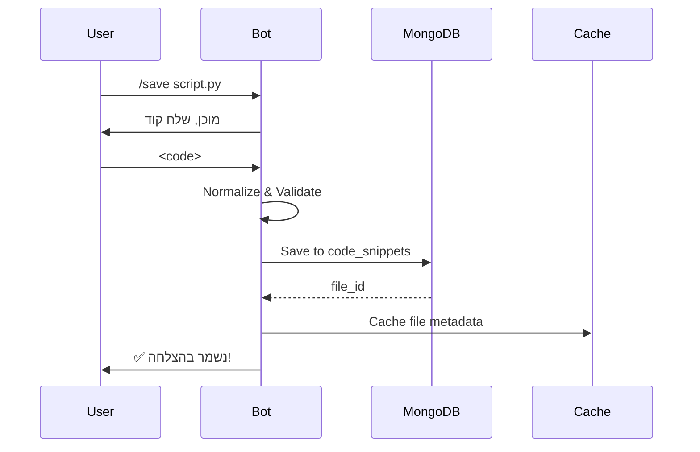
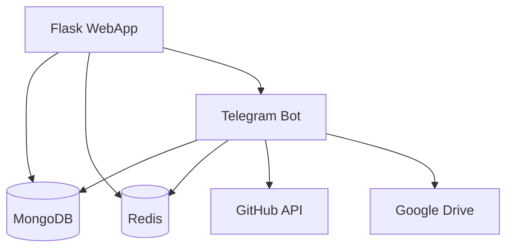

# 🚀 הצעות שיפורים ופיצ'רים - Code Keeper Bot
## סריקה מקיפה - נובמבר 2025

> **מסמך זה נוצר לאחר סריקה מעמיקה של כל הקוד (Bot + WebApp)**
> הצעות מותאמות ספציפית לארכיטקטורה ולפיצ'רים הקיימים בפרויקט

---

## 📋 תוכן עניינים

1. [סיכום מצב נוכחי](#סיכום-מצב-נוכחי)
2. [פיצ'רים חדשים - עדיפות גבוהה](#פיצרים-חדשים---עדיפות-גבוהה)
3. [פיצ'רים חדשים - עדיפות בינונית](#פיצרים-חדשים---עדיפות-בינונית)
4. [שיפורי ביצועים](#שיפורי-ביצועים)
5. [שיפורי אבטחה](#שיפורי-אבטחה)
6. [שיפורי WebApp](#שיפורי-webapp)
7. [שיפורי חוויית משתמש (UX)](#שיפורי-חוויית-משתמש-ux)
8. [אינטגרציות חדשות](#אינטגרציות-חדשות)
9. [שיפורי תשתית](#שיפורי-תשתית)
10. [תיעוד ונגישות](#תיעוד-ונגישות)

---

## 🎯 סיכום מצב נוכחי

### ✅ נקודות חוזק (מה שעובד מעולה)

**ארכיטקטורה:**
- קוד מאורגן מצוין עם 74,000+ שורות קוד
- 509 קבצי טסטים - כיסוי מצוין
- ארכיטקטורה async-first עם python-telegram-bot
- Service Layer Pattern ברור עם הפרדה נקייה
- Repository Pattern למסד הנתונים

**פיצ'רים קיימים:**
- ✅ ניהול קוד מתקדם (20+ שפות, גרסאות, diff)
- ✅ מנוע חיפוש משוכלל (5 סוגי חיפוש: content, text, regex, fuzzy, function)
- ✅ אינטגרציות: GitHub (Gist + Repo), Google Drive, Pastebin
- ✅ גיבוי ושחזור (ZIP, JSON, GridFS)
- ✅ WebApp מלא עם Bookmarks, Sticky Notes, Collections
- ✅ Community Library + Snippet Library
- ✅ Observability מצוין (Sentry, Prometheus, OpenTelemetry, structlog)
- ✅ Predictive Engine לניטור בריאות
- ✅ Repository Analyzer לניתוח קוד
- ✅ Cache Manager עם Redis
- ✅ Rate Limiting חכם

**תשתית:**
- ✅ Docker + Docker Compose
- ✅ CI/CD מלא (GitHub Actions)
- ✅ Deploy ל-Render.com
- ✅ MongoDB עם אינדקסים מקיפים
- ✅ Redis לקאש ו-rate limiting

### 🔄 אזורים לשיפור

**קוד:**
- קבצים גדולים מדי (main.py: 5,200 שורות, app.py: 6,165 שורות, conversation_handlers.py: 6,200 שורות)
- כפילויות קוד מסוימות בין handlers
- חלק מהקוד inline JavaScript בתבניות

**פיצ'רים:**
- אין AI/ML capabilities (GPT, code suggestions)
- אין שיתוף פעולה בזמן אמת (real-time collaboration)
- אין IDE integrations
- אין mobile app נטיבי
- אין API פומבי ל-third-party integrations

**WebApp:**
- bundle גדול (md_preview.bundle.js: 6.7MB)
- אין PWA מלא (Service Worker חסר)
- אין dark mode toggle (רק מצב אחד)
- אין diff viewer לגרסאות קוד
- אין CSRF protection מלא

---

## 🔥 פיצ'רים חדשים - עדיפות גבוהה

### 1. 🤖 AI Code Assistant (אסיסטנט קוד חכם)

**מה זה:**
- אינטגרציה עם GPT-4 / Claude / Gemini
- הסברי קוד, תיקון באגים, הצעות לשיפור
- Code review אוטומטי
- תיעוד אוטומטי (docstrings, comments)

**למה זה חשוב:**
- מוסיף ערך משמעותי למשתמשים
- מבדיל את הבוט מהמתחרים
- הופך את הבוט ל"מורה" אישי לקוד

**איך לממש:**

```python
# services/ai_service.py
from anthropic import AsyncAnthropic
from openai import AsyncOpenAI

class AICodeService:
    def __init__(self):
        self.anthropic_client = AsyncAnthropic(api_key=config.ANTHROPIC_API_KEY)
        self.openai_client = AsyncOpenAI(api_key=config.OPENAI_API_KEY)

    async def explain_code(self, code: str, language: str) -> str:
        """הסבר קוד בשפה ברורה"""
        prompt = f"""הסבר את קוד ה-{language} הבא בצורה פשוטה וברורה:

```{language}
{code}
```

הסבר:
1. מה הקוד עושה
2. איך הוא עובד
3. האם יש בעיות או שיפורים אפשריים
"""

        response = await self.anthropic_client.messages.create(
            model="claude-3-5-sonnet-20241022",
            max_tokens=1024,
            messages=[{"role": "user", "content": prompt}]
        )
        return response.content[0].text

    async def review_code(self, code: str, language: str) -> dict:
        """Code review אוטומטי"""
        prompt = f"""בצע code review ל-{language} הבא:

```{language}
{code}
```

החזר בפורמט JSON:
{{
  "overall_score": 1-10,
  "issues": [
    {{"severity": "high/medium/low", "line": 5, "message": "..."}}
  ],
  "suggestions": ["...", "..."],
  "security_concerns": ["...", "..."],
  "performance_tips": ["...", "..."]
}}
"""

        response = await self.openai_client.chat.completions.create(
            model="gpt-4o",
            messages=[{"role": "user", "content": prompt}],
            response_format={"type": "json_object"}
        )
        return json.loads(response.choices[0].message.content)

    async def generate_tests(self, code: str, language: str) -> str:
        """יצירת טסטים אוטומטית"""
        pass

    async def fix_bug(self, code: str, error_message: str, language: str) -> str:
        """תיקון באג אוטומטי"""
        pass

    async def generate_docstring(self, code: str, language: str) -> str:
        """יצירת תיעוד אוטומטי"""
        pass

    async def optimize_code(self, code: str, language: str) -> str:
        """אופטימיזציה של קוד"""
        pass
```

**פקודות חדשות:**
- `/explain <filename>` - הסבר קוד
- `/review <filename>` - code review
- `/fix <filename>` - תיקון באגים
- `/optimize <filename>` - אופטימיזציה
- `/generate_tests <filename>` - יצירת טסטים
- `/document <filename>` - הוספת תיעוד

**כפתורים ב-WebApp:**
- 🤖 "הסבר קוד"
- 🔍 "Code Review"
- 🔧 "תקן באגים"
- ⚡ "אופטמיזציה"
- 📝 "צור תיעוד"

**שיקולים:**
- עלות API - צריך להגביל שימוש (rate limit)
- אופציה ל-premium users (💎)
- cache תשובות נפוצות
- streaming response למשתמש (טקסט מגיע בזמן אמת)

**מאגר נתונים:**
```javascript
// webapp/static/js/ai-assistant.js
async function explainCode(fileId) {
    const response = await fetch(`/api/ai/explain/${fileId}`, {
        method: 'POST'
    });

    const reader = response.body.getReader();
    const decoder = new TextDecoder();

    // Stream response
    while (true) {
        const {done, value} = await reader.read();
        if (done) break;

        const chunk = decoder.decode(value);
        appendToExplanation(chunk);
    }
}
```

**הערכת מאמץ:** 🔴 גבוה (2-3 שבועות)
**ערך למשתמש:** 🟢🟢🟢 גבוה מאוד

---

### 2. 👥 Team Collaboration (שיתוף פעולה צוותי)

**מה זה:**
- Workspaces משותפים
- הרשאות (owner, editor, viewer)
- תגובות ודיונים על קוד
- Real-time editing (WebSocket)
- Activity feed לצוות

**למה זה חשוב:**
- הופך את הבוט לכלי צוותי
- פותח שוק של teams/organizations
- מודל הכנסה: premium teams

**איך לממש:**

```python
# database/models.py
@dataclass
class Workspace:
    workspace_id: str
    name: str
    description: str
    owner_id: int
    members: List[WorkspaceMember]
    created_at: datetime
    settings: dict

@dataclass
class WorkspaceMember:
    user_id: int
    role: str  # owner, admin, editor, viewer
    joined_at: datetime
    permissions: List[str]

@dataclass
class Comment:
    comment_id: str
    file_id: str
    user_id: int
    line_number: Optional[int]
    text: str
    thread_id: Optional[str]
    created_at: datetime
    reactions: List[Reaction]

@dataclass
class Activity:
    activity_id: str
    workspace_id: str
    user_id: int
    action_type: str  # created, edited, commented, shared
    target_id: str
    timestamp: datetime
```

**פקודות חדשות:**
- `/workspace create <name>` - יצירת workspace
- `/workspace invite <@user>` - הזמנת משתמש
- `/workspace list` - רשימת workspaces
- `/workspace switch <name>` - מעבר בין workspaces
- `/comment <filename> [line]` - הוספת תגובה

**WebApp Features:**
- 🏢 Workspace selector בטופ-בר
- 💬 Comments panel בצד של קוד
- 👥 Members management
- 📊 Activity feed
- 🔔 Notifications on mentions (@user)

**Real-time Collaboration:**
```python
# webapp/websocket.py
from flask_socketio import SocketIO, emit, join_room

socketio = SocketIO(app, cors_allowed_origins="*")

@socketio.on('join_file')
def handle_join_file(data):
    file_id = data['file_id']
    user_id = session['user_id']
    join_room(file_id)

    # שלח למשתמשים אחרים שמישהו נכנס
    emit('user_joined', {
        'user_id': user_id,
        'username': session['user_data']['first_name']
    }, room=file_id, skip_sid=request.sid)

@socketio.on('code_edit')
def handle_code_edit(data):
    file_id = data['file_id']
    changes = data['changes']

    # שמור שינויים
    save_code_changes(file_id, changes)

    # שדר לכולם בחדר
    emit('code_updated', {
        'changes': changes,
        'user_id': session['user_id']
    }, room=file_id, skip_sid=request.sid)
```

**הרשאות:**
```python
# services/workspace_service.py
class WorkspaceService:
    PERMISSIONS = {
        'owner': ['read', 'write', 'delete', 'invite', 'manage'],
        'admin': ['read', 'write', 'delete', 'invite'],
        'editor': ['read', 'write'],
        'viewer': ['read']
    }

    def can_user_perform(self, workspace_id: str, user_id: int, action: str) -> bool:
        member = self.get_member(workspace_id, user_id)
        if not member:
            return False

        return action in self.PERMISSIONS[member.role]
```

**הערכת מאמץ:** 🔴🔴 גבוה מאוד (4-6 שבועות)
**ערך למשתמש:** 🟢🟢🟢 גבוה מאוד
**פוטנציאל הכנסות:** 💰💰💰

---

### 3. 📱 Mobile App (אפליקציה מובילית)

**מה זה:**
- אפליקציה נטיבית ל-iOS ו-Android
- ממשק מותאם למובייל
- Offline support
- Push notifications
- Quick actions

**למה זה חשוב:**
- WebApp לא תמיד נוח במובייל
- חוויית משתמש משופרת
- Push notifications אמיתיות
- App Store presence

**אופציות יישום:**

**אופציה 1: React Native**
```javascript
// CodeKeeperApp/src/screens/FilesScreen.js
import React from 'react';
import { FlatList, TouchableOpacity, Text } from 'react-native';

export default function FilesScreen() {
  const [files, setFiles] = useState([]);

  useEffect(() => {
    fetchFiles();
  }, []);

  const fetchFiles = async () => {
    const response = await fetch(`${API_URL}/api/files`, {
      headers: {
        'Authorization': `Bearer ${token}`
      }
    });
    setFiles(await response.json());
  };

  return (
    <FlatList
      data={files}
      renderItem={({item}) => (
        <FileCard file={item} onPress={() => navigateToFile(item.id)} />
      )}
    />
  );
}
```

**אופציה 2: Flutter**
```dart
// lib/screens/files_screen.dart
class FilesScreen extends StatefulWidget {
  @override
  _FilesScreenState createState() => _FilesScreenState();
}

class _FilesScreenState extends State<FilesScreen> {
  List<CodeFile> files = [];

  @override
  void initState() {
    super.initState();
    fetchFiles();
  }

  Future<void> fetchFiles() async {
    final response = await http.get(
      Uri.parse('$apiUrl/api/files'),
      headers: {'Authorization': 'Bearer $token'}
    );

    setState(() {
      files = (json.decode(response.body) as List)
          .map((e) => CodeFile.fromJson(e))
          .toList();
    });
  }

  @override
  Widget build(BuildContext context) {
    return ListView.builder(
      itemCount: files.length,
      itemBuilder: (context, index) => FileCard(file: files[index])
    );
  }
}
```

**אופציה 3: PWA משופר**
- Service Worker מלא
- Install prompt
- Offline caching
- Push notifications (Web Push API)

**פיצ'רים במובייל:**
- 📸 צילום קוד (OCR)
- 🎤 Voice commands
- 📲 Share to app from other apps
- 🔔 Rich notifications
- ⚡ Quick actions (3D Touch / Long Press)
- 📂 Files app integration (iOS)

**הערכת מאמץ:** 🔴🔴🔴 מאוד גבוה (3-4 חודשים)
**ערך למשתמש:** 🟢🟢🟢 גבוה מאוד

---

### 4. 🔌 REST API Public (API פומבי)

**מה זה:**
- API מתועד ל-third-party developers
- API keys לאימות
- Rate limiting per key
- Webhooks לאירועים
- SDKs (Python, JavaScript, Go)

**למה זה חשוב:**
- מאפשר אינטגרציות עם כלים אחרים
- מרחיב את האקוסיסטם
- מודל הכנסה: API usage pricing

**איך לממש:**

```python
# api/v1/__init__.py
from flask import Blueprint
from flask_limiter import Limiter

api_v1 = Blueprint('api_v1', __name__, url_prefix='/api/v1')
limiter = Limiter(key_func=get_api_key)

# api/v1/files.py
from . import api_v1, limiter

@api_v1.route('/files', methods=['GET'])
@limiter.limit("100/hour")
@require_api_key
def list_files():
    """
    List all files for authenticated user

    Rate limit: 100 requests/hour

    Query params:
      - language: Filter by programming language
      - tag: Filter by tag
      - limit: Number of results (max 100)
      - offset: Pagination offset

    Returns:
      {
        "files": [...],
        "total": 123,
        "limit": 20,
        "offset": 0
      }
    """
    api_key = request.headers['X-API-Key']
    user_id = get_user_from_api_key(api_key)

    language = request.args.get('language')
    tag = request.args.get('tag')
    limit = min(int(request.args.get('limit', 20)), 100)
    offset = int(request.args.get('offset', 0))

    files = db_manager.get_user_files(
        user_id=user_id,
        language=language,
        tag=tag,
        limit=limit,
        offset=offset
    )

    return jsonify({
        'files': [f.to_dict() for f in files],
        'total': db_manager.count_user_files(user_id),
        'limit': limit,
        'offset': offset
    })

@api_v1.route('/files', methods=['POST'])
@limiter.limit("50/hour")
@require_api_key
def create_file():
    """
    Create a new file

    Body:
      {
        "filename": "script.py",
        "code": "print('hello')",
        "language": "python",
        "description": "...",
        "tags": ["api", "test"]
      }
    """
    data = request.json
    user_id = get_user_from_api_key(request.headers['X-API-Key'])

    file_id = db_manager.save_code_snippet(
        user_id=user_id,
        file_name=data['filename'],
        code=data['code'],
        language=data.get('language'),
        description=data.get('description'),
        tags=data.get('tags', [])
    )

    # Trigger webhook
    trigger_webhook(user_id, 'file.created', {'file_id': file_id})

    return jsonify({'file_id': file_id}), 201

@api_v1.route('/files/<file_id>', methods=['GET'])
@limiter.limit("1000/hour")
@require_api_key
def get_file(file_id):
    """Get file by ID"""
    pass

@api_v1.route('/files/<file_id>', methods=['PUT'])
@limiter.limit("50/hour")
@require_api_key
def update_file(file_id):
    """Update file"""
    pass

@api_v1.route('/files/<file_id>', methods=['DELETE'])
@limiter.limit("50/hour")
@require_api_key
def delete_file(file_id):
    """Delete file"""
    pass
```

**API Keys Management:**
```python
# database/models.py
@dataclass
class APIKey:
    key_id: str
    user_id: int
    key: str  # hashed
    name: str
    permissions: List[str]
    rate_limit: int
    created_at: datetime
    last_used_at: Optional[datetime]
    expires_at: Optional[datetime]

# services/api_key_service.py
class APIKeyService:
    def generate_key(self, user_id: int, name: str, permissions: List[str]) -> str:
        """יצירת API key חדש"""
        key = secrets.token_urlsafe(32)
        key_hash = hashlib.sha256(key.encode()).hexdigest()

        db.api_keys.insert_one({
            'key_id': str(uuid.uuid4()),
            'user_id': user_id,
            'key': key_hash,
            'name': name,
            'permissions': permissions,
            'rate_limit': 100,
            'created_at': datetime.now()
        })

        return key  # רק פעם אחת מוצג למשתמש!

    def verify_key(self, key: str) -> Optional[APIKey]:
        """בדיקת תקינות API key"""
        key_hash = hashlib.sha256(key.encode()).hexdigest()
        return db.api_keys.find_one({'key': key_hash})
```

**Webhooks:**
```python
# services/webhook_service.py
class WebhookService:
    EVENTS = [
        'file.created',
        'file.updated',
        'file.deleted',
        'backup.completed',
        'workspace.member_added'
    ]

    async def trigger_webhook(self, user_id: int, event: str, data: dict):
        """שלח webhook לכל ה-endpoints הרשומים"""
        webhooks = db.webhooks.find({
            'user_id': user_id,
            'events': event,
            'active': True
        })

        for webhook in webhooks:
            try:
                await self._send_webhook(webhook, event, data)
            except Exception as e:
                logger.error(f"Webhook failed: {e}")

    async def _send_webhook(self, webhook: dict, event: str, data: dict):
        payload = {
            'event': event,
            'timestamp': datetime.now().isoformat(),
            'data': data
        }

        # HMAC signature
        signature = hmac.new(
            webhook['secret'].encode(),
            json.dumps(payload).encode(),
            hashlib.sha256
        ).hexdigest()

        async with aiohttp.ClientSession() as session:
            await session.post(
                webhook['url'],
                json=payload,
                headers={
                    'X-CodeKeeper-Event': event,
                    'X-CodeKeeper-Signature': signature
                },
                timeout=10
            )
```

**SDK Example (Python):**
```python
# codekeeper-sdk-python
from codekeeper import CodeKeeperClient

client = CodeKeeperClient(api_key='ck_1234567890abcdef')

# List files
files = client.files.list(language='python', limit=10)

# Create file
file = client.files.create(
    filename='test.py',
    code='print("hello")',
    tags=['test']
)

# Update file
client.files.update(file.id, code='print("hello world")')

# Search
results = client.search.query('function', search_type='fuzzy')

# Webhooks
webhook = client.webhooks.create(
    url='https://myapp.com/webhook',
    events=['file.created', 'file.updated']
)
```

**תיעוד API:**
- OpenAPI 3.0 spec (כבר קיים!)
- Swagger UI (כבר קיים!)
- ReDoc (כבר קיים!)
- דוגמאות קוד לכל endpoint
- Postman collection

**פקודות חדשות בבוט:**
- `/api_key create <name>` - יצירת API key
- `/api_key list` - רשימת keys
- `/api_key revoke <name>` - ביטול key
- `/webhook create <url> <events>` - רישום webhook
- `/webhook list` - רשימת webhooks

**הערכת מאמץ:** 🔴🔴 גבוה (3-4 שבועות)
**ערך למשתמש:** 🟢🟢🟢 גבוה מאוד
**פוטנציאל הכנסות:** 💰💰

---

### 5. 🔗 IDE Integrations (אינטגרציה ל-IDEs)

**מה זה:**
- תוספים ל-VSCode, PyCharm, IntelliJ
- Save to CodeKeeper ישירות מה-IDE
- Browse + search קבצים
- Sync snippets
- AI assistant בתוך ה-IDE

**למה זה חשוב:**
- workflow חלק - לא צריך לעזוב את ה-IDE
- מגביר שימוש בבוט
- מתחרה עם GitHub Gist, SnippetsLab

**VSCode Extension:**

```typescript
// vscode-codekeeper/src/extension.ts
import * as vscode from 'vscode';
import { CodeKeeperClient } from './client';

export function activate(context: vscode.ExtensionContext) {
    const client = new CodeKeeperClient(
        context.globalState.get('apiKey')
    );

    // Save current file
    let saveCommand = vscode.commands.registerCommand(
        'codekeeper.saveFile',
        async () => {
            const editor = vscode.window.activeTextEditor;
            if (!editor) return;

            const document = editor.document;
            const code = document.getText();
            const filename = document.fileName.split('/').pop();
            const language = document.languageId;

            try {
                const file = await client.files.create({
                    filename,
                    code,
                    language
                });

                vscode.window.showInformationMessage(
                    `✅ Saved to CodeKeeper: ${filename}`
                );
            } catch (error) {
                vscode.window.showErrorMessage(
                    `❌ Failed to save: ${error.message}`
                );
            }
        }
    );

    // Browse files
    let browseCommand = vscode.commands.registerCommand(
        'codekeeper.browseFiles',
        async () => {
            const files = await client.files.list({ limit: 50 });

            const selected = await vscode.window.showQuickPick(
                files.map(f => ({
                    label: f.filename,
                    description: f.language,
                    detail: f.description,
                    file: f
                }))
            );

            if (selected) {
                const doc = await vscode.workspace.openTextDocument({
                    content: selected.file.code,
                    language: selected.file.language
                });
                await vscode.window.showTextDocument(doc);
            }
        }
    );

    // Search
    let searchCommand = vscode.commands.registerCommand(
        'codekeeper.search',
        async () => {
            const query = await vscode.window.showInputBox({
                prompt: 'Search your code snippets'
            });

            if (!query) return;

            const results = await client.search.query(query);
            // ... show results
        }
    );

    // AI Explain
    let explainCommand = vscode.commands.registerCommand(
        'codekeeper.explainCode',
        async () => {
            const editor = vscode.window.activeTextEditor;
            if (!editor) return;

            const selection = editor.selection;
            const code = editor.document.getText(selection);

            const explanation = await client.ai.explain(
                code,
                editor.document.languageId
            );

            // Show in panel
            const panel = vscode.window.createWebviewPanel(
                'codeExplanation',
                'Code Explanation',
                vscode.ViewColumn.Beside,
                {}
            );

            panel.webview.html = `
                <h1>Code Explanation</h1>
                <pre>${explanation}</pre>
            `;
        }
    );

    context.subscriptions.push(
        saveCommand,
        browseCommand,
        searchCommand,
        explainCommand
    );
}
```

**package.json:**
```json
{
  "name": "codekeeper",
  "displayName": "CodeKeeper",
  "description": "Save and manage code snippets with CodeKeeper Bot",
  "version": "1.0.0",
  "publisher": "codekeeper",
  "engines": {
    "vscode": "^1.80.0"
  },
  "categories": ["Other"],
  "activationEvents": ["*"],
  "main": "./out/extension.js",
  "contributes": {
    "commands": [
      {
        "command": "codekeeper.saveFile",
        "title": "CodeKeeper: Save to CodeKeeper"
      },
      {
        "command": "codekeeper.browseFiles",
        "title": "CodeKeeper: Browse Files"
      },
      {
        "command": "codekeeper.search",
        "title": "CodeKeeper: Search"
      },
      {
        "command": "codekeeper.explainCode",
        "title": "CodeKeeper: Explain Code"
      }
    ],
    "keybindings": [
      {
        "command": "codekeeper.saveFile",
        "key": "ctrl+shift+s",
        "mac": "cmd+shift+s"
      }
    ],
    "configuration": {
      "title": "CodeKeeper",
      "properties": {
        "codekeeper.apiKey": {
          "type": "string",
          "default": "",
          "description": "Your CodeKeeper API Key"
        }
      }
    }
  }
}
```

**PyCharm Plugin (Kotlin):**
```kotlin
// codekeeper-intellij/src/main/kotlin/com/codekeeper/SaveAction.kt
class SaveToCodeKeeperAction : AnAction() {
    override fun actionPerformed(e: AnActionEvent) {
        val project = e.project ?: return
        val editor = e.getData(CommonDataKeys.EDITOR) ?: return

        val document = editor.document
        val code = document.text
        val file = e.getData(CommonDataKeys.PSI_FILE)
        val filename = file?.name ?: "untitled"
        val language = file?.fileType?.name ?: "text"

        // Call API
        val client = CodeKeeperClient(getApiKey())
        val result = client.saveFile(filename, code, language)

        if (result.isSuccess) {
            Messages.showInfoMessage(
                project,
                "Saved to CodeKeeper: $filename",
                "CodeKeeper"
            )
        } else {
            Messages.showErrorDialog(
                project,
                "Failed to save: ${result.error}",
                "CodeKeeper Error"
            )
        }
    }
}
```

**הערכת מאמץ:** 🔴🔴 גבוה (4-5 שבועות לכל IDE)
**ערך למשתמש:** 🟢🟢🟢 גבוה מאוד

---

## 🔄 פיצ'רים חדשים - עדיפות בינונית

### 6. 🎨 Code Playground (סביבת ריצה)

**מה זה:**
- הרצת קוד בטוחה ב-sandbox
- תמיכה ב-Python, JavaScript, TypeScript, Go, Rust
- Output בזמן אמת
- Stdin input
- Time limits + memory limits

**איך לממש:**

```python
# services/code_execution_service.py
import docker
import asyncio

class CodeExecutionService:
    SUPPORTED_LANGUAGES = {
        'python': 'python:3.11-alpine',
        'javascript': 'node:20-alpine',
        'typescript': 'node:20-alpine',
        'go': 'golang:1.21-alpine',
        'rust': 'rust:1.75-alpine'
    }

    def __init__(self):
        self.client = docker.from_env()

    async def execute_code(
        self,
        code: str,
        language: str,
        stdin: str = '',
        timeout: int = 10
    ) -> dict:
        """הרצת קוד ב-Docker container מבודד"""

        if language not in self.SUPPORTED_LANGUAGES:
            raise ValueError(f"Language {language} not supported")

        image = self.SUPPORTED_LANGUAGES[language]

        # הכן קוד להרצה
        if language == 'typescript':
            # Compile TypeScript first
            code = await self._compile_typescript(code)
            language = 'javascript'

        # הרץ ב-container
        try:
            container = self.client.containers.run(
                image=image,
                command=self._get_run_command(language, code),
                stdin_open=True,
                stdout=True,
                stderr=True,
                detach=True,
                remove=True,
                mem_limit='128m',
                nano_cpus=int(0.5 * 1e9),  # 0.5 CPU
                network_disabled=True,  # אין גישה לרשת
                security_opt=['no-new-privileges'],
                cap_drop=['ALL']
            )

            # שלח stdin
            if stdin:
                container.exec_run(cmd=stdin, stdin=True)

            # המתן לתוצאות עם timeout
            result = await asyncio.wait_for(
                asyncio.to_thread(container.wait),
                timeout=timeout
            )

            # קבל output
            stdout = container.logs(stdout=True, stderr=False).decode()
            stderr = container.logs(stdout=False, stderr=True).decode()

            return {
                'success': result['StatusCode'] == 0,
                'stdout': stdout,
                'stderr': stderr,
                'exit_code': result['StatusCode'],
                'execution_time': result.get('ExecutionTime', 0)
            }

        except asyncio.TimeoutError:
            container.kill()
            return {
                'success': False,
                'error': 'Execution timed out',
                'timeout': timeout
            }
        except Exception as e:
            return {
                'success': False,
                'error': str(e)
            }

    def _get_run_command(self, language: str, code: str) -> list:
        if language == 'python':
            return ['python', '-c', code]
        elif language == 'javascript':
            return ['node', '-e', code]
        elif language == 'go':
            # Go requires file
            return ['sh', '-c', f'echo "{code}" > main.go && go run main.go']
        elif language == 'rust':
            return ['sh', '-c', f'echo "{code}" > main.rs && rustc main.rs && ./main']
```

**פקודה בבוט:**
```
/run script.py
או:
/run script.py
input: hello world
```

**WebApp - Playground UI:**
```javascript
// webapp/static/js/playground.js
class CodePlayground {
    constructor(fileId) {
        this.fileId = fileId;
        this.editor = null;
        this.outputPanel = null;
    }

    async runCode() {
        const code = this.editor.getValue();
        const language = this.getLanguage();
        const stdin = this.getStdin();

        this.showLoading();

        try {
            const response = await fetch('/api/playground/execute', {
                method: 'POST',
                headers: {'Content-Type': 'application/json'},
                body: JSON.stringify({code, language, stdin})
            });

            const result = await response.json();

            if (result.success) {
                this.displayOutput(result.stdout, 'success');
            } else {
                this.displayOutput(result.stderr || result.error, 'error');
            }
        } catch (error) {
            this.displayOutput(error.message, 'error');
        }
    }

    displayOutput(text, type) {
        this.outputPanel.innerHTML = `
            <div class="output output-${type}">
                <pre>${escapeHtml(text)}</pre>
            </div>
        `;
    }
}
```

**אבטחה:**
- Docker isolation
- No network access
- Resource limits (CPU, memory, time)
- Sandbox file system
- Rate limiting (5 runs/minute)

**הערכת מאמץ:** 🔴 גבוה (2-3 שבועות)
**ערך למשתמש:** 🟢🟢 בינוני-גבוה

---

### 7. 📊 Advanced Analytics (אנליטיקה מתקדמת)

**מה זה:**
- Dashboard מפורט עם גרפים
- Code quality trends לאורך זמן
- Language distribution over time
- Activity heatmap
- Most used tags/languages
- Productivity insights

**מימוש:**

```python
# services/analytics_service.py
from datetime import datetime, timedelta
import pandas as pd

class AnalyticsService:
    def get_user_analytics(self, user_id: int, days: int = 30) -> dict:
        """אנליטיקה מקיפה של משתמש"""

        # טווח תאריכים
        end_date = datetime.now()
        start_date = end_date - timedelta(days=days)

        # שאילתות
        files = list(db.code_snippets.find({
            'user_id': user_id,
            'created_at': {'$gte': start_date, '$lte': end_date}
        }))

        df = pd.DataFrame(files)

        return {
            'overview': self._get_overview(df),
            'language_trends': self._get_language_trends(df),
            'activity_heatmap': self._get_activity_heatmap(df),
            'code_quality': self._get_code_quality(df),
            'productivity': self._get_productivity(df),
            'tags_cloud': self._get_tags_cloud(df)
        }

    def _get_overview(self, df) -> dict:
        return {
            'total_files': len(df),
            'total_lines': df['lines_count'].sum(),
            'total_size_bytes': df['file_size'].sum(),
            'languages_count': df['programming_language'].nunique(),
            'avg_file_size': df['file_size'].mean(),
            'most_active_day': df['created_at'].dt.date.mode()[0]
        }

    def _get_language_trends(self, df) -> dict:
        """שינויים בשימוש בשפות לאורך זמן"""
        df['week'] = df['created_at'].dt.to_period('W')
        trends = df.groupby(['week', 'programming_language']).size()

        return {
            'weeks': [str(w) for w in trends.index.get_level_values(0).unique()],
            'languages': {
                lang: trends[:, lang].tolist()
                for lang in df['programming_language'].unique()
            }
        }

    def _get_activity_heatmap(self, df) -> dict:
        """מפת חום של פעילות לפי יום ושעה"""
        df['hour'] = df['created_at'].dt.hour
        df['day'] = df['created_at'].dt.day_name()

        heatmap = df.groupby(['day', 'hour']).size().unstack(fill_value=0)

        return {
            'days': heatmap.index.tolist(),
            'hours': heatmap.columns.tolist(),
            'values': heatmap.values.tolist()
        }

    def _get_code_quality(self, df) -> dict:
        """מדדי איכות קוד ממוצעים"""
        return {
            'avg_lines_per_file': df['lines_count'].mean(),
            'avg_functions_per_file': df['functions_count'].mean(),
            'files_with_comments': len(df[df['has_comments'] == True]),
            'files_with_docstrings': len(df[df['has_docstrings'] == True])
        }

    def _get_productivity(self, df) -> dict:
        """תובנות פרודוקטיביות"""
        daily_files = df.groupby(df['created_at'].dt.date).size()

        return {
            'avg_files_per_day': daily_files.mean(),
            'most_productive_day': str(daily_files.idxmax()),
            'max_files_in_day': int(daily_files.max()),
            'streak_days': self._calculate_streak(daily_files)
        }

    def _get_tags_cloud(self, df) -> dict:
        """ענן תגיות"""
        all_tags = [tag for tags in df['tags'] for tag in tags]
        tag_counts = pd.Series(all_tags).value_counts()

        return {
            tag: int(count)
            for tag, count in tag_counts.head(50).items()
        }
```

**WebApp - Analytics Dashboard:**
```javascript
// webapp/static/js/analytics.js
class AnalyticsDashboard {
    async loadAnalytics(days = 30) {
        const response = await fetch(`/api/analytics?days=${days}`);
        const data = await response.json();

        this.renderOverview(data.overview);
        this.renderLanguageTrends(data.language_trends);
        this.renderActivityHeatmap(data.activity_heatmap);
        this.renderTagsCloud(data.tags_cloud);
    }

    renderLanguageTrends(data) {
        // Chart.js
        new Chart(document.getElementById('languageTrendsChart'), {
            type: 'line',
            data: {
                labels: data.weeks,
                datasets: Object.entries(data.languages).map(([lang, values]) => ({
                    label: lang,
                    data: values,
                    borderColor: this.getLanguageColor(lang),
                    fill: false
                }))
            },
            options: {
                responsive: true,
                title: {text: 'Language Usage Trends'}
            }
        });
    }

    renderActivityHeatmap(data) {
        // Plotly.js heatmap
        Plotly.newPlot('heatmapChart', [{
            z: data.values,
            x: data.hours,
            y: data.days,
            type: 'heatmap',
            colorscale: 'Viridis'
        }], {
            title: 'Activity Heatmap',
            xaxis: {title: 'Hour of Day'},
            yaxis: {title: 'Day of Week'}
        });
    }

    renderTagsCloud(data) {
        // WordCloud library
        WordCloud(document.getElementById('tagsCloud'), {
            list: Object.entries(data).map(([tag, count]) => [tag, count]),
            gridSize: 8,
            weightFactor: 2,
            color: 'random-dark',
            backgroundColor: 'transparent'
        });
    }
}
```

**פקודה בבוט:**
```
/analytics [days]
```

**הערכת מאמץ:** 🟡 בינוני (1-2 שבועות)
**ערך למשתמש:** 🟢🟢 בינוני-גבוה

---

### 8. 🔄 Git Integration (אינטגרציה מלאה עם Git)

**מה זה:**
- Clone repository ושמירת כל הקבצים
- Track changes - Git diff
- Push changes back to repo
- Branch management
- Commit history

**מימוש:**

```python
# services/git_service.py
import git
import tempfile
import shutil

class GitService:
    def __init__(self):
        self.temp_dir = tempfile.mkdtemp(prefix='codekeeper_git_')

    async def clone_repo(self, repo_url: str, user_id: int, branch: str = 'main') -> dict:
        """שכפול ריפו ושמירת כל הקבצים"""

        try:
            # Clone
            repo_path = os.path.join(self.temp_dir, f'repo_{user_id}')
            repo = git.Repo.clone_from(repo_url, repo_path, branch=branch)

            # עבור על כל הקבצים
            saved_files = []
            for root, dirs, files in os.walk(repo_path):
                # דלג על .git
                if '.git' in root:
                    continue

                for file in files:
                    file_path = os.path.join(root, file)
                    relative_path = os.path.relpath(file_path, repo_path)

                    # קרא קובץ
                    try:
                        with open(file_path, 'r', encoding='utf-8') as f:
                            content = f.read()

                        # שמור בבוט
                        file_id = await db_manager.save_code_snippet(
                            user_id=user_id,
                            file_name=relative_path,
                            code=content,
                            programming_language=self._detect_language(file),
                            tags=[f'git:{repo_url.split("/")[-1]}', f'branch:{branch}']
                        )

                        saved_files.append({
                            'file_id': file_id,
                            'path': relative_path
                        })
                    except:
                        continue

            # נקה
            shutil.rmtree(repo_path)

            return {
                'success': True,
                'files_count': len(saved_files),
                'files': saved_files
            }

        except Exception as e:
            return {
                'success': False,
                'error': str(e)
            }

    async def get_diff(self, repo_url: str, file_path: str, commit_a: str, commit_b: str) -> str:
        """קבל diff בין שני commits"""
        repo_path = self._clone_temp(repo_url)
        repo = git.Repo(repo_path)

        diff = repo.git.diff(commit_a, commit_b, file_path)

        shutil.rmtree(repo_path)
        return diff

    async def push_changes(
        self,
        repo_url: str,
        file_path: str,
        new_content: str,
        commit_message: str,
        branch: str = 'main'
    ) -> dict:
        """דחיפת שינויים חזרה ל-repo"""

        repo_path = self._clone_temp(repo_url)
        repo = git.Repo(repo_path)

        # כתוב קובץ
        full_path = os.path.join(repo_path, file_path)
        os.makedirs(os.path.dirname(full_path), exist_ok=True)

        with open(full_path, 'w') as f:
            f.write(new_content)

        # Commit
        repo.index.add([file_path])
        repo.index.commit(commit_message)

        # Push
        origin = repo.remote('origin')
        origin.push(branch)

        shutil.rmtree(repo_path)

        return {'success': True}
```

**פקודות בבוט:**
```
/git clone <repo_url> [branch]
/git diff <file> <commit1> <commit2>
/git push <file> -m "commit message"
/git branches <repo>
/git log <repo> [file]
```

**הערכת מאמץ:** 🔴 גבוה (2-3 שבועות)
**ערך למשתמש:** 🟢🟢 בינוני-גבוה

---

### 9. 🎓 Learning Mode (מצב למידה)

**מה זה:**
- טיפים וטריקים לפי שפת התכנות
- Code challenges
- Best practices
- תרגילים אינטראקטיביים
- Badges/achievements

**מימוש:**

```python
# services/learning_service.py
class LearningService:
    CHALLENGES = {
        'python': [
            {
                'id': 'py_001',
                'title': 'Hello World',
                'description': 'כתוב תוכנית שמדפיסה "Hello, World!"',
                'difficulty': 'beginner',
                'template': 'def solution():\n    # כתוב כאן\n    pass',
                'tests': [
                    {'input': '', 'expected_output': 'Hello, World!'}
                ]
            },
            {
                'id': 'py_002',
                'title': 'FizzBuzz',
                'description': 'מימוש FizzBuzz עד N',
                'difficulty': 'beginner',
                'template': 'def fizzbuzz(n):\n    # כתוב כאן\n    pass',
                'tests': [
                    {'input': '15', 'expected_output': '1\n2\nFizz\n4\nBuzz...'}
                ]
            }
        ]
    }

    async def get_challenge(self, language: str, difficulty: str = None) -> dict:
        """קבל אתגר אקראי"""
        challenges = self.CHALLENGES.get(language, [])

        if difficulty:
            challenges = [c for c in challenges if c['difficulty'] == difficulty]

        return random.choice(challenges) if challenges else None

    async def check_solution(self, challenge_id: str, code: str) -> dict:
        """בדוק פתרון"""
        challenge = self._get_challenge_by_id(challenge_id)

        results = []
        for test in challenge['tests']:
            result = await self._run_test(code, test)
            results.append(result)

        all_passed = all(r['passed'] for r in results)

        if all_passed:
            await self._award_badge(user_id, challenge_id)

        return {
            'success': all_passed,
            'tests': results,
            'badge_earned': all_passed
        }

    async def get_tip_of_the_day(self, language: str) -> str:
        """טיפ יומי"""
        tips = {
            'python': [
                "💡 השתמש ב-list comprehensions במקום לולאות פשוטות",
                "💡 f-strings מהירים יותר מ-format() או %",
                "💡 השתמש ב-with עבור קבצים - זה סוגר אותם אוטומטית"
            ],
            'javascript': [
                "💡 השתמש ב-const ו-let במקום var",
                "💡 Array methods (map, filter, reduce) קריאים יותר מלולאות",
                "💡 async/await קל יותר מ-promises chains"
            ]
        }

        return random.choice(tips.get(language, []))
```

**פקודות בבוט:**
```
/challenge [language] [difficulty]
/submit_solution <challenge_id>
/my_badges
/tip [language]
/learn <topic>
```

**Gamification:**
```python
# database/models.py
@dataclass
class UserAchievement:
    user_id: int
    achievement_id: str
    earned_at: datetime
    level: int

ACHIEVEMENTS = {
    'first_file': {
        'name': '🎉 First Steps',
        'description': 'שמרת את הקובץ הראשון שלך'
    },
    'code_master': {
        'name': '🏆 Code Master',
        'description': 'שמרת 100 קבצים',
        'levels': [10, 50, 100, 500, 1000]
    },
    'polyglot': {
        'name': '🌍 Polyglot',
        'description': 'השתמשת ב-5 שפות תכנות שונות',
        'levels': [3, 5, 10, 20]
    },
    'challenge_solver': {
        'name': '🧩 Challenge Solver',
        'description': 'פתרת אתגרים',
        'levels': [1, 5, 10, 25, 50]
    }
}
```

**הערכת מאמץ:** 🟡 בינוני (2-3 שבועות)
**ערך למשתמש:** 🟢🟢 בינוני-גבוה

---

## ⚡ שיפורי ביצועים

### 10. Database Query Optimization

**בעיות נוכחיות:**
- כמה queries עם skip (pagination) - לא יעיל למספרים גדולים
- אין cursor-based pagination
- חלק מה-indexes חסרים

**פתרונות:**

```python
# database/repository.py - Cursor-based pagination
class CodeSnippetRepository:
    async def get_files_paginated(
        self,
        user_id: int,
        cursor: Optional[str] = None,
        limit: int = 20,
        filters: dict = None
    ) -> dict:
        """Pagination עם cursor במקום skip"""

        query = {'user_id': user_id, 'is_active': True}

        if filters:
            query.update(filters)

        # Cursor pagination
        if cursor:
            # Decode cursor (base64 encoded ObjectId)
            cursor_id = ObjectId(base64.b64decode(cursor).decode())
            query['_id'] = {'$lt': cursor_id}  # קבצים לפני ה-cursor

        files = list(
            self.collection.find(query)
            .sort('_id', -1)  # חשוב! סדר קבוע
            .limit(limit + 1)  # +1 כדי לבדוק אם יש עוד
        )

        has_more = len(files) > limit
        if has_more:
            files = files[:limit]

        # יצירת cursor הבא
        next_cursor = None
        if has_more and files:
            last_id = files[-1]['_id']
            next_cursor = base64.b64encode(str(last_id).encode()).decode()

        return {
            'files': files,
            'next_cursor': next_cursor,
            'has_more': has_more
        }

    # Optimized search with projection
    async def search_files(
        self,
        user_id: int,
        query: str,
        language: Optional[str] = None,
        limit: int = 50
    ) -> List[dict]:
        """חיפוש עם projection לשדות נדרשים בלבד"""

        search_query = {
            'user_id': user_id,
            'is_active': True,
            '$text': {'$search': query}
        }

        if language:
            search_query['programming_language'] = language

        # רק שדות שאנחנו צריכים
        projection = {
            'file_name': 1,
            'programming_language': 1,
            'description': 1,
            'tags': 1,
            'created_at': 1,
            'file_size': 1,
            'lines_count': 1,
            'score': {'$meta': 'textScore'}
        }

        return list(
            self.collection.find(search_query, projection)
            .sort([('score', {'$meta': 'textScore'})])
            .limit(limit)
        )
```

**אינדקסים נוספים:**
```python
# database/manager.py
def _create_indexes(self):
    """יצירת כל האינדקסים הנדרשים"""

    # Existing indexes...

    # NEW: Compound indexes for common queries
    self.db.code_snippets.create_index([
        ('user_id', 1),
        ('is_active', 1),
        ('created_at', -1)
    ], name='user_active_created')

    self.db.code_snippets.create_index([
        ('user_id', 1),
        ('programming_language', 1),
        ('created_at', -1)
    ], name='user_lang_created')

    self.db.code_snippets.create_index([
        ('user_id', 1),
        ('is_favorite', 1),
        ('favorited_at', -1)
    ], name='user_favorites')

    # Index for repository-based queries
    self.db.code_snippets.create_index([
        ('user_id', 1),
        ('tags', 1),
        ('created_at', -1)
    ], name='user_tags_created')

    # Partial index - רק קבצים פעילים
    self.db.code_snippets.create_index(
        [('user_id', 1), ('created_at', -1)],
        name='user_created_active_only',
        partialFilterExpression={'is_active': True}
    )
```

**Query Analysis:**
```python
# tools/analyze_queries.py
def analyze_slow_queries():
    """נתח queries איטיות"""

    # הפעל profiling
    db.set_profiling_level(1, slow_ms=100)  # Log queries > 100ms

    # קבל slow queries
    slow_queries = list(db.system.profile.find({
        'millis': {'$gt': 100}
    }).sort('millis', -1).limit(20))

    for query in slow_queries:
        print(f"Query: {query['command']}")
        print(f"Time: {query['millis']}ms")
        print(f"Explain: {query.get('execStats', {})}")
        print("---")
```

**הערכת מאמץ:** 🟡 בינוני (1 שבוע)
**ערך:** 🟢🟢🟢 גבוה מאוד (ביצועים)

---

### 11. WebApp Bundle Optimization

**בעיה נוכחית:**
- `md_preview.bundle.js`: 6.7MB
- `codemirror.local.js`: 2.6MB
- סה"כ ~9.3MB של JavaScript

**פתרונות:**

**1. Code Splitting:**
```javascript
// webapp/static_build/webpack.config.js
module.exports = {
    entry: {
        main: './src/main.js',
        editor: './src/editor.js',
        markdown: './src/markdown.js'
    },
    output: {
        filename: '[name].[contenthash].js',
        path: path.resolve(__dirname, '../static/js/dist')
    },
    optimization: {
        splitChunks: {
            chunks: 'all',
            cacheGroups: {
                vendor: {
                    test: /[\\/]node_modules[\\/]/,
                    name: 'vendors',
                    priority: 10
                },
                codemirror: {
                    test: /[\\/]node_modules[\\/]@codemirror/,
                    name: 'codemirror',
                    priority: 20
                },
                markdown: {
                    test: /[\\/](markdown-it|katex|mermaid)/,
                    name: 'markdown',
                    priority: 20
                }
            }
        }
    }
};
```

**2. Lazy Loading:**
```javascript
// webapp/templates/base.html
<script type="module">
    // טען רק מה שצריך
    if (window.location.pathname.includes('/edit/')) {
        import('/static/js/dist/editor.js');
    }

    if (window.location.pathname.includes('/md/')) {
        import('/static/js/dist/markdown.js');
    }
</script>
```

**3. Tree Shaking:**
```javascript
// רק ה-plugins שצריכים
import { basicSetup } from 'codemirror';
import { python } from '@codemirror/lang-python';
import { javascript } from '@codemirror/lang-javascript';

// במקום:
// import * as codemirror from 'codemirror';
```

**4. CDN עם fallback:**
```html
<!-- webapp/templates/base.html -->
<script src="https://cdn.jsdelivr.net/npm/codemirror@6/dist/codemirror.min.js"
        integrity="sha384-..." crossorigin="anonymous"
        onerror="loadLocalCodeMirror()"></script>

<script>
function loadLocalCodeMirror() {
    const script = document.createElement('script');
    script.src = '/static/js/codemirror.local.js';
    document.head.appendChild(script);
}
</script>
```

**5. Compression:**
```python
# webapp/app.py
from flask_compress import Compress

app = Flask(__name__)
compress = Compress()

app.config['COMPRESS_MIMETYPES'] = [
    'text/html',
    'text/css',
    'application/javascript',
    'application/json'
]
app.config['COMPRESS_LEVEL'] = 6  # gzip
app.config['COMPRESS_BR_LEVEL'] = 5  # brotli

compress.init_app(app)
```

**6. Service Worker (PWA):**
```javascript
// webapp/static/sw.js
const CACHE_NAME = 'codekeeper-v1';
const STATIC_ASSETS = [
    '/static/css/base.css',
    '/static/js/dist/main.js',
    '/static/fonts/heebo.woff2'
];

self.addEventListener('install', (event) => {
    event.waitUntil(
        caches.open(CACHE_NAME)
            .then(cache => cache.addAll(STATIC_ASSETS))
    );
});

self.addEventListener('fetch', (event) => {
    event.respondWith(
        caches.match(event.request)
            .then(response => response || fetch(event.request))
    );
});
```

**הערכת מאמץ:** 🟡 בינוני (1-2 שבועות)
**ערך:** 🟢🟢🟢 גבוה מאוד (ביצועים + UX)

---

## 🔒 שיפורי אבטחה

### 12. Security Hardening

**CSRF Protection:**
```python
# webapp/app.py
from flask_wtf.csrf import CSRFProtect

csrf = CSRFProtect(app)

# בכל טופס:
# <input type="hidden" name="csrf_token" value="{{ csrf_token() }}"/>
```

**Content Security Policy (CSP):**
```python
# webapp/app.py
@app.after_request
def set_security_headers(response):
    response.headers['Content-Security-Policy'] = (
        "default-src 'self'; "
        "script-src 'self' 'nonce-{nonce}' https://cdn.jsdelivr.net; "
        "style-src 'self' 'unsafe-inline' https://fonts.googleapis.com; "
        "font-src 'self' https://fonts.gstatic.com; "
        "img-src 'self' data: https:; "
        "connect-src 'self'; "
        "frame-ancestors 'none';"
    )

    response.headers['X-Frame-Options'] = 'DENY'
    response.headers['X-Content-Type-Options'] = 'nosniff'
    response.headers['X-XSS-Protection'] = '1; mode=block'
    response.headers['Strict-Transport-Security'] = 'max-age=31536000; includeSubDomains'
    response.headers['Referrer-Policy'] = 'strict-origin-when-cross-origin'

    return response
```

**Sub-Resource Integrity (SRI):**
```html
<!-- templates/base.html -->
<script src="https://cdn.jsdelivr.net/npm/chart.js@4.4.0/dist/chart.umd.min.js"
        integrity="sha384-vYA..."
        crossorigin="anonymous"></script>
```

**Rate Limiting Enhancements:**
```python
# webapp/app.py
from flask_limiter import Limiter
from flask_limiter.util import get_remote_address

limiter = Limiter(
    app=app,
    key_func=lambda: session.get('user_id') or get_remote_address(),
    storage_uri=config.REDIS_URL,
    storage_options={'socket_connect_timeout': 30},
    strategy='moving-window'
)

# Sensitive endpoints
@app.route('/api/files/bulk-delete', methods=['POST'])
@limiter.limit("5/hour")
def bulk_delete():
    pass

@app.route('/api/ai/explain/<file_id>', methods=['POST'])
@limiter.limit("10/hour")  # AI is expensive
def ai_explain(file_id):
    pass
```

**Input Validation:**
```python
# utils/validation.py
from pydantic import BaseModel, validator, constr

class FileCreateRequest(BaseModel):
    filename: constr(min_length=1, max_length=255)
    code: constr(max_length=10_000_000)  # 10MB max
    language: Optional[str]
    description: Optional[constr(max_length=1000)]
    tags: Optional[List[constr(max_length=50)]]

    @validator('filename')
    def validate_filename(cls, v):
        # אסור תווים מסוכנים
        dangerous_chars = ['..', '/', '\\', '<', '>', '|', ':']
        if any(char in v for char in dangerous_chars):
            raise ValueError('Invalid filename')
        return v

    @validator('tags')
    def validate_tags(cls, v):
        if v and len(v) > 20:
            raise ValueError('Maximum 20 tags')
        return v
```

**Audit Logging:**
```python
# services/audit_service.py
class AuditService:
    SENSITIVE_ACTIONS = [
        'file.deleted',
        'api_key.created',
        'webhook.created',
        'workspace.member_added',
        'settings.changed'
    ]

    async def log_action(
        self,
        user_id: int,
        action: str,
        resource_type: str,
        resource_id: str,
        details: dict = None
    ):
        """רישום פעולות רגישות"""

        audit_log = {
            'user_id': user_id,
            'action': action,
            'resource_type': resource_type,
            'resource_id': resource_id,
            'details': details or {},
            'timestamp': datetime.now(),
            'ip_address': request.remote_addr,
            'user_agent': request.headers.get('User-Agent')
        }

        await db.audit_logs.insert_one(audit_log)

        # התראה למנהל על פעולות רגישות
        if action in self.SENSITIVE_ACTIONS:
            await self._notify_admin(audit_log)
```

**הערכת מאמץ:** 🟡 בינוני (1-2 שבועות)
**ערך:** 🟢🟢🟢 גבוה מאוד (אבטחה)

---

## 🎨 שיפורי WebApp

### 13. Dark/Light Mode Toggle

**בעיה נוכחית:**
- רק מצב כהה אחד
- אין toggle למשתמש

**פתרון:**

```css
/* webapp/static/css/themes.css */
:root {
    /* Light theme (default) */
    --bg-primary: #ffffff;
    --bg-secondary: #f5f5f5;
    --text-primary: #1a1a1a;
    --text-secondary: #666666;
    --border-color: #e0e0e0;
    --shadow: rgba(0, 0, 0, 0.1);
}

[data-theme="dark"] {
    /* Dark theme */
    --bg-primary: #1a1a2e;
    --bg-secondary: #16213e;
    --text-primary: #ffffff;
    --text-secondary: #b8b8b8;
    --border-color: #2d3952;
    --shadow: rgba(0, 0, 0, 0.5);
}

[data-theme="ocean"] {
    /* Ocean theme */
    --bg-primary: #0a192f;
    --bg-secondary: #112240;
    --text-primary: #ccd6f6;
    --text-secondary: #8892b0;
    --border-color: #233554;
    --shadow: rgba(0, 0, 0, 0.7);
}

body {
    background: var(--bg-primary);
    color: var(--text-primary);
}

.card {
    background: var(--bg-secondary);
    border: 1px solid var(--border-color);
    box-shadow: 0 4px 6px var(--shadow);
}
```

```javascript
// webapp/static/js/theme-switcher.js
class ThemeSwitcher {
    constructor() {
        this.currentTheme = localStorage.getItem('theme') || 'light';
        this.applyTheme(this.currentTheme);
    }

    applyTheme(theme) {
        document.documentElement.setAttribute('data-theme', theme);
        localStorage.setItem('theme', theme);
        this.currentTheme = theme;

        // עדכן גם ב-server
        fetch('/api/user/preferences', {
            method: 'POST',
            headers: {'Content-Type': 'application/json'},
            body: JSON.stringify({theme})
        });
    }

    toggle() {
        const themes = ['light', 'dark', 'ocean'];
        const currentIndex = themes.indexOf(this.currentTheme);
        const nextTheme = themes[(currentIndex + 1) % themes.length];
        this.applyTheme(nextTheme);
    }
}

const themeSwitcher = new ThemeSwitcher();

// כפתור ב-navbar
document.getElementById('themeToggle').addEventListener('click', () => {
    themeSwitcher.toggle();
});
```

**הערכת מאמץ:** 🟢 נמוך (2-3 ימים)
**ערך למשתמש:** 🟢🟢 בינוני

---

### 14. Version History Viewer with Diff

**בעיה נוכחית:**
- גרסאות נשמרות אבל אין UI לצפות בהן
- אין diff viewer

**פתרון:**

```python
# webapp/app.py
@app.route('/file/<file_id>/versions')
@login_required
def file_versions(file_id):
    """רשימת כל הגרסאות של קובץ"""
    versions = db_manager.get_file_versions(file_id, session['user_id'])
    return render_template('file_versions.html', versions=versions)

@app.route('/file/<file_id>/diff/<int:version_a>/<int:version_b>')
@login_required
def file_diff(file_id, version_a, version_b):
    """השוואה בין שתי גרסאות"""
    diff = db_manager.get_version_diff(file_id, version_a, version_b)
    return render_template('file_diff.html', diff=diff)
```

```javascript
// webapp/static/js/diff-viewer.js
class DiffViewer {
    constructor(containerId) {
        this.container = document.getElementById(containerId);
    }

    async loadDiff(fileId, versionA, versionB) {
        const response = await fetch(
            `/api/file/${fileId}/diff/${versionA}/${versionB}`
        );
        const diff = await response.json();

        this.renderDiff(diff);
    }

    renderDiff(diff) {
        // استخدام diff2html
        const diffHtml = Diff2Html.html(diff.unified_diff, {
            drawFileList: false,
            matching: 'lines',
            outputFormat: 'side-by-side'
        });

        this.container.innerHTML = diffHtml;
    }
}
```

**HTML Template:**
```html
<!-- webapp/templates/file_versions.html -->
<div class="versions-list">
    
    <div class="version-card">
        <div class="version-header">
            <span class="version-number">גרסה {{ version.version }}</span>
            <span class="version-date">{{ version.updated_at }}</span>
        </div>

        <div class="version-actions">
            <button onclick="viewVersion({{ version.version }})">
                👁️ צפייה
            </button>
            <button onclick="restoreVersion({{ version.version }})">
                ↩️ שחזור
            </button>
            
            <button onclick="showDiff({{ version.version - 1 }}, {{ version.version }})">
                🔍 השוואה
            </button>
            
        </div>
    </div>
    
</div>

<!-- Diff Modal -->
<div id="diffModal" class="modal">
    <div class="modal-content">
        <span class="close">&times;</span>
        <h2>השוואת גרסאות</h2>
        <div id="diffViewer"></div>
    </div>
</div>
```

**הערכת מאמץ:** 🟡 בינוני (1 שבוע)
**ערך למשתמש:** 🟢🟢🟢 גבוה

---

## 🔗 אינטגרציות חדשות

### 15. Slack/Discord Integration

**מה זה:**
- קבלת התראות ב-Slack/Discord
- שמירת קוד ישירות מ-Slack
- Slash commands ב-Slack (`/codekeeper save`)
- Bot ב-Discord

**מימוש Slack:**

```python
# integrations/slack_integration.py
from slack_sdk import WebClient
from slack_sdk.signature import SignatureVerifier

class SlackIntegration:
    def __init__(self):
        self.client = WebClient(token=config.SLACK_BOT_TOKEN)
        self.verifier = SignatureVerifier(config.SLACK_SIGNING_SECRET)

    async def handle_command(self, request_data: dict) -> dict:
        """טיפול ב-slash commands"""

        command = request_data['command']
        text = request_data['text']
        user_id = request_data['user_id']
        channel_id = request_data['channel_id']

        if command == '/codekeeper-save':
            return await self._save_code(text, user_id, channel_id)
        elif command == '/codekeeper-search':
            return await self._search_code(text, user_id)
        elif command == '/codekeeper-list':
            return await self._list_files(user_id)

    async def _save_code(self, code: str, slack_user_id: str, channel_id: str) -> dict:
        """שמירת קוד מ-Slack"""

        # קשר Slack user ל-Telegram user
        telegram_user_id = await self._get_telegram_user(slack_user_id)

        if not telegram_user_id:
            return {
                'response_type': 'ephemeral',
                'text': 'אנא קשר את חשבון Telegram שלך תחילה: /codekeeper-connect'
            }

        # שמור
        file_id = await db_manager.save_code_snippet(
            user_id=telegram_user_id,
            file_name='slack_snippet.txt',
            code=code,
            tags=['slack']
        )

        return {
            'response_type': 'in_channel',
            'text': f'✅ נשמר בהצלחה! ID: {file_id}',
            'attachments': [{
                'text': code[:200],
                'mrkdwn_in': ['text']
            }]
        }

    async def send_notification(self, user_id: int, message: str):
        """שלח התראה ל-Slack"""

        slack_channel = await self._get_user_slack_channel(user_id)
        if not slack_channel:
            return

        await self.client.chat_postMessage(
            channel=slack_channel,
            text=message,
            blocks=[{
                'type': 'section',
                'text': {'type': 'mrkdwn', 'text': message}
            }]
        )
```

**Slack App Manifest:**
```yaml
# slack_manifest.yml
display_information:
  name: CodeKeeper
  description: Your personal code snippet manager
  background_color: "#2d3e50"

features:
  bot_user:
    display_name: CodeKeeper Bot
    always_online: true

  slash_commands:
    - command: /codekeeper-save
      description: Save a code snippet
      usage_hint: "[code]"
    - command: /codekeeper-search
      description: Search your snippets
      usage_hint: "[query]"
    - command: /codekeeper-list
      description: List recent files
      usage_hint: ""

oauth_config:
  scopes:
    bot:
      - commands
      - chat:write
      - users:read

settings:
  event_subscriptions:
    request_url: https://your-app.com/slack/events
    bot_events:
      - message.channels
      - message.im

  interactivity:
    is_enabled: true
    request_url: https://your-app.com/slack/interactivity
```

**Discord Bot:**
```python
# integrations/discord_integration.py
import discord
from discord.ext import commands

class CodeKeeperBot(commands.Bot):
    def __init__(self):
        intents = discord.Intents.default()
        intents.message_content = True
        super().__init__(command_prefix='!ck ', intents=intents)

    @commands.command(name='save')
    async def save_code(self, ctx, *, code: str):
        """!ck save <code>"""

        # קשר Discord user ל-Telegram
        telegram_user_id = await self._get_telegram_user(ctx.author.id)

        if not telegram_user_id:
            await ctx.send('❌ אנא קשר את חשבון Telegram שלך: !ck connect')
            return

        # שמור
        file_id = await db_manager.save_code_snippet(
            user_id=telegram_user_id,
            file_name='discord_snippet.txt',
            code=code,
            tags=['discord']
        )

        embed = discord.Embed(
            title="✅ נשמר בהצלחה!",
            description=f"File ID: `{file_id}`",
            color=discord.Color.green()
        )
        embed.add_field(name="קוד", value=f"```\n{code[:200]}\n```")

        await ctx.send(embed=embed)

    @commands.command(name='search')
    async def search_code(self, ctx, *, query: str):
        """!ck search <query>"""
        # ... מימוש חיפוש
```

**הערכת מאמץ:** 🟡 בינוני (1-2 שבועות לכל אינטגרציה)
**ערך למשתמש:** 🟢🟢 בינוני-גבוה

---

### 16. GitLab / Bitbucket Integration

**מה זה:**
- תמיכה ב-GitLab בנוסף ל-GitHub
- תמיכה ב-Bitbucket
- Upload to repos
- Clone repositories

**מימוש:**

```python
# services/gitlab_service.py
import gitlab

class GitLabService:
    def __init__(self, access_token: str):
        self.client = gitlab.Gitlab('https://gitlab.com', private_token=access_token)

    async def create_snippet(
        self,
        title: str,
        content: str,
        filename: str,
        visibility: str = 'private'
    ) -> str:
        """יצירת GitLab Snippet"""

        snippet = self.client.snippets.create({
            'title': title,
            'file_name': filename,
            'content': content,
            'visibility': visibility
        })

        return snippet.web_url

    async def upload_to_repo(
        self,
        project_id: str,
        file_path: str,
        content: str,
        commit_message: str,
        branch: str = 'main'
    ):
        """העלאת קובץ ל-repository"""

        project = self.client.projects.get(project_id)

        try:
            # אם הקובץ קיים - עדכן
            file = project.files.get(file_path, ref=branch)
            file.content = content
            file.save(branch=branch, commit_message=commit_message)
        except:
            # אחרת - צור חדש
            project.files.create({
                'file_path': file_path,
                'branch': branch,
                'content': content,
                'commit_message': commit_message
            })

    async def list_projects(self) -> List[dict]:
        """רשימת פרויקטים"""
        projects = self.client.projects.list(owned=True)
        return [
            {
                'id': p.id,
                'name': p.name,
                'url': p.web_url,
                'default_branch': p.default_branch
            }
            for p in projects
        ]
```

```python
# services/bitbucket_service.py
from atlassian import Bitbucket

class BitbucketService:
    def __init__(self, username: str, app_password: str):
        self.client = Bitbucket(
            url='https://api.bitbucket.org',
            username=username,
            password=app_password
        )

    async def create_snippet(
        self,
        title: str,
        content: str,
        filename: str,
        is_private: bool = True
    ) -> str:
        """יצירת Bitbucket Snippet"""

        snippet = self.client.create_snippet(
            title=title,
            filename=filename,
            code=content,
            is_private=is_private
        )

        return snippet['links']['html']['href']

    async def upload_to_repo(
        self,
        workspace: str,
        repo_slug: str,
        file_path: str,
        content: str,
        message: str,
        branch: str = 'main'
    ):
        """העלאת קובץ"""

        self.client.create_or_update_file(
            workspace=workspace,
            repo_slug=repo_slug,
            file_path=file_path,
            content=content,
            message=message,
            branch=branch
        )
```

**פקודות בבוט:**
```
/gitlab_connect
/gitlab_upload <filename> <project_id>
/gitlab_snippet <filename>

/bitbucket_connect
/bitbucket_upload <filename> <workspace/repo>
/bitbucket_snippet <filename>
```

**הערכת מאמץ:** 🟡 בינוני (1 שבוע לכל אחד)
**ערך למשתמש:** 🟢🟢 בינוני

---

## 🏗️ שיפורי תשתית

### 17. Kubernetes Deployment

**מה זה:**
- מעבר מ-Docker Compose ל-Kubernetes
- Auto-scaling
- High availability
- Rolling updates
- Health checks

**מימוש:**

```yaml
# k8s/deployment.yaml
apiVersion: apps/v1
kind: Deployment
metadata:
  name: codekeeper-bot
  labels:
    app: codekeeper
    component: bot
spec:
  replicas: 3
  selector:
    matchLabels:
      app: codekeeper
      component: bot
  template:
    metadata:
      labels:
        app: codekeeper
        component: bot
    spec:
      containers:
      - name: bot
        image: codekeeper/bot:latest
        ports:
        - containerPort: 8080
        env:
        - name: BOT_TOKEN
          valueFrom:
            secretKeyRef:
              name: codekeeper-secrets
              key: bot-token
        - name: MONGODB_URL
          valueFrom:
            secretKeyRef:
              name: codekeeper-secrets
              key: mongodb-url
        resources:
          requests:
            memory: "256Mi"
            cpu: "250m"
          limits:
            memory: "512Mi"
            cpu: "500m"
        livenessProbe:
          httpGet:
            path: /health
            port: 8080
          initialDelaySeconds: 30
          periodSeconds: 10
        readinessProbe:
          httpGet:
            path: /ready
            port: 8080
          initialDelaySeconds: 5
          periodSeconds: 5
---
apiVersion: v1
kind: Service
metadata:
  name: codekeeper-bot
spec:
  selector:
    app: codekeeper
    component: bot
  ports:
  - port: 80
    targetPort: 8080
  type: LoadBalancer
---
apiVersion: autoscaling/v2
kind: HorizontalPodAutoscaler
metadata:
  name: codekeeper-bot-hpa
spec:
  scaleTargetRef:
    apiVersion: apps/v1
    kind: Deployment
    name: codekeeper-bot
  minReplicas: 3
  maxReplicas: 10
  metrics:
  - type: Resource
    resource:
      name: cpu
      target:
        type: Utilization
        averageUtilization: 70
  - type: Resource
    resource:
      name: memory
      target:
        type: Utilization
        averageUtilization: 80
```

```yaml
# k8s/mongodb.yaml
apiVersion: v1
kind: PersistentVolumeClaim
metadata:
  name: mongodb-pvc
spec:
  accessModes:
    - ReadWriteOnce
  resources:
    requests:
      storage: 10Gi
---
apiVersion: apps/v1
kind: StatefulSet
metadata:
  name: mongodb
spec:
  serviceName: mongodb
  replicas: 3
  selector:
    matchLabels:
      app: mongodb
  template:
    metadata:
      labels:
        app: mongodb
    spec:
      containers:
      - name: mongodb
        image: mongo:7.0
        ports:
        - containerPort: 27017
        volumeMounts:
        - name: mongodb-data
          mountPath: /data/db
        env:
        - name: MONGO_INITDB_ROOT_USERNAME
          valueFrom:
            secretKeyRef:
              name: mongodb-secrets
              key: username
        - name: MONGO_INITDB_ROOT_PASSWORD
          valueFrom:
            secretKeyRef:
              name: mongodb-secrets
              key: password
  volumeClaimTemplates:
  - metadata:
      name: mongodb-data
    spec:
      accessModes: ["ReadWriteOnce"]
      resources:
        requests:
          storage: 10Gi
```

**Helm Chart:**
```yaml
# helm/codekeeper/values.yaml
replicaCount: 3

image:
  repository: codekeeper/bot
  tag: latest
  pullPolicy: IfNotPresent

service:
  type: LoadBalancer
  port: 80

ingress:
  enabled: true
  className: nginx
  annotations:
    cert-manager.io/cluster-issuer: letsencrypt-prod
  hosts:
    - host: codekeeper.example.com
      paths:
        - path: /
          pathType: Prefix
  tls:
    - secretName: codekeeper-tls
      hosts:
        - codekeeper.example.com

autoscaling:
  enabled: true
  minReplicas: 3
  maxReplicas: 10
  targetCPUUtilizationPercentage: 70

mongodb:
  enabled: true
  architecture: replicaset
  replicaCount: 3
  persistence:
    enabled: true
    size: 10Gi

redis:
  enabled: true
  architecture: standalone
  master:
    persistence:
      enabled: true
      size: 1Gi
```

**הערכת מאמץ:** 🔴🔴 גבוה (2-3 שבועות)
**ערך:** 🟢🟢 בינוני (רלוונטי רק לסקייל גדול)

---

### 18. CI/CD Improvements

**מה זה:**
- E2E tests באוטומציה
- Performance regression tests
- Security scanning משופר
- Automatic rollback on failure
- Blue-Green deployments

```yaml
# .github/workflows/deploy-production.yml
name: Deploy to Production

on:
  push:
    branches: [main]
  workflow_dispatch:

jobs:
  test:
    runs-on: ubuntu-latest
    steps:
      - uses: actions/checkout@v4

      - name: Run Unit Tests
        run: pytest tests/ -v

      - name: Run Integration Tests
        run: pytest tests/integration/ -v

      - name: Run E2E Tests
        run: |
          docker-compose -f docker-compose.test.yml up -d
          pytest tests/e2e/ -v
          docker-compose -f docker-compose.test.yml down

      - name: Performance Tests
        run: pytest tests/performance/ -v --benchmark-only

      - name: Security Scan
        uses: aquasecurity/trivy-action@master
        with:
          scan-type: 'fs'
          severity: 'CRITICAL,HIGH'

  build:
    needs: test
    runs-on: ubuntu-latest
    steps:
      - uses: actions/checkout@v4

      - name: Build Docker Image
        run: |
          docker build -t codekeeper/bot:${{ github.sha }} .
          docker tag codekeeper/bot:${{ github.sha }} codekeeper/bot:latest

      - name: Push to Registry
        run: |
          echo ${{ secrets.DOCKER_PASSWORD }} | docker login -u ${{ secrets.DOCKER_USERNAME }} --password-stdin
          docker push codekeeper/bot:${{ github.sha }}
          docker push codekeeper/bot:latest

  deploy:
    needs: build
    runs-on: ubuntu-latest
    steps:
      - name: Deploy to Production
        uses: appleboy/ssh-action@master
        with:
          host: ${{ secrets.PROD_HOST }}
          username: ${{ secrets.PROD_USER }}
          key: ${{ secrets.PROD_SSH_KEY }}
          script: |
            cd /opt/codekeeper

            # Blue-Green Deployment
            docker-compose -f docker-compose.green.yml pull
            docker-compose -f docker-compose.green.yml up -d

            # Health check
            sleep 10
            if curl -f http://localhost:8081/health; then
              # Switch to green
              docker-compose -f docker-compose.blue.yml down
              mv docker-compose.green.yml docker-compose.blue.yml
              echo "✅ Deployment successful"
            else
              # Rollback
              docker-compose -f docker-compose.green.yml down
              echo "❌ Deployment failed, rolled back"
              exit 1
            fi

      - name: Notify on Success
        if: success()
        uses: 8398a7/action-slack@v3
        with:
          status: success
          text: '✅ Production deployment successful!'
          webhook_url: ${{ secrets.SLACK_WEBHOOK }}

      - name: Notify on Failure
        if: failure()
        uses: 8398a7/action-slack@v3
        with:
          status: failure
          text: '❌ Production deployment failed!'
          webhook_url: ${{ secrets.SLACK_WEBHOOK }}
```

**הערכת מאמץ:** 🟡 בינוני (1 שבוע)
**ערך:** 🟢🟢🟢 גבוה (איכות)

---

## 📚 תיעוד ונגישות

### 19. Video Tutorials & Documentation

**מה זה:**
- סרטוני הדרכה ב-YouTube
- GIFs אינטראקטיביים
- Interactive tutorials בתוך הבוט
- תיעוד משופר עם דיאגרמות

**מימוש:**

```markdown
<!-- docs/tutorials/getting-started.md -->
# מדריך התחלה מהירה

## שלב 1: הרשמה לבוט

<video width="100%" controls>
  <source src="/videos/registration.mp4" type="video/mp4">
</video>

1. פתח צ'אט עם [@my_code_keeper_bot](https://t.me/my_code_keeper_bot)
2. שלח `/start`
3. עקוב אחרי ההוראות

## שלב 2: שמירת קוד ראשון


```
/save my_first_script.py
```

לאחר מכן, שלח את הקוד שלך.

## שלב 3: חיפוש וניהול

[Interactive Tutorial →](/tutorials/interactive/search)
```

**Interactive Tutorial בבוט:**
```python
# handlers/tutorial_handler.py
class TutorialHandler:
    TUTORIALS = {
        'basics': [
            {
                'step': 1,
                'title': 'שמירת קוד',
                'description': 'בוא נשמור את הקוד הראשון שלך!',
                'instruction': 'שלח /save hello.py',
                'expected_command': '/save',
                'hint': 'רמז: הקלד /save ואחריו שם הקובץ'
            },
            {
                'step': 2,
                'title': 'שליחת הקוד',
                'description': 'עכשיו שלח את קוד ה-Python שלך',
                'instruction': 'שלח: print("Hello, World!")',
                'expected_content': 'print',
                'hint': 'כתוב פקודת print פשוטה'
            }
        ]
    }

    async def start_tutorial(self, update: Update, context: ContextTypes.DEFAULT_TYPE):
        """התחלת מדריך אינטראקטיבי"""

        tutorial_name = context.args[0] if context.args else 'basics'
        tutorial = self.TUTORIALS.get(tutorial_name)

        context.user_data['tutorial'] = tutorial
        context.user_data['tutorial_step'] = 0

        await self._show_tutorial_step(update, context)

    async def _show_tutorial_step(self, update: Update, context: ContextTypes.DEFAULT_TYPE):
        tutorial = context.user_data['tutorial']
        step_index = context.user_data['tutorial_step']
        step = tutorial[step_index]

        message = f"""
📚 **{step['title']}** (שלב {step['step']}/{len(tutorial)})

{step['description']}

🎯 **מה לעשות:**
{step['instruction']}

💡 **רמז:** {step['hint']}
        """

        keyboard = [[
            InlineKeyboardButton("💡 רמז", callback_data=f"tutorial_hint_{step_index}"),
            InlineKeyboardButton("⏭️ דלג", callback_data=f"tutorial_skip_{step_index}")
        ]]

        await update.message.reply_text(
            message,
            reply_markup=InlineKeyboardMarkup(keyboard)
        )
```

**Mermaid Diagrams בתיעוד:**
```markdown
<!-- docs/architecture.md -->
# ארכיטקטורת המערכת

## תזרים שמירת קוד



## ארכיטקטורת מיקרו-שירותים


```

**הערכת מאמץ:** 🟡 בינוני (2-3 שבועות)
**ערך למשתמש:** 🟢🟢🟢 גבוה

---

### 20. Accessibility (A11y) Improvements

**מה זה:**
- תמיכה מלאה בקוראי מסך
- ניווט מקלדת
- ARIA labels
- High contrast mode
- Font size controls

**מימוש:**

```html
<!-- webapp/templates/base.html -->
<!-- Skip to content -->
<a href="#main-content" class="skip-to-content">דלג לתוכן</a>

<nav role="navigation" aria-label="ניווט ראשי">
  <ul>
    <li><a href="/dashboard" aria-current="page">לוח בקרה</a></li>
    <li><a href="/files">קבצים</a></li>
  </ul>
</nav>

<main id="main-content" role="main">
  <!-- תוכן -->
</main>
```

```css
/* webapp/static/css/accessibility.css */
.skip-to-content {
    position: absolute;
    top: -40px;
    left: 0;
    background: #000;
    color: #fff;
    padding: 8px;
    text-decoration: none;
    z-index: 100;
}

.skip-to-content:focus {
    top: 0;
}

/* High contrast mode */
@media (prefers-contrast: high) {
    :root {
        --text-primary: #000;
        --bg-primary: #fff;
        --border-color: #000;
    }
}

/* Reduced motion */
@media (prefers-reduced-motion: reduce) {
    * {
        animation-duration: 0.01ms !important;
        animation-iteration-count: 1 !important;
        transition-duration: 0.01ms !important;
    }
}

/* Focus visible */
*:focus-visible {
    outline: 3px solid var(--focus-color);
    outline-offset: 2px;
}
```

```javascript
// webapp/static/js/keyboard-nav.js
class KeyboardNavigation {
    constructor() {
        this.init();
    }

    init() {
        document.addEventListener('keydown', (e) => {
            // Ctrl+K: Global search
            if (e.ctrlKey && e.key === 'k') {
                e.preventDefault();
                document.getElementById('globalSearch').focus();
            }

            // Ctrl+B: Back to files
            if (e.ctrlKey && e.key === 'b') {
                e.preventDefault();
                window.location.href = '/files';
            }

            // Escape: Close modals
            if (e.key === 'Escape') {
                this.closeAllModals();
            }

            // Arrow keys: Navigate files
            if (e.key === 'ArrowDown' || e.key === 'ArrowUp') {
                this.navigateFiles(e.key);
            }
        });
    }

    navigateFiles(direction) {
        const files = document.querySelectorAll('.file-card');
        const focused = document.activeElement;
        const currentIndex = Array.from(files).indexOf(focused.closest('.file-card'));

        let nextIndex = direction === 'ArrowDown'
            ? currentIndex + 1
            : currentIndex - 1;

        if (nextIndex >= 0 && nextIndex < files.length) {
            files[nextIndex].querySelector('a').focus();
        }
    }
}

new KeyboardNavigation();
```

**הערכת מאמץ:** 🟡 בינוני (1-2 שבועות)
**ערך:** 🟢🟢 בינוני-גבוה (חשוב לכלל המשתמשים)

---

## 📊 סיכום ועדיפויות

### מטריצת עדיפויות

| פיצ'ר | עדיפות | מאמץ | ערך | ROI |
|-------|---------|------|-----|-----|
| 1. AI Code Assistant | 🔴 גבוהה | 🔴 גבוה | 🟢🟢🟢 | ⭐⭐⭐⭐⭐ |
| 2. Team Collaboration | 🔴 גבוהה | 🔴🔴 גבוה מאוד | 🟢🟢🟢 | ⭐⭐⭐⭐ |
| 3. Mobile App | 🟡 בינונית | 🔴🔴🔴 מאוד גבוה | 🟢🟢🟢 | ⭐⭐⭐ |
| 4. REST API Public | 🔴 גבוהה | 🔴🔴 גבוה | 🟢🟢🟢 | ⭐⭐⭐⭐⭐ |
| 5. IDE Integrations | 🔴 גבוהה | 🔴🔴 גבוה | 🟢🟢🟢 | ⭐⭐⭐⭐ |
| 6. Code Playground | 🟡 בינונית | 🔴 גבוה | 🟢🟢 | ⭐⭐⭐ |
| 7. Advanced Analytics | 🟡 בינונית | 🟡 בינוני | 🟢🟢 | ⭐⭐⭐ |
| 8. Git Integration | 🟡 בינונית | 🔴 גבוה | 🟢🟢 | ⭐⭐⭐ |
| 9. Learning Mode | 🟡 בינונית | 🟡 בינוני | 🟢🟢 | ⭐⭐⭐ |
| 10. DB Optimization | 🔴 גבוהה | 🟡 בינוך | 🟢🟢🟢 | ⭐⭐⭐⭐⭐ |
| 11. Bundle Optimization | 🔴 גבוהה | 🟡 בינוני | 🟢🟢🟢 | ⭐⭐⭐⭐⭐ |
| 12. Security Hardening | 🔴 גבוהה | 🟡 בינוני | 🟢🟢🟢 | ⭐⭐⭐⭐⭐ |
| 13. Dark Mode Toggle | 🟢 נמוכה | 🟢 נמוך | 🟢🟢 | ⭐⭐⭐⭐ |
| 14. Version Diff Viewer | 🟡 בינונית | 🟡 בינוני | 🟢🟢🟢 | ⭐⭐⭐⭐ |
| 15. Slack/Discord | 🟡 בינונית | 🟡 בינוני | 🟢🟢 | ⭐⭐⭐ |
| 16. GitLab/Bitbucket | 🟢 נמוכה | 🟡 בינוני | 🟢🟢 | ⭐⭐ |
| 17. Kubernetes | 🟢 נמוכה | 🔴🔴 גבוה מאוד | 🟢🟢 | ⭐⭐ |
| 18. CI/CD Improvements | 🟡 בינונית | 🟡 בינוני | 🟢🟢🟢 | ⭐⭐⭐⭐ |
| 19. Video Tutorials | 🟡 בינונית | 🟡 בינוני | 🟢🟢🟢 | ⭐⭐⭐⭐ |
| 20. Accessibility | 🟡 בינונית | 🟡 בינוני | 🟢🟢 | ⭐⭐⭐ |

### תוכנית מומלצת (6 חודשים)

#### Phase 1 (חודשים 1-2): Quick Wins + Foundation
1. ✅ Database Query Optimization (שבוע 1)
2. ✅ WebApp Bundle Optimization (שבוע 2)
3. ✅ Security Hardening (שבוע 3)
4. ✅ Dark Mode Toggle (שבוע 4)
5. ✅ Version Diff Viewer (שבועות 5-6)
6. ✅ CI/CD Improvements (שבוע 7-8)

**תוצאה:** ביצועים משופרים, אבטחה טובה יותר, UX משופר

#### Phase 2 (חודשים 3-4): Major Features
1. 🔥 REST API Public (שבועות 9-12)
2. 🔥 AI Code Assistant (שבועות 13-15)
3. ✨ Advanced Analytics (שבוע 16)

**תוצאה:** פיצ'רים מבדלים, פתיחה ל-developers חיצוניים, AI capabilities

#### Phase 3 (חודשים 5-6): Expansion
1. 🚀 IDE Integrations - VSCode (שבועות 17-20)
2. 👥 Team Collaboration (שבועות 21-24)
3. 📚 Video Tutorials & Documentation (במקביל)

**תוצאה:** הרחבת קהל המשתמשים, פיצ'רים צוותיים

#### Future (חודשים 7+):
- 📱 Mobile App (רק אם יש דרישה ומשאבים)
- 🎨 Code Playground
- 🔗 Git Integration מלא
- 🎓 Learning Mode
- 🔌 Slack/Discord Integration

---

## 💡 רעיונות נוספים (לטווח ארוך)

### 21. Monetization Ideas

**Premium Tier (💎):**
- AI features unlimited
- Advanced analytics
- Team workspaces (5+ members)
- Priority support
- Custom branding
- API access unlimited
- Storage: 10GB (vs 1GB free)

**מחיר מוצע:** $9/month או $90/year

**Enterprise Tier (🏢):**
- Everything in Premium
- SSO/SAML
- Audit logs
- On-premise deployment option
- SLA 99.9%
- Dedicated support
- Custom integrations

**מחיר מוצע:** $49/month per team (min 10 users)

### 22. Marketplace

**מה זה:**
- חנות תבניות קוד
- פלאגינים לבוט
- Themes ל-WebApp
- Extensions ל-IDE plugins

**דוגמה:**
```python
# marketplace/models.py
@dataclass
class MarketplaceItem:
    item_id: str
    type: str  # template, plugin, theme, extension
    name: str
    description: str
    author_id: int
    price: float  # 0 = free
    downloads: int
    rating: float
    screenshots: List[str]
    code_url: str
    created_at: datetime
```

### 23. Code Competitions

**מה זה:**
- אתגרים שבועיים
- Leaderboards
- Prizes/badges
- Community voting

**דוגמה:**
```
📣 אתגר השבוע: "Longest Prime Chain"

כתוב פונקציה שמוצאת את שרשרת המספרים הראשוניים הארוכה ביותר.

🏆 פרסים:
1st: 💎 Premium חודש חינם
2nd-3rd: 🎖️ Badge מיוחד

⏰ זמן: עד יום שישי 23:59

/compete join
```

### 24. Browser Extension

**מה זה:**
- Save code from any website
- GitHub code to CodeKeeper
- Stack Overflow snippets
- Quick search

```javascript
// chrome-extension/content.js
chrome.runtime.onMessage.addListener((request, sender, sendResponse) => {
    if (request.action === 'saveCode') {
        const code = window.getSelection().toString();
        const language = detectLanguage(code);

        // Send to CodeKeeper API
        fetch('https://api.codekeeper.com/v1/files', {
            method: 'POST',
            headers: {
                'X-API-Key': getApiKey(),
                'Content-Type': 'application/json'
            },
            body: JSON.stringify({
                filename: `snippet_${Date.now()}.${getExtension(language)}`,
                code,
                language,
                tags: ['web', window.location.hostname]
            })
        });
    }
});
```

---

## 🎯 סיכום והמלצות סופיות

### מה לעשות קודם?

**🔴 עדיפות מיידית (עכשיו!):**
1. **Database Optimization** - שיפור ביצועים מיידי
2. **Security Hardening** - CSRF, CSP, rate limiting
3. **Bundle Optimization** - WebApp מהיר יותר

**🟡 עדיפות גבוהה (חודש 1-2):**
1. **REST API Public** - פותח את הבוט ל-integrations
2. **AI Code Assistant** - פיצ'ר מבדל
3. **Version Diff Viewer** - פיצ'ר חסר חשוב

**🟢 עדיפות בינונית (חודשים 3-6):**
1. **IDE Integrations** - VSCode extension
2. **Team Collaboration** - workspaces משותפים
3. **Advanced Analytics** - insights למשתמשים

### נקודות מפתח

✅ **הפרויקט במצב מצוין** - קוד איכותי, טסטים, תשתית חזקה
🚀 **פוטנציאל ענק** - עם AI ו-API יהפוך למוצר מוביל
💰 **אפשרויות monetization** - Premium tier, Teams, Enterprise
🌍 **קהילה** - Community library + snippet library כבר קיימים

### האם חסר משהו?

כמעט הכל כבר קיים! שיפורים עיקריים:
- AI capabilities (החסר הכי גדול)
- Public API (פותח דלתות)
- IDE plugins (workflow חלק)
- Team features (B2B market)

---

**מסמך זה נוצר בתאריך:** נובמבר 2025
**גרסה:** 1.0
**מחבר:** Claude (AI Assistant)
**סטטוס:** ✅ Complete

---

## 📞 שאלות? הצעות נוספות?

פנה אל:
- **GitHub Issues**: https://github.com/amirbiron/CodeBot/issues
- **Telegram**: @moominAmir
- **Email**: amirbiron@gmail.com

---

**🌟 בהצלחה עם המשך הפיתוח!**
