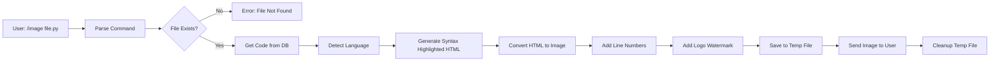
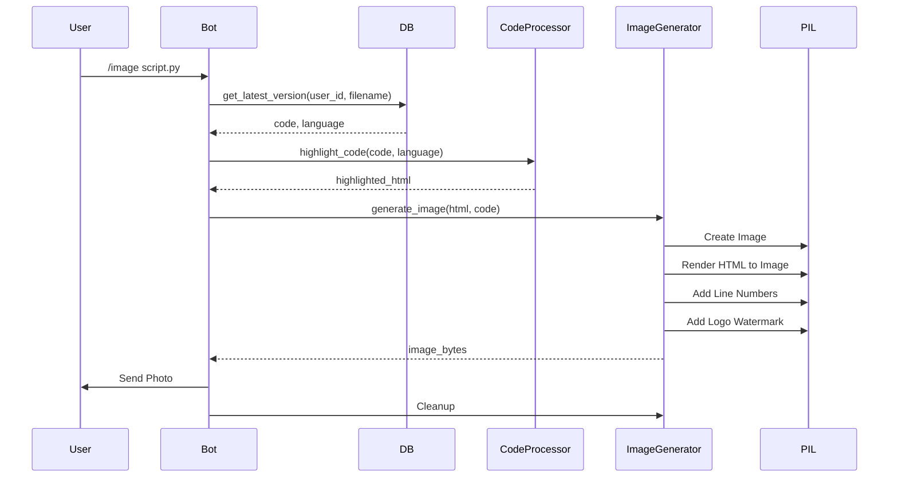

# 📋 מדריך מימוש מלא - יצירת תמונות קוד לשיתוף

## 📑 תוכן עניינים
1. [סקירה כללית](#סקירה-כללית)
2. [דרישות מוקדמות](#דרישות-מוקדמות)
3. [ארכיטקטורה](#ארכיטקטורה)
4. [מימוש מפורט](#מימוש-מפורט)
5. [דוגמאות קוד](#דוגמאות-קוד)
6. [בדיקות ו-QA](#בדיקות-ו-qa)
7. [שיקולי ביצועים](#שיקולי-ביצועים)
8. [אבטחה ו-Best Practices](#אבטחה-ו-best-practices)

---

## 📌 סקירה כללית

### מטרת הפרויקט
הוספת פקודה `/image <filename>` שמייצרת תמונת PNG מהקוד עם:
- ✅ היילייטינג צבעוני (syntax highlighting)
- ✅ רקע נקי ומקצועי
- ✅ מספרי שורות
- ✅ לוגו קטן של `@my_code_keeper_bot` בפינה
- ✅ אפשרות להוריד/לשלוח ישירות

### יעדים עיקריים
1. **שיפור חוויית שיתוף** - תמונות קוד נראות מקצועיות יותר מהודעות טקסט
2. **תאימות פלטפורמות** - תמונות עובדות בכל מקום (Twitter, LinkedIn, Discord וכו')
3. **ביצועים** - יצירת תמונה תוך פחות מ-2 שניות
4. **איכות** - תמונות באיכות גבוהה עם קריאות מעולה

---

## ⚙️ דרישות מוקדמות

### תשתית נדרשת
```yaml
requirements:
  python: ">=3.11"
  telegram_bot: "python-telegram-bot>=20.0"
  
dependencies:
  - Pillow>=10.2.0  # ✅ כבר קיים בפרויקט
  - pygments>=2.0.0  # ✅ כבר קיים בפרויקט
  - pygments-formatter-image>=0.1.0  # ⚠️ צריך להוסיף
```

### ספריות קיימות בפרויקט
- ✅ **Pillow** - עיבוד תמונות (כבר מותקן)
- ✅ **Pygments** - היילייטינג קוד (כבר מותקן)
- ⚠️ **pygments-formatter-image** - ייתכן שצריך להוסיף (או להשתמש ב-PIL ישירות)

### הכנות בקוד הקיים
- ✅ `code_processor.py` - כבר מכיל לוגיקת highlighting
- ✅ `bot_handlers.py` - כבר מכיל דוגמאות לפקודות (`/show`, `/download`)
- ✅ `database.py` - גישה לקבצים של המשתמש

---

## 🎨 ארכיטקטורה

### 1. זרימת פקודה בסיסית - Command Flow


### 2. מבנה המודולים
```
src/
├── bot_handlers.py          # ✅ קיים - הוספת image_command
├── code_processor.py        # ✅ קיים - שימוש ב-highlight_code
└── services/
    └── image_generator.py   # 🆕 חדש - לוגיקת יצירת תמונות
```

### 3. זרימת יצירת תמונה - Image Generation Flow


---

## 🏗️ מימוש מפורט

### שלב 1: יצירת מודול Image Generator

#### קובץ: `services/image_generator.py`
```python
"""
שירות ליצירת תמונות קוד עם היילייטינג
Code Image Generator Service
"""

import io
import logging
import re
from pathlib import Path
from typing import Optional, Tuple

try:
    from PIL import Image, ImageDraw, ImageFont, ImageFilter
    from PIL.ImageFont import FreeTypeFont
except Exception:
    Image = None
    ImageDraw = None
    ImageFont = None
    ImageFilter = None
    FreeTypeFont = None

try:
    from pygments import highlight
    from pygments.formatters import HtmlFormatter
    from pygments.lexers import get_lexer_by_name, guess_lexer
    from pygments.styles import get_style_by_name
    from pygments.util import ClassNotFound
except Exception:
    highlight = None
    HtmlFormatter = None
    get_lexer_by_name = None
    guess_lexer = None
    get_style_by_name = None
    ClassNotFound = Exception

logger = logging.getLogger(__name__)


class CodeImageGenerator:
    """מחלקה ליצירת תמונות קוד עם היילייטינג"""
    
    # הגדרות ברירת מחדל
    DEFAULT_WIDTH = 1200
    DEFAULT_PADDING = 40
    LINE_HEIGHT = 24
    FONT_SIZE = 14
    LINE_NUMBER_WIDTH = 60
    LOGO_SIZE = (80, 20)  # גודל הלוגו בפינה
    LOGO_PADDING = 10  # ריווח מהפינות
    
    # צבעים
    COLORS = {
        'background': '#1e1e1e',  # רקע כהה
        'line_number_bg': '#252526',
        'line_number_text': '#858585',
        'text': '#d4d4d4',
        'border': '#3e3e42',
    }
    
    def __init__(self, style: str = 'monokai'):
        """אתחול מחולל התמונות"""
        if Image is None:
            raise ImportError("PIL/Pillow is required for image generation")
        if highlight is None:
            raise ImportError("Pygments is required for syntax highlighting")
        
        self.style = style
        self._font_cache = {}
        self._logo_cache = None
        
    def _get_font(self, size: int, bold: bool = False) -> Optional[FreeTypeFont]:
        """קבלת פונט עם cache"""
        cache_key = f"{size}_{bold}"
        if cache_key in self._font_cache:
            return self._font_cache[cache_key]
        
        try:
            # נסה לטעון פונט מונוספייס
            # Linux: DejaVu Sans Mono, Windows: Consolas, macOS: Menlo
            font_paths = [
                '/usr/share/fonts/truetype/dejavu/DejaVuSansMono.ttf',
                '/usr/share/fonts/truetype/liberation/LiberationMono-Regular.ttf',
                'C:/Windows/Fonts/consola.ttf',
                '/System/Library/Fonts/Menlo.ttc',
            ]
            
            font = None
            for path in font_paths:
                if Path(path).exists():
                    try:
                        font = ImageFont.truetype(path, size)
                        if bold:
                            # נסה פונט bold
                            bold_path = path.replace('Regular', 'Bold').replace('.ttf', '-Bold.ttf')
                            if Path(bold_path).exists():
                                font = ImageFont.truetype(bold_path, size)
                        break
                    except Exception:
                        continue
            
            # Fallback לפונט ברירת מחדל
            if font is None:
                font = ImageFont.load_default()
            
            self._font_cache[cache_key] = font
            return font
            
        except Exception as e:
            logger.warning(f"Failed to load font: {e}, using default")
            return ImageFont.load_default()
    
    def _get_logo_image(self) -> Optional[Image.Image]:
        """טעינת לוגו או יצירת לוגו טקסטואלי"""
        if self._logo_cache is not None:
            return self._logo_cache
        
        try:
            # נסה לטעון לוגו מקובץ
            logo_paths = [
                Path(__file__).parent.parent / 'assets' / 'logo.png',
                Path(__file__).parent.parent / 'assets' / 'logo_small.png',
            ]
            
            for path in logo_paths:
                if path.exists():
                    logo = Image.open(path)
                    # שנה גודל
                    logo = logo.resize(self.LOGO_SIZE, Image.Resampling.LANCZOS)
                    self._logo_cache = logo
                    return logo
        except Exception:
            pass
        
        # Fallback: יצירת לוגו טקסטואלי
        try:
            logo = Image.new('RGBA', self.LOGO_SIZE, (0, 0, 0, 0))
            draw = ImageDraw.Draw(logo)
            font = self._get_font(10, bold=True)
            
            text = "@my_code_keeper_bot"
            # חישוב מיקום מרכז
            bbox = draw.textbbox((0, 0), text, font=font)
            text_width = bbox[2] - bbox[0]
            text_height = bbox[3] - bbox[1]
            x = (self.LOGO_SIZE[0] - text_width) // 2
            y = (self.LOGO_SIZE[1] - text_height) // 2
            
            # ציור טקסט עם רקע שקוף
            draw.rectangle(
                [(0, 0), self.LOGO_SIZE],
                fill=(30, 30, 30, 200)  # רקע כהה עם שקיפות
            )
            draw.text((x, y), text, fill=(255, 255, 255, 255), font=font)
            
            self._logo_cache = logo
            return logo
            
        except Exception as e:
            logger.warning(f"Failed to create logo: {e}")
            return None
    
    def _html_to_text_colors(self, html: str) -> list[Tuple[str, str]]:
        """
        המרת HTML מודגש לרשימת (טקסט, צבע)
        פישוט: נסיר תגיות HTML ונחלץ צבעים בסיסיים
        """
        # הסרת תגיות HTML ומיצוי צבעים
        # זה פישוט - ניתן לשפר עם BeautifulSoup או html.parser
        text_colors = []
        
        # הסרת תגיות style ו-script
        html = re.sub(r'<style[^>]*>.*?</style>', '', html, flags=re.DOTALL)
        html = re.sub(r'<script[^>]*>.*?</script>', '', html, flags=re.DOTALL)
        
        # חילוץ טקסט וצבעים מתגיות span
        pattern = r'<span[^>]*style="[^"]*color:\s*([^;"]+)[^"]*"[^>]*>(.*?)</span>'
        
        last_pos = 0
        for match in re.finditer(pattern, html, re.DOTALL):
            # טקסט לפני התג
            before = html[last_pos:match.start()]
            if before.strip():
                # ניקוי HTML
                clean_before = re.sub(r'<[^>]+>', '', before)
                if clean_before:
                    text_colors.append((clean_before, self.COLORS['text']))
            
            # הטקסט בתוך התג
            color = match.group(1).strip()
            text = match.group(2)
            # ניקוי HTML מקונן
            clean_text = re.sub(r'<[^>]+>', '', text)
            if clean_text:
                text_colors.append((clean_text, color))
            
            last_pos = match.end()
        
        # טקסט אחרי התג האחרון
        after = html[last_pos:]
        if after.strip():
            clean_after = re.sub(r'<[^>]+>', '', after)
            if clean_after:
                text_colors.append((clean_after, self.COLORS['text']))
        
        # אם לא מצאנו כלום, נחזיר את כל הטקסט
        if not text_colors:
            clean_html = re.sub(r'<[^>]+>', '', html)
            if clean_html.strip():
                text_colors.append((clean_html, self.COLORS['text']))
        
        return text_colors
    
    def _parse_color(self, color_str: str) -> Tuple[int, int, int]:
        """המרת מחרוזת צבע ל-RGB"""
        color_str = color_str.strip().lower()
        
        # Hex color (#rrggbb)
        if color_str.startswith('#'):
            hex_color = color_str[1:]
            if len(hex_color) == 6:
                return tuple(int(hex_color[i:i+2], 16) for i in (0, 2, 4))
            elif len(hex_color) == 3:
                return tuple(int(c*2, 16) for c in hex_color)
        
        # RGB color (rgb(255, 255, 255))
        rgb_match = re.match(r'rgb\((\d+),\s*(\d+),\s*(\d+)\)', color_str)
        if rgb_match:
            return tuple(int(x) for x in rgb_match.groups())
        
        # צבעים נפוצים
        color_map = {
            'white': (255, 255, 255),
            'black': (0, 0, 0),
            'red': (255, 0, 0),
            'green': (0, 255, 0),
            'blue': (0, 0, 255),
            'yellow': (255, 255, 0),
            'cyan': (0, 255, 255),
            'magenta': (255, 0, 255),
        }
        
        return color_map.get(color_str, (212, 212, 212))  # ברירת מחדל: אפור בהיר
    
    def generate_image(
        self,
        code: str,
        language: str = 'text',
        filename: Optional[str] = None,
        max_width: int = DEFAULT_WIDTH,
        max_height: Optional[int] = None,
    ) -> bytes:
        """
        יצירת תמונת PNG מקוד עם היילייטינג
        
        Args:
            code: הקוד ליצירת תמונה
            language: שפת התכנות לזיהוי תחביר
            filename: שם הקובץ (לצורך זיהוי שפה)
            max_width: רוחב מקסימלי של התמונה
            max_height: גובה מקסימלי (None = ללא הגבלה)
        
        Returns:
            bytes: תמונת PNG כ-bytes
        """
        if not code:
            raise ValueError("Code cannot be empty")
        
        # 1. יצירת HTML מודגש
        try:
            if filename:
                try:
                    lexer = get_lexer_for_filename(filename)
                except ClassNotFound:
                    lexer = get_lexer_by_name(language, stripall=True)
            else:
                try:
                    lexer = get_lexer_by_name(language, stripall=True)
                except ClassNotFound:
                    lexer = guess_lexer(code)
        except Exception:
            # Fallback לטקסט רגיל
            lexer = get_lexer_by_name('text', stripall=True)
        
        # יצירת formatter עם סגנון
        try:
            style = get_style_by_name(self.style)
        except Exception:
            style = get_style_by_name('default')
        
        formatter = HtmlFormatter(
            style=style,
            noclasses=True,  # inline styles
            nowrap=True,  # ללא wrap
        )
        
        highlighted_html = highlight(code, lexer, formatter)
        
        # 2. חישוב מימדים
        lines = code.split('\n')
        num_lines = len(lines)
        
        font = self._get_font(self.FONT_SIZE)
        line_height = self.LINE_HEIGHT
        
        # חישוב רוחב מקסימלי של שורה
        max_line_width = 0
        for line in lines:
            # חישוב רוחב טקסט (קירוב)
            bbox = font.getbbox(line) if hasattr(font, 'getbbox') else (0, 0, len(line) * 8, line_height)
            line_width = bbox[2] - bbox[0] if len(bbox) > 2 else len(line) * 8
            max_line_width = max(max_line_width, line_width)
        
        # רוחב כולל: מספרי שורות + ריווח + קוד + ריווח
        content_width = self.LINE_NUMBER_WIDTH + 20 + max_line_width + self.DEFAULT_PADDING
        image_width = min(content_width, max_width)
        
        # גובה כולל: כותרת (אופציונלית) + קוד + ריווח
        image_height = (num_lines * line_height) + (self.DEFAULT_PADDING * 2)
        if max_height and image_height > max_height:
            # חיתוך או גלילה - כאן נחתוך
            max_lines = (max_height - (self.DEFAULT_PADDING * 2)) // line_height
            lines = lines[:max_lines]
            num_lines = len(lines)
            image_height = (num_lines * line_height) + (self.DEFAULT_PADDING * 2)
        
        # 3. יצירת תמונה
        img = Image.new('RGB', (image_width, image_height), self.COLORS['background'])
        draw = ImageDraw.Draw(img)
        
        # 4. ציור מספרי שורות
        line_number_font = self._get_font(self.FONT_SIZE - 1)
        line_number_x = self.DEFAULT_PADDING
        line_number_bg_x1 = 0
        line_number_bg_x2 = self.DEFAULT_PADDING + self.LINE_NUMBER_WIDTH
        
        # רקע למספרי שורות
        draw.rectangle(
            [(line_number_bg_x1, 0), (line_number_bg_x2, image_height)],
            fill=self.COLORS['line_number_bg']
        )
        
        # קו הפרדה
        draw.line(
            [(line_number_bg_x2, 0), (line_number_bg_x2, image_height)],
            fill=self.COLORS['border'],
            width=1
        )
        
        # 5. ציור קוד עם היילייטינג
        code_x = line_number_bg_x2 + 20
        code_y = self.DEFAULT_PADDING
        
        # פיצול HTML לשורות עם צבעים
        html_lines = highlighted_html.split('\n')
        
        for line_num, (line_code, html_line) in enumerate(zip(lines, html_lines[:len(lines)]), 1):
            y = code_y + ((line_num - 1) * line_height)
            
            # ציור מספר שורה
            line_num_str = str(line_num)
            line_num_bbox = line_number_font.getbbox(line_num_str) if hasattr(line_number_font, 'getbbox') else (0, 0, len(line_num_str) * 6, line_height)
            line_num_width = line_num_bbox[2] - line_num_bbox[0] if len(line_num_bbox) > 2 else len(line_num_str) * 6
            line_num_x = line_number_bg_x2 - line_num_width - 10
            
            draw.text(
                (line_num_x, y),
                line_num_str,
                fill=self.COLORS['line_number_text'],
                font=line_number_font
            )
            
            # ציור קוד עם צבעים
            # פישוט: נחלץ צבעים מ-HTML ונצייר
            text_colors = self._html_to_text_colors(html_line)
            
            current_x = code_x
            for text, color_str in text_colors:
                if not text.strip() and text != ' ':
                    continue
                
                color = self._parse_color(color_str)
                
                # ציור טקסט
                draw.text(
                    (current_x, y),
                    text,
                    fill=color,
                    font=font
                )
                
                # חישוב רוחב טקסט
                bbox = font.getbbox(text) if hasattr(font, 'getbbox') else (0, 0, len(text) * 8, line_height)
                text_width = bbox[2] - bbox[0] if len(bbox) > 2 else len(text) * 8
                current_x += text_width
        
        # 6. הוספת לוגו בפינה
        logo = self._get_logo_image()
        if logo:
            # מיקום: פינה ימנית תחתונה
            logo_x = image_width - self.LOGO_SIZE[0] - self.LOGO_PADDING
            logo_y = image_height - self.LOGO_SIZE[1] - self.LOGO_PADDING
            
            # הדבקת לוגו עם שקיפות
            if logo.mode == 'RGBA':
                img.paste(logo, (logo_x, logo_y), logo)
            else:
                img.paste(logo, (logo_x, logo_y))
        
        # 7. המרה ל-bytes
        img_bytes = io.BytesIO()
        img.save(img_bytes, format='PNG', optimize=True)
        img_bytes.seek(0)
        
        return img_bytes.getvalue()
```

### שלב 2: הוספת פקודה לבוט

#### עדכון `bot_handlers.py`
```python
# הוספה בתחילת הקובץ (imports)
from services.image_generator import CodeImageGenerator
import tempfile
import os

# הוספה ב-setup_advanced_handlers
def setup_advanced_handlers(self):
    """הגדרת handlers מתקדמים"""
    # ... קוד קיים ...
    
    # פקודת יצירת תמונה
    self.application.add_handler(CommandHandler("image", self.image_command))

# הוספת הפונקציה image_command
async def image_command(self, update: Update, context: ContextTypes.DEFAULT_TYPE):
    """יצירת תמונת PNG מקוד"""
    reporter.report_activity(update.effective_user.id)
    user_id = update.effective_user.id
    
    if not context.args:
        await update.message.reply_text(
            "🖼️ **יצירת תמונת קוד**\n\n"
            "שימוש: `/image <file_name>`\n\n"
            "דוגמה:\n"
            "`/image script.py`\n\n"
            "הפקודה תיצור תמונת PNG מהקוד עם:\n"
            "• היילייטינג צבעוני\n"
            "• מספרי שורות\n"
            "• לוגו @my_code_keeper_bot",
            parse_mode=ParseMode.MARKDOWN
        )
        return
    
    file_name = " ".join(context.args)
    file_data = db.get_latest_version(user_id, file_name)
    
    if not file_data:
        await update.message.reply_text(
            f"❌ קובץ `{file_name}` לא נמצא.",
            parse_mode=ParseMode.MARKDOWN
        )
        return
    
    # שליחת הודעת "מעבד..."
    processing_msg = await update.message.reply_text(
        "🎨 יוצר תמונה...",
        parse_mode=ParseMode.HTML
    )
    
    try:
        # יצירת תמונה
        code = file_data.get('code', '')
        language = file_data.get('programming_language', 'text')
        
        if not code:
            await processing_msg.edit_text("❌ הקובץ ריק.")
            return
        
        generator = CodeImageGenerator(style='monokai')
        image_bytes = generator.generate_image(
            code=code,
            language=language,
            filename=file_name
        )
        
        # שמירה לקובץ זמני
        with tempfile.NamedTemporaryFile(
            delete=False,
            suffix='.png',
            dir=tempfile.gettempdir()
        ) as tmp_file:
            tmp_file.write(image_bytes)
            tmp_path = tmp_file.name
        
        try:
            # שליחת התמונה
            with open(tmp_path, 'rb') as photo_file:
                await update.message.reply_photo(
                    photo=InputFile(photo_file, filename=f"{file_name}.png"),
                    caption=(
                        f"🖼️ **תמונת קוד:** `{html.escape(file_name)}`\n"
                        f"🔤 שפה: {html.escape(language)}\n"
                        f"📏 שורות: {len(code.splitlines())}"
                    ),
                    parse_mode=ParseMode.MARKDOWN
                )
            
            # מחיקת הודעת "מעבד..."
            try:
                await processing_msg.delete()
            except Exception:
                pass
                
        finally:
            # ניקוי קובץ זמני
            try:
                if os.path.exists(tmp_path):
                    os.unlink(tmp_path)
            except Exception as e:
                logger.warning(f"Failed to delete temp file {tmp_path}: {e}")
    
    except ImportError as e:
        await processing_msg.edit_text(
            "❌ שגיאה: חסרות ספריות נדרשות.\n"
            f"פרטים: {str(e)}"
        )
    except Exception as e:
        logger.error(f"Error generating image: {e}", exc_info=True)
        await processing_msg.edit_text(
            f"❌ שגיאה ביצירת תמונה:\n`{html.escape(str(e))}`",
            parse_mode=ParseMode.MARKDOWN
        )
```

### שלב 3: יצירת תיקיית assets (אופציונלי)

אם יש לוגו קיים, ניתן להוסיף אותו:
```
/workspace/
└── assets/
    ├── logo.png          # לוגו מלא (אם קיים)
    └── logo_small.png    # לוגו קטן (80x20px)
```

אם אין לוגו, הקוד ייצור לוגו טקסטואלי אוטומטית.

---

## 📊 דוגמאות קוד

### דוגמה 1: שימוש בסיסי
```python
from services.image_generator import CodeImageGenerator

code = """
def hello_world():
    print("Hello, World!")
    return True
"""

generator = CodeImageGenerator(style='monokai')
image_bytes = generator.generate_image(
    code=code,
    language='python',
    filename='hello.py'
)

# שמירה לקובץ
with open('output.png', 'wb') as f:
    f.write(image_bytes)
```

### דוגמה 2: התאמה אישית
```python
generator = CodeImageGenerator(style='github-dark')  # סגנון אחר

image_bytes = generator.generate_image(
    code=code,
    language='javascript',
    filename='app.js',
    max_width=1600,  # רוחב גדול יותר
    max_height=2000  # הגבלת גובה
)
```

### דוגמה 3: טיפול בשגיאות
```python
try:
    generator = CodeImageGenerator()
    image_bytes = generator.generate_image(code, language='python')
except ImportError as e:
    print(f"חסרות ספריות: {e}")
except ValueError as e:
    print(f"קלט לא תקין: {e}")
except Exception as e:
    print(f"שגיאה כללית: {e}")
```

---

## 🧪 בדיקות ו-QA

### Test Coverage Requirements
```yaml
test_coverage:
  unit_tests:
    target: 85%
    critical_paths: 95%
    
  integration_tests:
    - Image generation from various languages
    - Logo watermark placement
    - Line number rendering
    - Error handling
    
  performance_tests:
    - Generation time < 2 seconds
    - Memory usage < 100MB per image
    - File size < 2MB per image
```

### דוגמאות לבדיקות

#### קובץ: `tests/test_image_generator.py`
```python
import pytest
from services.image_generator import CodeImageGenerator

class TestCodeImageGenerator:
    """בדיקות למחולל תמונות קוד"""
    
    @pytest.fixture
    def generator(self):
        """יצירת מחולל לבדיקות"""
        return CodeImageGenerator(style='monokai')
    
    def test_basic_generation(self, generator):
        """בדיקת יצירת תמונה בסיסית"""
        code = "print('Hello')"
        image_bytes = generator.generate_image(code, language='python')
        
        assert image_bytes is not None
        assert len(image_bytes) > 0
        assert image_bytes.startswith(b'\x89PNG')  # PNG signature
    
    def test_empty_code_error(self, generator):
        """בדיקת שגיאה על קוד ריק"""
        with pytest.raises(ValueError, match="Code cannot be empty"):
            generator.generate_image("", language='python')
    
    def test_multiline_code(self, generator):
        """בדיקת קוד מרובה שורות"""
        code = """def test():
    x = 1
    y = 2
    return x + y"""
        
        image_bytes = generator.generate_image(code, language='python')
        assert len(image_bytes) > 0
    
    def test_different_languages(self, generator):
        """בדיקת תמיכה בשפות שונות"""
        languages = ['python', 'javascript', 'java', 'cpp', 'text']
        
        for lang in languages:
            code = f"// {lang} code"
            image_bytes = generator.generate_image(code, language=lang)
            assert len(image_bytes) > 0
    
    def test_max_width(self, generator):
        """בדיקת הגבלת רוחב"""
        code = "x" * 200  # שורה ארוכה
        image_bytes = generator.generate_image(
            code,
            language='text',
            max_width=800
        )
        assert len(image_bytes) > 0
    
    def test_logo_watermark(self, generator):
        """בדיקת הוספת לוגו"""
        code = "test code"
        image_bytes = generator.generate_image(code, language='text')
        
        # הלוגו צריך להיות בתמונה
        # ניתן לבדוק על ידי קריאת התמונה ובדיקת פיקסלים בפינה
        assert len(image_bytes) > 0
```

#### קובץ: `tests/test_image_command.py`
```python
import pytest
from unittest.mock import AsyncMock, patch, MagicMock
from telegram import Update, Message, User, Chat
from bot_handlers import AdvancedBotHandlers

class TestImageCommand:
    """בדיקות לפקודת /image"""
    
    @pytest.fixture
    def mock_update(self):
        """יצירת Update מדומה"""
        user = User(id=123, first_name="Test", is_bot=False)
        chat = Chat(id=123, type="private")
        message = Message(
            message_id=1,
            date=None,
            chat=chat,
            from_user=user,
            text="/image test.py"
        )
        update = Update(update_id=1, message=message)
        return update
    
    @pytest.fixture
    def mock_context(self):
        """יצירת Context מדומה"""
        context = MagicMock()
        context.args = ['test.py']
        context.user_data = {}
        return context
    
    @pytest.mark.asyncio
    async def test_image_command_no_args(self, mock_update, mock_context):
        """בדיקת פקודה ללא ארגומנטים"""
        mock_context.args = []
        
        handler = AdvancedBotHandlers(MagicMock())
        await handler.image_command(mock_update, mock_context)
        
        # צריך לשלוח הודעת עזרה
        mock_update.message.reply_text.assert_called_once()
        call_args = mock_update.message.reply_text.call_args[0][0]
        assert "יצירת תמונת קוד" in call_args
    
    @pytest.mark.asyncio
    async def test_image_command_file_not_found(self, mock_update, mock_context):
        """בדיקת פקודה עם קובץ שלא קיים"""
        with patch('bot_handlers.db') as mock_db:
            mock_db.get_latest_version.return_value = None
            
            handler = AdvancedBotHandlers(MagicMock())
            await handler.image_command(mock_update, mock_context)
            
            mock_update.message.reply_text.assert_called_once()
            call_args = mock_update.message.reply_text.call_args[0][0]
            assert "לא נמצא" in call_args
    
    @pytest.mark.asyncio
    async def test_image_command_success(self, mock_update, mock_context):
        """בדיקת פקודה מוצלחת"""
        with patch('bot_handlers.db') as mock_db, \
             patch('bot_handlers.CodeImageGenerator') as mock_gen, \
             patch('tempfile.NamedTemporaryFile') as mock_temp, \
             patch('builtins.open', create=True) as mock_open:
            
            # הגדרת mocks
            mock_db.get_latest_version.return_value = {
                'code': 'print("test")',
                'programming_language': 'python'
            }
            
            mock_generator = MagicMock()
            mock_generator.generate_image.return_value = b'fake_png_data'
            mock_gen.return_value = mock_generator
            
            mock_temp_file = MagicMock()
            mock_temp_file.name = '/tmp/test.png'
            mock_temp_file.__enter__ = MagicMock(return_value=mock_temp_file)
            mock_temp_file.__exit__ = MagicMock(return_value=False)
            mock_temp.return_value = mock_temp_file
            
            mock_file = MagicMock()
            mock_open.return_value.__enter__ = MagicMock(return_value=mock_file)
            mock_open.return_value.__exit__ = MagicMock(return_value=False)
            
            handler = AdvancedBotHandlers(MagicMock())
            await handler.image_command(mock_update, mock_context)
            
            # צריך לשלוח תמונה
            mock_update.message.reply_photo.assert_called_once()
```

---

## ⚡ שיקולי ביצועים

### 1. Caching
```python
# הוספת cache ליצירת תמונות
from cache_manager import cached

@cached(expire_seconds=3600, key_prefix="code_image")
def generate_image_cached(self, code: str, language: str, **kwargs) -> bytes:
    """יצירת תמונה עם cache"""
    return self.generate_image(code, language, **kwargs)
```

### 2. Async Processing
```python
# עיבוד אסינכרוני ליצירת תמונות גדולות
import asyncio
from concurrent.futures import ThreadPoolExecutor

class AsyncImageGenerator:
    def __init__(self):
        self.executor = ThreadPoolExecutor(max_workers=2)
    
    async def generate_image_async(self, code: str, language: str) -> bytes:
        """יצירת תמונה באופן אסינכרוני"""
        loop = asyncio.get_event_loop()
        generator = CodeImageGenerator()
        return await loop.run_in_executor(
            self.executor,
            generator.generate_image,
            code,
            language
        )
```

### 3. Optimization Tips
- **Font Caching**: שמירת פונטים ב-cache (כבר מיושם)
- **Logo Caching**: שמירת לוגו ב-cache (כבר מיושם)
- **Image Optimization**: שימוש ב-`optimize=True` ב-PNG
- **Size Limits**: הגבלת גודל תמונה מקסימלי
- **Lazy Loading**: טעינת פונטים רק כשצריך

### 4. Memory Management
```python
# ניקוי זיכרון לאחר יצירת תמונה
def generate_image(self, ...):
    try:
        # ... יצירת תמונה ...
        return img_bytes.getvalue()
    finally:
        # ניקוי
        img_bytes.close()
        if 'img' in locals():
            img.close()
```

---

## 🔒 אבטחה ו-Best Practices

### 1. Input Validation
```python
def generate_image(self, code: str, language: str, **kwargs):
    """יצירת תמונה עם ולידציה"""
    # בדיקת קלט
    if not isinstance(code, str):
        raise TypeError("Code must be a string")
    
    if len(code) > 100000:  # הגבלת גודל
        raise ValueError("Code too large (max 100KB)")
    
    if len(code) == 0:
        raise ValueError("Code cannot be empty")
    
    # בדיקת שפה
    if language and not isinstance(language, str):
        raise TypeError("Language must be a string")
    
    # ... שאר הקוד ...
```

### 2. File Security
```python
# שימוש ב-tempfile בטוח
import tempfile
import os

# יצירת קובץ זמני עם הרשאות בטוחות
tmp_file = tempfile.NamedTemporaryFile(
    delete=False,
    suffix='.png',
    dir=tempfile.gettempdir(),  # רק בתיקיית temp
    mode='wb'
)

try:
    # שימוש בקובץ
    tmp_file.write(image_bytes)
    tmp_path = tmp_file.name
finally:
    tmp_file.close()
    # ניקוי אחרי שימוש
    try:
        if os.path.exists(tmp_path):
            os.unlink(tmp_path)
    except Exception:
        pass
```

### 3. Error Handling
```python
async def image_command(self, update, context):
    """פקודה עם טיפול בשגיאות"""
    try:
        # ... יצירת תמונה ...
    except ImportError as e:
        logger.error(f"Missing dependencies: {e}")
        await update.message.reply_text(
            "❌ שגיאה: חסרות ספריות נדרשות.\n"
            "אנא צור קשר עם המנהל."
        )
    except ValueError as e:
        logger.warning(f"Invalid input: {e}")
        await update.message.reply_text(
            f"❌ קלט לא תקין: {str(e)}"
        )
    except Exception as e:
        logger.error(f"Unexpected error: {e}", exc_info=True)
        await update.message.reply_text(
            "❌ שגיאה בלתי צפויה ביצירת תמונה.\n"
            "אנא נסה שוב מאוחר יותר."
        )
```

### 4. Rate Limiting
```python
# הוספת rate limiting לפקודה
from rate_limiter import RateLimiter

image_rate_limiter = RateLimiter(max_calls=10, period=60)  # 10 פעמים בדקה

async def image_command(self, update, context):
    """פקודה עם rate limiting"""
    user_id = update.effective_user.id
    
    if not image_rate_limiter.allow(user_id):
        await update.message.reply_text(
            "⏱️ יותר מדי בקשות. אנא נסה שוב בעוד דקה."
        )
        return
    
    # ... שאר הקוד ...
```

---

## 📝 סיכום

### אבני דרך למימוש
1. ✅ **יום 1:** יצירת `services/image_generator.py` עם פונקציונליות בסיסית
2. ✅ **יום 2:** הוספת פקודה `/image` ל-`bot_handlers.py`
3. ✅ **יום 3:** הוספת לוגו ומיקום מספרי שורות
4. ✅ **יום 4:** בדיקות ואופטימיזציה

### KPIs להצלחה
- 📉 **זמן יצירה** - פחות מ-2 שניות לתמונה
- 📊 **איכות** - תמונות קריאות וצבעוניות
- 🎯 **תאימות** - עובד על כל הפלטפורמות
- ⚡ **ביצועים** - ללא בעיות זיכרון

### Next Steps
1. Review והערות על המסמך
2. אישור prioritization
3. הקצאת משאבים
4. Kickoff meeting
5. Sprint planning

---

## 📚 משאבים נוספים

### ספריות מומלצות
- [Pillow Documentation](https://pillow.readthedocs.io/)
- [Pygments Documentation](https://pygments.org/docs/)
- [Python-telegram-bot Documentation](https://python-telegram-bot.org/)

### סגנונות Pygments זמינים
- `monokai` - כהה ופופולרי
- `github-dark` - סגנון GitHub כהה
- `dracula` - סגנון Dracula
- `one-dark` - סגנון Atom One Dark
- `vs` - Visual Studio style

---

**המסמך מוכן למימוש! 🚀**

בהצלחה עם הפיתוח!
