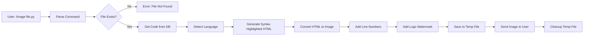
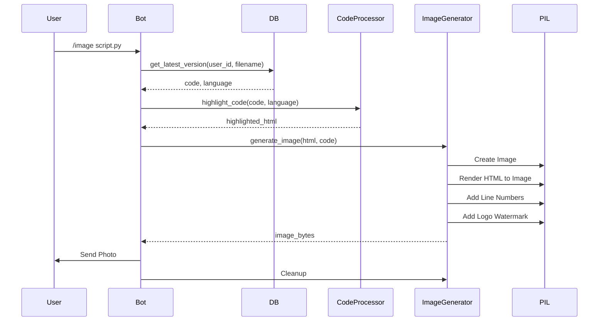

# 📋 מדריך מימוש מלא - יצירת תמונות קוד לשיתוף

## 📑 תוכן עניינים
1. [סקירה כללית](#סקירה-כללית)
2. [דרישות מוקדמות](#דרישות-מוקדמות)
3. [ארכיטקטורה](#ארכיטקטורה)
4. [מימוש מפורט](#מימוש-מפורט)
5. [תכונות מתקדמות](#תכונות-מתקדמות)
6. [דוגמאות קוד](#דוגמאות-קוד)
7. [בדיקות ו-QA](#בדיקות-ו-qa)
8. [שיקולי ביצועים](#שיקולי-ביצועים)
9. [אבטחה ו-Best Practices](#אבטחה-ו-best-practices)
10. [קונפיגורציה וניטור](#קונפיגורציה-וניטור)

---

## 📌 סקירה כללית

### מטרת הפרויקט
הוספת פקודה `/image <filename>` שמייצרת תמונת PNG מהקוד עם:
- ✅ היילייטינג צבעוני (syntax highlighting)
- ✅ רקע נקי ומקצועי
- ✅ מספרי שורות
- ✅ לוגו קטן של `@my_code_keeper_bot` בפינה
- ✅ אפשרות להוריד/לשלוח ישירות

### יעדים עיקריים
1. **שיפור חוויית שיתוף** - תמונות קוד נראות מקצועיות יותר מהודעות טקסט
2. **תאימות פלטפורמות** - תמונות עובדות בכל מקום (Twitter, LinkedIn, Discord וכו')
3. **ביצועים** - יצירת תמונה תוך פחות מ-2 שניות
4. **איכות** - תמונות באיכות גבוהה עם קריאות מעולה

---

## ⚙️ דרישות מוקדמות

### תשתית נדרשת
```yaml
requirements:
  python: ">=3.11"
  telegram_bot: "python-telegram-bot>=20.0"
  
dependencies:
  - Pillow>=10.2.0  # ✅ כבר קיים בפרויקט
  - pygments>=2.0.0  # ✅ כבר קיים בפרויקט
  - weasyprint>=60.0  # 🆕 מומלץ - HTML to Image מתקדם
  # אלטרנטיבה: playwright>=1.40.0  # לרינדור HTML בדפדפן
```

### ספריות קיימות בפרויקט
- ✅ **Pillow** - עיבוד תמונות (כבר מותקן)
- ✅ **Pygments** - היילייטינג קוד (כבר מותקן)
- 🆕 **WeasyPrint** - מומלץ להוסיף - HTML to Image מתקדם ומדויק
- 🔄 **Playwright** - אלטרנטיבה ל-WeasyPrint (דורש דפדפן headless)

### הכנות בקוד הקיים
- ✅ `code_processor.py` - כבר מכיל לוגיקת highlighting
- ✅ `bot_handlers.py` - כבר מכיל דוגמאות לפקודות (`/show`, `/download`)
- ✅ `database.py` - גישה לקבצים של המשתמש

---

## 🎨 ארכיטקטורה

### 1. זרימת פקודה בסיסית - Command Flow


### 2. מבנה המודולים
```
src/
├── bot_handlers.py          # ✅ קיים - הוספת image_command
├── code_processor.py        # ✅ קיים - שימוש ב-highlight_code
└── services/
    └── image_generator.py   # 🆕 חדש - לוגיקת יצירת תמונות
```

### 3. זרימת יצירת תמונה - Image Generation Flow


---

## 🏗️ מימוש מפורט

### שלב 1: יצירת מודול Image Generator

#### קובץ: `services/image_generator.py`
```python
"""
שירות ליצירת תמונות קוד עם היילייטינג
Code Image Generator Service
"""

import io
import logging
import re
from pathlib import Path
from typing import Optional, Tuple

try:
    from PIL import Image, ImageDraw, ImageFont, ImageFilter
    from PIL.ImageFont import FreeTypeFont
except Exception:
    Image = None
    ImageDraw = None
    ImageFont = None
    ImageFilter = None
    FreeTypeFont = None

try:
    from pygments import highlight
    from pygments.formatters import HtmlFormatter
    from pygments.lexers import get_lexer_by_name, get_lexer_for_filename, guess_lexer
    from pygments.styles import get_style_by_name
    from pygments.util import ClassNotFound
except Exception:
    highlight = None
    HtmlFormatter = None
    get_lexer_by_name = None
    get_lexer_for_filename = None
    guess_lexer = None
    get_style_by_name = None
    ClassNotFound = Exception

logger = logging.getLogger(__name__)


class CodeImageGenerator:
    """מחלקה ליצירת תמונות קוד עם היילייטינג"""
    
    # הגדרות ברירת מחדל
    DEFAULT_WIDTH = 1200
    DEFAULT_PADDING = 40
    LINE_HEIGHT = 24
    FONT_SIZE = 14
    LINE_NUMBER_WIDTH = 60
    LOGO_SIZE = (80, 20)  # גודל הלוגו בפינה
    LOGO_PADDING = 10  # ריווח מהפינות
    
    # תמות זמינות
    THEMES = {
        'dark': {
            'background': '#1e1e1e',
            'text': '#d4d4d4',
            'line_number_bg': '#252526',
            'line_number_text': '#858585',
            'border': '#3e3e42',
        },
        'light': {
            'background': '#ffffff',
            'text': '#333333',
            'line_number_bg': '#f5f5f5',
            'line_number_text': '#999999',
            'border': '#e0e0e0',
        },
        'github': {
            'background': '#0d1117',
            'text': '#c9d1d9',
            'line_number_bg': '#161b22',
            'line_number_text': '#7d8590',
            'border': '#30363d',
        },
        'monokai': {
            'background': '#272822',
            'text': '#f8f8f2',
            'line_number_bg': '#3e3d32',
            'line_number_text': '#75715e',
            'border': '#49483e',
        }
    }
    
    def __init__(self, style: str = 'monokai', theme: str = 'dark'):
        """אתחול מחולל התמונות"""
        if Image is None:
            raise ImportError("PIL/Pillow is required for image generation")
        if highlight is None:
            raise ImportError("Pygments is required for syntax highlighting")
        
        self.style = style
        self.theme = theme
        self.colors = self.THEMES.get(theme, self.THEMES['dark'])
        self._font_cache = {}
        self._logo_cache = None
        
        # בדיקה אם WeasyPrint זמין
        try:
            from weasyprint import HTML, CSS
            self._has_weasyprint = True
        except ImportError:
            self._has_weasyprint = False
            logger.info("WeasyPrint not available, using PIL-based rendering")
        
    def _get_font(self, size: int, bold: bool = False) -> Optional[FreeTypeFont]:
        """קבלת פונט עם cache"""
        cache_key = f"{size}_{bold}"
        if cache_key in self._font_cache:
            return self._font_cache[cache_key]
        
        try:
            # נסה לטעון פונט מונוספייס
            # Linux: DejaVu Sans Mono, Windows: Consolas, macOS: Menlo
            font_paths = [
                '/usr/share/fonts/truetype/dejavu/DejaVuSansMono.ttf',
                '/usr/share/fonts/truetype/liberation/LiberationMono-Regular.ttf',
                'C:/Windows/Fonts/consola.ttf',
                '/System/Library/Fonts/Menlo.ttc',
            ]
            
            font = None
            for path in font_paths:
                if Path(path).exists():
                    try:
                        font = ImageFont.truetype(path, size)
                        if bold:
                            # נסה פונט bold
                            bold_path = path.replace('Regular', 'Bold').replace('.ttf', '-Bold.ttf')
                            if Path(bold_path).exists():
                                font = ImageFont.truetype(bold_path, size)
                        break
                    except Exception:
                        continue
            
            # Fallback לפונט ברירת מחדל
            if font is None:
                font = ImageFont.load_default()
            
            self._font_cache[cache_key] = font
            return font
            
        except Exception as e:
            logger.warning(f"Failed to load font: {e}, using default")
            return ImageFont.load_default()
    
    def _get_logo_image(self) -> Optional[Image.Image]:
        """טעינת לוגו או יצירת לוגו טקסטואלי"""
        if self._logo_cache is not None:
            return self._logo_cache
        
        try:
            # נסה לטעון לוגו מקובץ
            logo_paths = [
                Path(__file__).parent.parent / 'assets' / 'logo.png',
                Path(__file__).parent.parent / 'assets' / 'logo_small.png',
            ]
            
            for path in logo_paths:
                if path.exists():
                    logo = Image.open(path)
                    # שנה גודל
                    logo = logo.resize(self.LOGO_SIZE, Image.Resampling.LANCZOS)
                    self._logo_cache = logo
                    return logo
        except Exception:
            pass
        
        # Fallback: יצירת לוגו טקסטואלי
        try:
            logo = Image.new('RGBA', self.LOGO_SIZE, (0, 0, 0, 0))
            draw = ImageDraw.Draw(logo)
            font = self._get_font(10, bold=True)
            
            text = "@my_code_keeper_bot"
            # חישוב מיקום מרכז
            bbox = draw.textbbox((0, 0), text, font=font)
            text_width = bbox[2] - bbox[0]
            text_height = bbox[3] - bbox[1]
            x = (self.LOGO_SIZE[0] - text_width) // 2
            y = (self.LOGO_SIZE[1] - text_height) // 2
            
            # ציור טקסט עם רקע שקוף
            draw.rectangle(
                [(0, 0), self.LOGO_SIZE],
                fill=(30, 30, 30, 200)  # רקע כהה עם שקיפות
            )
            draw.text((x, y), text, fill=(255, 255, 255, 255), font=font)
            
            self._logo_cache = logo
            return logo
            
        except Exception as e:
            logger.warning(f"Failed to create logo: {e}")
            return None
    
    def _html_to_text_colors(self, html: str) -> list[Tuple[str, str]]:
        """
        המרת HTML מודגש לרשימת (טקסט, צבע)
        פישוט: נסיר תגיות HTML ונחלץ צבעים בסיסיים
        """
        # הסרת תגיות HTML ומיצוי צבעים
        # זה פישוט - ניתן לשפר עם BeautifulSoup או html.parser
        text_colors = []
        
        # הסרת תגיות style ו-script
        html = re.sub(r'<style[^>]*>.*?</style>', '', html, flags=re.DOTALL)
        html = re.sub(r'<script[^>]*>.*?</script>', '', html, flags=re.DOTALL)
        
        # חילוץ טקסט וצבעים מתגיות span
        pattern = r'<span[^>]*style="[^"]*color:\s*([^;"]+)[^"]*"[^>]*>(.*?)</span>'
        
        last_pos = 0
        for match in re.finditer(pattern, html, re.DOTALL):
            # טקסט לפני התג
            before = html[last_pos:match.start()]
            if before.strip():
                # ניקוי HTML
                clean_before = re.sub(r'<[^>]+>', '', before)
                if clean_before:
                    text_colors.append((clean_before, self.colors['text']))
            
            # הטקסט בתוך התג
            color = match.group(1).strip()
            text = match.group(2)
            # ניקוי HTML מקונן
            clean_text = re.sub(r'<[^>]+>', '', text)
            if clean_text:
                text_colors.append((clean_text, color))
            
            last_pos = match.end()
        
        # טקסט אחרי התג האחרון
        after = html[last_pos:]
        if after.strip():
            clean_after = re.sub(r'<[^>]+>', '', after)
            if clean_after:
                text_colors.append((clean_after, self.colors['text']))
        
        # אם לא מצאנו כלום, נחזיר את כל הטקסט
        if not text_colors:
            clean_html = re.sub(r'<[^>]+>', '', html)
            if clean_html.strip():
                text_colors.append((clean_html, self.colors['text']))
        
        return text_colors
    
    def _parse_color(self, color_str: str) -> Tuple[int, int, int]:
        """המרת מחרוזת צבע ל-RGB"""
        color_str = color_str.strip().lower()
        
        # Hex color (#rrggbb)
        if color_str.startswith('#'):
            hex_color = color_str[1:]
            if len(hex_color) == 6:
                return tuple(int(hex_color[i:i+2], 16) for i in (0, 2, 4))
            elif len(hex_color) == 3:
                return tuple(int(c*2, 16) for c in hex_color)
        
        # RGB color (rgb(255, 255, 255))
        rgb_match = re.match(r'rgb\((\d+),\s*(\d+),\s*(\d+)\)', color_str)
        if rgb_match:
            return tuple(int(x) for x in rgb_match.groups())
        
        # צבעים נפוצים
        color_map = {
            'white': (255, 255, 255),
            'black': (0, 0, 0),
            'red': (255, 0, 0),
            'green': (0, 255, 0),
            'blue': (0, 0, 255),
            'yellow': (255, 255, 0),
            'cyan': (0, 255, 255),
            'magenta': (255, 0, 255),
        }
        
        return color_map.get(color_str, (212, 212, 212))  # ברירת מחדל: אפור בהיר
    
    def _detect_language_from_content(self, code: str, filename: Optional[str] = None) -> str:
        """זיהוי שפה מתקדם יותר עם היוריסטיקות"""
        # זיהוי לפי סיומת קובץ
        if filename:
            lang_map = {
                '.py': 'python', '.js': 'javascript', '.ts': 'typescript',
                '.tsx': 'tsx', '.jsx': 'jsx', '.java': 'java', '.cpp': 'cpp',
                '.c': 'c', '.cs': 'csharp', '.php': 'php', '.rb': 'ruby',
                '.go': 'go', '.rs': 'rust', '.swift': 'swift', '.kt': 'kotlin',
                '.scala': 'scala', '.clj': 'clojure', '.hs': 'haskell',
                '.ml': 'ocaml', '.r': 'r', '.sql': 'sql', '.sh': 'bash',
                '.yaml': 'yaml', '.yml': 'yaml', '.json': 'json',
                '.xml': 'xml', '.html': 'html', '.css': 'css', '.scss': 'scss',
                '.md': 'markdown', '.tex': 'latex', '.vue': 'vue'
            }
            ext = Path(filename).suffix.lower()
            if ext in lang_map:
                return lang_map[ext]
        
        # זיהוי לפי תוכן (patterns נפוצים)
        patterns = {
            'python': [
                r'def\s+\w+\s*\(', r'import\s+\w+', r'from\s+\w+\s+import',
                r'class\s+\w+.*:', r'if\s+__name__\s*==\s*["\']__main__["\']'
            ],
            'javascript': [
                r'function\s+\w+\s*\(', r'const\s+\w+\s*=', r'=>\s*{',
                r'var\s+\w+\s*=', r'let\s+\w+\s*=', r'\.then\s*\('
            ],
            'java': [
                r'public\s+class\s+\w+', r'public\s+static\s+void\s+main',
                r'@Override', r'package\s+\w+'
            ],
            'cpp': [
                r'#include\s*<', r'using\s+namespace\s+std', r'std::',
                r'int\s+main\s*\('
            ],
            'c': [
                r'#include\s*<', r'int\s+main\s*\(', r'printf\s*\('
            ],
            'bash': [
                r'#!/bin/bash', r'#!/bin/sh', r'\$\{', r'if\s+\['
            ],
            'sql': [
                r'SELECT\s+.*\s+FROM', r'INSERT\s+INTO', r'CREATE\s+TABLE',
                r'UPDATE\s+\w+\s+SET'
            ]
        }
        
        for lang, pattern_list in patterns.items():
            if any(re.search(pattern, code, re.MULTILINE | re.IGNORECASE) for pattern in pattern_list):
                return lang
        
        return 'text'
    
    def _check_code_safety(self, code: str) -> bool:
        """בדיקת בטיחות קוד בסיסית - זיהוי דפוסים חשודים"""
        suspicious_patterns = [
            r'exec\s*\(', r'eval\s*\(', r'__import__\s*\(',
            r'os\.system\s*\(', r'subprocess\.', r'compile\s*\(',
            r'open\s*\([^)]*["\']/',  # פתיחת קבצים עם נתיבים
            r'rm\s+-rf', r'del\s+.*\[',  # מחיקות מסוכנות
        ]
        
        for pattern in suspicious_patterns:
            if re.search(pattern, code, re.IGNORECASE):
                logger.warning(f"Suspicious code pattern detected: {pattern}")
                # לא נבלוק, רק נתעד ללוגים
        
        return True
    
    def _render_html_with_weasyprint(self, html_content: str, width: int, height: int) -> Image.Image:
        """רינדור HTML לתמונה באמצעות WeasyPrint (מדויק יותר)"""
        try:
            from weasyprint import HTML, CSS
            from weasyprint.text.fonts import FontConfiguration
            
            # יצירת CSS מותאם
            css_string = f"""
            @page {{
                size: {width}px {height}px;
                margin: 0;
            }}
            body {{
                margin: 0;
                padding: 0;
                background-color: {self.colors['background']};
                color: {self.colors['text']};
                font-family: 'DejaVu Sans Mono', 'Consolas', 'Monaco', monospace;
                font-size: {self.FONT_SIZE}px;
                line-height: {self.LINE_HEIGHT}px;
            }}
            """
            
            # רינדור HTML לתמונה
            html_obj = HTML(string=html_content)
            css_obj = CSS(string=css_string)
            
            # המרה ל-PIL Image
            png_bytes = html_obj.write_png(stylesheets=[css_obj])
            img = Image.open(io.BytesIO(png_bytes))
            
            return img
            
        except Exception as e:
            logger.warning(f"WeasyPrint rendering failed: {e}, falling back to PIL")
            raise
    
    def optimize_image_size(self, img: Image.Image) -> Image.Image:
        """אופטימיזציה חכמה של גודל תמונה"""
        # המרה ל-RGB אם צריך
        if img.mode != 'RGB':
            img = img.convert('RGB')
        
        # אם התמונה גדולה מדי, הקטן בצורה חכמה
        max_size = (2000, 2000)
        if img.size[0] > max_size[0] or img.size[1] > max_size[1]:
            img.thumbnail(max_size, Image.Resampling.LANCZOS)
        
        return img
    
    def save_optimized_png(self, img: Image.Image) -> bytes:
        """שמירת PNG מאופטמת עם דחיסה חכמה"""
        img_bytes = io.BytesIO()
        
        # נסה דחיסה מקסימלית
        img.save(img_bytes, format='PNG', optimize=True, compress_level=9)
        
        # אם הקובץ גדול מדי, המר ל-JPEG איכותי
        if len(img_bytes.getvalue()) > 2 * 1024 * 1024:  # 2MB
            img_bytes = io.BytesIO()
            img.save(img_bytes, format='JPEG', quality=95, optimize=True)
            logger.info("Image too large, converted to JPEG")
        
        return img_bytes.getvalue()
    
    def generate_image(
        self,
        code: str,
        language: str = 'text',
        filename: Optional[str] = None,
        max_width: int = DEFAULT_WIDTH,
        max_height: Optional[int] = None,
    ) -> bytes:
        """
        יצירת תמונת PNG מקוד עם היילייטינג
        
        Args:
            code: הקוד ליצירת תמונה
            language: שפת התכנות לזיהוי תחביר
            filename: שם הקובץ (לצורך זיהוי שפה)
            max_width: רוחב מקסימלי של התמונה
            max_height: גובה מקסימלי (None = ללא הגבלה)
        
        Returns:
            bytes: תמונת PNG כ-bytes
        """
        if not code:
            raise ValueError("Code cannot be empty")
        
        # ולידציה
        if len(code) > 100000:  # 100KB
            raise ValueError("Code too large (max 100KB)")
        
        # בדיקת בטיחות
        self._check_code_safety(code)
        
        # זיהוי שפה משופר
        if not language or language == 'text':
            language = self._detect_language_from_content(code, filename)
        
        # 1. יצירת HTML מודגש
        try:
            if filename:
                try:
                    lexer = get_lexer_for_filename(filename)
                except ClassNotFound:
                    lexer = get_lexer_by_name(language, stripall=True)
            else:
                try:
                    lexer = get_lexer_by_name(language, stripall=True)
                except ClassNotFound:
                    lexer = guess_lexer(code)
        except Exception:
            # Fallback לטקסט רגיל
            lexer = get_lexer_by_name('text', stripall=True)
        
        # יצירת formatter עם סגנון
        try:
            style = get_style_by_name(self.style)
        except Exception:
            style = get_style_by_name('default')
        
        formatter = HtmlFormatter(
            style=style,
            noclasses=True,  # inline styles
            nowrap=True,  # ללא wrap
        )
        
        highlighted_html = highlight(code, lexer, formatter)
        
        # 2. חישוב מימדים
        lines = code.split('\n')
        num_lines = len(lines)
        
        font = self._get_font(self.FONT_SIZE)
        line_height = self.LINE_HEIGHT
        
        # חישוב רוחב מקסימלי של שורה
        max_line_width = 0
        for line in lines:
            # חישוב רוחב טקסט (קירוב)
            bbox = font.getbbox(line) if hasattr(font, 'getbbox') else (0, 0, len(line) * 8, line_height)
            line_width = bbox[2] - bbox[0] if len(bbox) > 2 else len(line) * 8
            max_line_width = max(max_line_width, line_width)
        
        # רוחב כולל: מספרי שורות + ריווח + קוד + ריווח
        content_width = self.LINE_NUMBER_WIDTH + 20 + max_line_width + self.DEFAULT_PADDING
        image_width = min(content_width, max_width)
        
        # גובה כולל: כותרת (אופציונלית) + קוד + ריווח
        image_height = (num_lines * line_height) + (self.DEFAULT_PADDING * 2)
        if max_height and image_height > max_height:
            # חיתוך או גלילה - כאן נחתוך
            max_lines = (max_height - (self.DEFAULT_PADDING * 2)) // line_height
            lines = lines[:max_lines]
            num_lines = len(lines)
            image_height = (num_lines * line_height) + (self.DEFAULT_PADDING * 2)
        
        # 3. יצירת תמונה
        # נסה להשתמש ב-WeasyPrint אם זמין
        if self._has_weasyprint and len(lines) < 500:  # WeasyPrint טוב לקוד קטן-בינוני
            try:
                # יצירת HTML מלא עם styling
                full_html = f"""
                <!DOCTYPE html>
                <html>
                <head>
                    <style>
                        body {{
                            background-color: {self.colors['background']};
                            color: {self.colors['text']};
                            font-family: 'DejaVu Sans Mono', monospace;
                            font-size: {self.FONT_SIZE}px;
                            line-height: {self.LINE_HEIGHT}px;
                            padding: {self.DEFAULT_PADDING}px;
                            margin: 0;
                        }}
                        {highlighted_html}
                    </style>
                </head>
                <body>
                    <pre><code>{highlighted_html}</code></pre>
                </body>
                </html>
                """
                img = self._render_html_with_weasyprint(full_html, image_width, image_height)
                # WeasyPrint יצר את התמונה, אבל עדיין צריך להוסיף לוגו
                use_manual_rendering = False
            except Exception as e:
                logger.warning(f"WeasyPrint failed: {e}, using manual rendering")
                use_manual_rendering = True
        else:
            use_manual_rendering = True
        
        if use_manual_rendering:
            # יצירת תמונה ידנית עם PIL
            img = Image.new('RGB', (image_width, image_height), self.colors['background'])
            draw = ImageDraw.Draw(img)
            
            # 4. ציור מספרי שורות
            line_number_font = self._get_font(self.FONT_SIZE - 1)
            line_number_x = self.DEFAULT_PADDING
            line_number_bg_x1 = 0
            line_number_bg_x2 = self.DEFAULT_PADDING + self.LINE_NUMBER_WIDTH
            
            # רקע למספרי שורות
            draw.rectangle(
                [(line_number_bg_x1, 0), (line_number_bg_x2, image_height)],
                fill=self.colors['line_number_bg']
            )
            
            # קו הפרדה
            draw.line(
                [(line_number_bg_x2, 0), (line_number_bg_x2, image_height)],
                fill=self.colors['border'],
                width=1
            )
            
            # 5. ציור קוד עם היילייטינג
            code_x = line_number_bg_x2 + 20
            code_y = self.DEFAULT_PADDING
            
            # פיצול HTML לשורות עם צבעים
            html_lines = highlighted_html.split('\n')
            
            for line_num, (line_code, html_line) in enumerate(zip(lines, html_lines[:len(lines)]), 1):
                y = code_y + ((line_num - 1) * line_height)
                
                # ציור מספר שורה
                line_num_str = str(line_num)
                line_num_bbox = line_number_font.getbbox(line_num_str) if hasattr(line_number_font, 'getbbox') else (0, 0, len(line_num_str) * 6, line_height)
                line_num_width = line_num_bbox[2] - line_num_bbox[0] if len(line_num_bbox) > 2 else len(line_num_str) * 6
                line_num_x = line_number_bg_x2 - line_num_width - 10
                
                draw.text(
                    (line_num_x, y),
                    line_num_str,
                    fill=self.colors['line_number_text'],
                    font=line_number_font
                )
                
                # ציור קוד עם צבעים
                # פישוט: נחלץ צבעים מ-HTML ונצייר
                text_colors = self._html_to_text_colors(html_line)
                
                current_x = code_x
                for text, color_str in text_colors:
                    if not text.strip() and text != ' ':
                        continue
                    
                    color = self._parse_color(color_str)
                    
                    # ציור טקסט
                    draw.text(
                        (current_x, y),
                        text,
                        fill=color,
                        font=font
                    )
                    
                    # חישוב רוחב טקסט
                    bbox = font.getbbox(text) if hasattr(font, 'getbbox') else (0, 0, len(text) * 8, line_height)
                    text_width = bbox[2] - bbox[0] if len(bbox) > 2 else len(text) * 8
                    current_x += text_width
        
        # 6. הוספת לוגו בפינה (גם אם WeasyPrint שימש)
        logo = self._get_logo_image()
        if logo:
            # מיקום: פינה ימנית תחתונה
            logo_x = image_width - self.LOGO_SIZE[0] - self.LOGO_PADDING
            logo_y = image_height - self.LOGO_SIZE[1] - self.LOGO_PADDING
            
            # הדבקת לוגו עם שקיפות
            if logo.mode == 'RGBA':
                img.paste(logo, (logo_x, logo_y), logo)
            else:
                img.paste(logo, (logo_x, logo_y))
        
        # 7. אופטימיזציה של גודל
        img = self.optimize_image_size(img)
        
        # 8. המרה ל-bytes עם אופטימיזציה
        return self.save_optimized_png(img)
```

### שלב 2: יצירת קובץ קונפיגורציה

#### קובץ: `config/image_settings.yaml`
```yaml
image_generation:
  default_theme: "dark"
  default_style: "monokai"
  max_file_size: 1048576  # 1MB
  max_lines: 1000
  default_width: 1200
  default_font_size: 14
  supported_formats: ["png", "jpg"]
  cache_enabled: true
  cache_ttl: 3600  # 1 hour
  rate_limit:
    max_calls: 10
    period: 60  # seconds
  preview:
    enabled: true
    max_lines: 50
    width: 800
```

### שלב 3: הוספת פקודות לבוט

#### עדכון `bot_handlers.py`
```python
# הוספה בתחילת הקובץ (imports)
from services.image_generator import CodeImageGenerator
from telegram import InlineKeyboardButton, InlineKeyboardMarkup
import tempfile
import os
import re
import time
import yaml
from pathlib import Path

# טעינת קונפיגורציה
def load_image_config():
    """טעינת קונפיגורציה מתמונות"""
    config_path = Path(__file__).parent.parent / 'config' / 'image_settings.yaml'
    if config_path.exists():
        with open(config_path) as f:
            return yaml.safe_load(f).get('image_generation', {})
    return {}

IMAGE_CONFIG = load_image_config()

# Rate limiting
from rate_limiter import RateLimiter
image_rate_limiter = RateLimiter(
    max_calls=IMAGE_CONFIG.get('rate_limit', {}).get('max_calls', 10),
    period=IMAGE_CONFIG.get('rate_limit', {}).get('period', 60)
)

# Monitoring
try:
    from prometheus_client import Counter, Histogram
    image_generation_counter = Counter(
        'codebot_image_generations_total',
        'Total image generations',
        ['theme', 'language']
    )
    image_generation_duration = Histogram(
        'codebot_image_generation_duration_seconds',
        'Image generation duration'
    )
except ImportError:
    image_generation_counter = None
    image_generation_duration = None

# הוספה ב-setup_advanced_handlers
def setup_advanced_handlers(self):
    """הגדרת handlers מתקדמים"""
    # ... קוד קיים ...
    
    # פקודות יצירת תמונה
    self.application.add_handler(CommandHandler("image", self.image_command))
    self.application.add_handler(CommandHandler("preview", self.preview_command))
    self.application.add_handler(CommandHandler("image_all", self.image_all_command))

# פונקציית עזר לפרסינג פרמטרים
def _parse_image_args(self, args: list) -> dict:
    """פרסינג פרמטרים מתקדם לפקודת /image"""
    if not args:
        return {}
    
    options = {
        'filename': args[0],
        'theme': IMAGE_CONFIG.get('default_theme', 'dark'),
        'style': IMAGE_CONFIG.get('default_style', 'monokai'),
        'font_size': IMAGE_CONFIG.get('default_font_size', 14),
        'width': IMAGE_CONFIG.get('default_width', 1200),
        'show_logo': True,
        'show_line_numbers': True,
    }
    
    # פרסינג פרמטרים נוספים
    for arg in args[1:]:
        if arg.startswith('--'):
            if '=' in arg:
                key, value = arg[2:].split('=', 1)
            else:
                key = arg[2:]
                value = True
            
            if key == 'theme':
                options['theme'] = value
            elif key == 'style':
                options['style'] = value
            elif key == 'font-size':
                try:
                    options['font_size'] = int(value)
                except ValueError:
                    pass
            elif key == 'width':
                try:
                    options['width'] = int(value)
                except ValueError:
                    pass
            elif key == 'no-logo':
                options['show_logo'] = False
            elif key == 'no-line-numbers':
                options['show_line_numbers'] = False
    
    return options

# הוספת הפונקציה image_command
async def image_command(self, update: Update, context: ContextTypes.DEFAULT_TYPE):
    """יצירת תמונת PNG מקוד"""
    reporter.report_activity(update.effective_user.id)
    user_id = update.effective_user.id
    
    if not context.args:
        await update.message.reply_text(
            "🖼️ **יצירת תמונת קוד**\n\n"
            "שימוש: `/image <file_name> [options]`\n\n"
            "דוגמה:\n"
            "`/image script.py`\n"
            "`/image script.py --theme=github --width=1400`\n"
            "`/image script.py --no-logo --font-size=16`\n\n"
            "אפשרויות:\n"
            "• `--theme=<dark|light|github|monokai>` - בחירת תמה\n"
            "• `--style=<style_name>` - סגנון Pygments\n"
            "• `--width=<number>` - רוחב תמונה\n"
            "• `--font-size=<number>` - גודל פונט\n"
            "• `--no-logo` - ללא לוגו\n"
            "• `--no-line-numbers` - ללא מספרי שורות\n\n"
            "הפקודה תיצור תמונת PNG מהקוד עם:\n"
            "• היילייטינג צבעוני\n"
            "• מספרי שורות\n"
            "• לוגו @my_code_keeper_bot",
            parse_mode=ParseMode.MARKDOWN
        )
        return
    
    # Rate limiting
    if not image_rate_limiter.allow(user_id):
        await update.message.reply_text(
            "⏱️ יותר מדי בקשות. אנא נסה שוב בעוד דקה."
        )
        return
    
    # פרסינג פרמטרים
    options = self._parse_image_args(context.args)
    file_name = options.get('filename')
    
    if not file_name:
        await update.message.reply_text(
            "❌ אנא ציין שם קובץ.",
            parse_mode=ParseMode.MARKDOWN
        )
        return
    file_data = db.get_latest_version(user_id, file_name)
    
    if not file_data:
        await update.message.reply_text(
            f"❌ קובץ `{file_name}` לא נמצא.",
            parse_mode=ParseMode.MARKDOWN
        )
        return
    
    # שליחת הודעת "מעבד..." מפורטת
    code = file_data.get('code', '')
    language = file_data.get('programming_language', 'text')
    lines = code.splitlines()
    estimated_time = min(len(lines) / 100, 3)  # עד 3 שניות
    
    processing_msg = await update.message.reply_text(
        f"🎨 **יוצר תמונה...**\n\n"
        f"📄 קובץ: `{html.escape(file_name)}`\n"
        f"🔤 שפה: {html.escape(language)}\n"
        f"📏 {len(lines)} שורות\n"
        f"⏱️ זמן משוער: ~{estimated_time:.1f}s",
        parse_mode=ParseMode.MARKDOWN
    )
    
    try:
        if not code:
            await processing_msg.edit_text("❌ הקובץ ריק.")
            return
        
        # Monitoring
        start_time = time.time() if image_generation_duration else None
        
        generator = CodeImageGenerator(
            style=options.get('style', 'monokai'),
            theme=options.get('theme', 'dark')
        )
        
        image_bytes = generator.generate_image(
            code=code,
            language=language,
            filename=file_name,
            max_width=options.get('width', 1200)
        )
        
        # עדכון מטריקות
        if image_generation_duration:
            image_generation_duration.observe(time.time() - start_time)
        if image_generation_counter:
            image_generation_counter.labels(
                theme=options.get('theme', 'dark'),
                language=language
            ).inc()
        
        # שמירה לקובץ זמני
        with tempfile.NamedTemporaryFile(
            delete=False,
            suffix='.png',
            dir=tempfile.gettempdir()
        ) as tmp_file:
            tmp_file.write(image_bytes)
            tmp_path = tmp_file.name
        
        try:
            # יצירת כפתורי inline לפעולות נוספות
            keyboard = [
                [
                    InlineKeyboardButton("🔄 יצור מחדש", callback_data=f"regenerate_image_{file_name}"),
                    InlineKeyboardButton("📝 ערוך הגדרות", callback_data=f"edit_image_settings_{file_name}")
                ],
                [
                    InlineKeyboardButton("💾 שמור ב-Drive", callback_data=f"save_to_drive_{file_name}")
                ]
            ]
            reply_markup = InlineKeyboardMarkup(keyboard)
            
            # שליחת התמונה
            with open(tmp_path, 'rb') as photo_file:
                await update.message.reply_photo(
                    photo=InputFile(photo_file, filename=f"{file_name}.png"),
                    caption=(
                        f"🖼️ **תמונת קוד:** `{html.escape(file_name)}`\n"
                        f"🔤 שפה: {html.escape(language)}\n"
                        f"📏 שורות: {len(lines)}\n"
                        f"🎨 תמה: {options.get('theme', 'dark')}"
                    ),
                    parse_mode=ParseMode.MARKDOWN,
                    reply_markup=reply_markup
                )
            
            # מחיקת הודעת "מעבד..."
            try:
                await processing_msg.delete()
            except Exception:
                pass
                
        finally:
            # ניקוי קובץ זמני
            try:
                if os.path.exists(tmp_path):
                    os.unlink(tmp_path)
            except Exception as e:
                logger.warning(f"Failed to delete temp file {tmp_path}: {e}")
    
    except ImportError as e:
        await processing_msg.edit_text(
            "❌ שגיאה: חסרות ספריות נדרשות.\n"
            f"פרטים: {str(e)}"
        )
    except Exception as e:
        logger.error(f"Error generating image: {e}", exc_info=True)
        await processing_msg.edit_text(
            f"❌ שגיאה ביצירת תמונה:\n`{html.escape(str(e))}`",
            parse_mode=ParseMode.MARKDOWN
        )
```

### שלב 4: הוספת פקודת Preview

```python
async def preview_command(self, update: Update, context: ContextTypes.DEFAULT_TYPE):
    """תצוגה מקדימה מהירה של קוד"""
    reporter.report_activity(update.effective_user.id)
    user_id = update.effective_user.id
    
    if not context.args:
        await update.message.reply_text(
            "👁️ **תצוגה מקדימה**\n\n"
            "שימוש: `/preview <file_name>`\n\n"
            "יוצר תמונה קטנה ומהירה (עד 50 שורות)",
            parse_mode=ParseMode.MARKDOWN
        )
        return
    
    file_name = " ".join(context.args)
    file_data = db.get_latest_version(user_id, file_name)
    
    if not file_data:
        await update.message.reply_text(f"❌ קובץ `{file_name}` לא נמצא.")
        return
    
    code = file_data.get('code', '')
    language = file_data.get('programming_language', 'text')
    
    # הגבלת שורות לתצוגה מקדימה
    max_preview_lines = IMAGE_CONFIG.get('preview', {}).get('max_lines', 50)
    lines = code.splitlines()
    if len(lines) > max_preview_lines:
        code = '\n'.join(lines[:max_preview_lines]) + '\n...'
    
    try:
        generator = CodeImageGenerator(theme='dark')
        image_bytes = generator.generate_image(
            code=code,
            language=language,
            filename=file_name,
            max_width=IMAGE_CONFIG.get('preview', {}).get('width', 800),
            max_height=1500
        )
        
        with tempfile.NamedTemporaryFile(delete=False, suffix='.png') as tmp_file:
            tmp_file.write(image_bytes)
            tmp_path = tmp_file.name
        
        try:
            with open(tmp_path, 'rb') as photo_file:
                await update.message.reply_photo(
                    photo=InputFile(photo_file, filename=f"preview_{file_name}.png"),
                    caption=f"👁️ תצוגה מקדימה: `{html.escape(file_name)}`",
                    parse_mode=ParseMode.MARKDOWN
                )
        finally:
            if os.path.exists(tmp_path):
                os.unlink(tmp_path)
    
    except Exception as e:
        logger.error(f"Preview error: {e}")
        await update.message.reply_text(f"❌ שגיאה: {str(e)}")
```

### שלב 5: הוספת פקודת Batch Processing

```python
async def image_all_command(self, update: Update, context: ContextTypes.DEFAULT_TYPE):
    """יצירת תמונות לכל הקבצים של המשתמש"""
    reporter.report_activity(update.effective_user.id)
    user_id = update.effective_user.id
    
    files = db.get_user_files(user_id, limit=100)
    
    if not files:
        await update.message.reply_text("❌ לא נמצאו קבצים.")
        return
    
    if len(files) > 10:
        await update.message.reply_text(
            f"⚠️ יש לך {len(files)} קבצים. זה יכול לקחת זמן.\n"
            "האם להמשיך? שלח /image_all_confirm לאישור."
        )
        # שמירת מצב ב-context
        context.user_data['pending_batch'] = files
        return
    
    await self._process_batch_images(update, context, files)

async def _process_batch_images(self, update, context, files):
    """עיבוד אצווה של תמונות"""
    status_msg = await update.message.reply_text(
        f"🎨 יוצר {len(files)} תמונות...\n0/{len(files)} הושלמו"
    )
    
    generator = CodeImageGenerator()
    success_count = 0
    
    for idx, file_data in enumerate(files, 1):
        try:
            file_name = file_data.get('file_name', 'unknown')
            code = file_data.get('code', '')
            language = file_data.get('programming_language', 'text')
            
            if not code:
                continue
            
            image_bytes = generator.generate_image(
                code=code,
                language=language,
                filename=file_name
            )
            
            with tempfile.NamedTemporaryFile(delete=False, suffix='.png') as tmp_file:
                tmp_file.write(image_bytes)
                tmp_path = tmp_file.name
            
            try:
                with open(tmp_path, 'rb') as photo_file:
                    await update.message.reply_photo(
                        photo=InputFile(photo_file, filename=f"{file_name}.png"),
                        caption=f"🖼️ `{html.escape(file_name)}`",
                        parse_mode=ParseMode.MARKDOWN
                    )
                success_count += 1
            finally:
                if os.path.exists(tmp_path):
                    os.unlink(tmp_path)
            
            # עדכון סטטוס כל 5 קבצים
            if idx % 5 == 0:
                await status_msg.edit_text(
                    f"🎨 יוצר {len(files)} תמונות...\n{idx}/{len(files)} הושלמו"
                )
        
        except Exception as e:
            logger.error(f"Error processing {file_name}: {e}")
            continue
    
    await status_msg.edit_text(
        f"✅ הושלם! נוצרו {success_count}/{len(files)} תמונות."
    )
```

### שלב 6: יצירת תיקיית assets (אופציונלי)

אם יש לוגו קיים, ניתן להוסיף אותו:
```
/workspace/
└── assets/
    ├── logo.png          # לוגו מלא (אם קיים)
    └── logo_small.png    # לוגו קטן (80x20px)
```

אם אין לוגו, הקוד ייצור לוגו טקסטואלי אוטומטית.

---

## 🚀 תכונות מתקדמות

### 1. תמיכה בתמות מרובות

המערכת תומכת בתמות שונות שניתן לבחור:

```python
# שימוש בתמות שונות
generator_dark = CodeImageGenerator(theme='dark', style='monokai')
generator_light = CodeImageGenerator(theme='light', style='github')
generator_github = CodeImageGenerator(theme='github', style='github-dark')

# או דרך פקודה
# /image script.py --theme=github
```

### 2. אפשרויות התאמה אישית

```python
# דוגמאות שימוש:
# /image script.py --theme=github --width=1400 --font-size=16
# /image script.py --no-logo --no-line-numbers
# /image script.py --style=dracula --theme=dark
```

### 3. Preview Mode

תצוגה מקדימה מהירה עם הגבלות:
- עד 50 שורות
- רוחב 800px
- ללא לוגו (אופציונלי)

```bash
/preview script.py
```

### 4. Batch Processing

יצירת תמונות לכל הקבצים בבת אחת:

```bash
/image_all
```

---

## 📊 דוגמאות קוד

### דוגמה 1: שימוש בסיסי
```python
from services.image_generator import CodeImageGenerator

code = """
def hello_world():
    print("Hello, World!")
    return True
"""

generator = CodeImageGenerator(style='monokai')
image_bytes = generator.generate_image(
    code=code,
    language='python',
    filename='hello.py'
)

# שמירה לקובץ
with open('output.png', 'wb') as f:
    f.write(image_bytes)
```

### דוגמה 2: התאמה אישית
```python
generator = CodeImageGenerator(style='github-dark')  # סגנון אחר

image_bytes = generator.generate_image(
    code=code,
    language='javascript',
    filename='app.js',
    max_width=1600,  # רוחב גדול יותר
    max_height=2000  # הגבלת גובה
)
```

### דוגמה 3: טיפול בשגיאות
```python
try:
    generator = CodeImageGenerator()
    image_bytes = generator.generate_image(code, language='python')
except ImportError as e:
    print(f"חסרות ספריות: {e}")
except ValueError as e:
    print(f"קלט לא תקין: {e}")
except Exception as e:
    print(f"שגיאה כללית: {e}")
```

---

## 🧪 בדיקות ו-QA

### Test Coverage Requirements
```yaml
test_coverage:
  unit_tests:
    target: 85%
    critical_paths: 95%
    
  integration_tests:
    - Image generation from various languages
    - Logo watermark placement
    - Line number rendering
    - Error handling
    
  performance_tests:
    - Generation time < 2 seconds
    - Memory usage < 100MB per image
    - File size < 2MB per image
```

### דוגמאות לבדיקות

#### קובץ: `tests/test_image_generator.py`
```python
import pytest
from services.image_generator import CodeImageGenerator

class TestCodeImageGenerator:
    """בדיקות למחולל תמונות קוד"""
    
    @pytest.fixture
    def generator(self):
        """יצירת מחולל לבדיקות"""
        return CodeImageGenerator(style='monokai')
    
    def test_basic_generation(self, generator):
        """בדיקת יצירת תמונה בסיסית"""
        code = "print('Hello')"
        image_bytes = generator.generate_image(code, language='python')
        
        assert image_bytes is not None
        assert len(image_bytes) > 0
        assert image_bytes.startswith(b'\x89PNG')  # PNG signature
    
    def test_empty_code_error(self, generator):
        """בדיקת שגיאה על קוד ריק"""
        with pytest.raises(ValueError, match="Code cannot be empty"):
            generator.generate_image("", language='python')
    
    def test_multiline_code(self, generator):
        """בדיקת קוד מרובה שורות"""
        code = """def test():
    x = 1
    y = 2
    return x + y"""
        
        image_bytes = generator.generate_image(code, language='python')
        assert len(image_bytes) > 0
    
    def test_different_languages(self, generator):
        """בדיקת תמיכה בשפות שונות"""
        languages = ['python', 'javascript', 'java', 'cpp', 'text']
        
        for lang in languages:
            code = f"// {lang} code"
            image_bytes = generator.generate_image(code, language=lang)
            assert len(image_bytes) > 0
    
    def test_max_width(self, generator):
        """בדיקת הגבלת רוחב"""
        code = "x" * 200  # שורה ארוכה
        image_bytes = generator.generate_image(
            code,
            language='text',
            max_width=800
        )
        assert len(image_bytes) > 0
    
    def test_logo_watermark(self, generator):
        """בדיקת הוספת לוגו"""
        code = "test code"
        image_bytes = generator.generate_image(code, language='text')
        
        # הלוגו צריך להיות בתמונה
        # ניתן לבדוק על ידי קריאת התמונה ובדיקת פיקסלים בפינה
        assert len(image_bytes) > 0
```

#### קובץ: `tests/test_image_command.py`
```python
import pytest
from unittest.mock import AsyncMock, patch, MagicMock
from telegram import Update, Message, User, Chat
from bot_handlers import AdvancedBotHandlers

class TestImageCommand:
    """בדיקות לפקודת /image"""
    
    @pytest.fixture
    def mock_update(self):
        """יצירת Update מדומה"""
        user = User(id=123, first_name="Test", is_bot=False)
        chat = Chat(id=123, type="private")
        message = Message(
            message_id=1,
            date=None,
            chat=chat,
            from_user=user,
            text="/image test.py"
        )
        update = Update(update_id=1, message=message)
        return update
    
    @pytest.fixture
    def mock_context(self):
        """יצירת Context מדומה"""
        context = MagicMock()
        context.args = ['test.py']
        context.user_data = {}
        return context
    
    @pytest.mark.asyncio
    async def test_image_command_no_args(self, mock_update, mock_context):
        """בדיקת פקודה ללא ארגומנטים"""
        mock_context.args = []
        
        handler = AdvancedBotHandlers(MagicMock())
        await handler.image_command(mock_update, mock_context)
        
        # צריך לשלוח הודעת עזרה
        mock_update.message.reply_text.assert_called_once()
        call_args = mock_update.message.reply_text.call_args[0][0]
        assert "יצירת תמונת קוד" in call_args
    
    @pytest.mark.asyncio
    async def test_image_command_file_not_found(self, mock_update, mock_context):
        """בדיקת פקודה עם קובץ שלא קיים"""
        with patch('bot_handlers.db') as mock_db:
            mock_db.get_latest_version.return_value = None
            
            handler = AdvancedBotHandlers(MagicMock())
            await handler.image_command(mock_update, mock_context)
            
            mock_update.message.reply_text.assert_called_once()
            call_args = mock_update.message.reply_text.call_args[0][0]
            assert "לא נמצא" in call_args
    
    @pytest.mark.asyncio
    async def test_image_command_success(self, mock_update, mock_context):
        """בדיקת פקודה מוצלחת"""
        with patch('bot_handlers.db') as mock_db, \
             patch('bot_handlers.CodeImageGenerator') as mock_gen, \
             patch('tempfile.NamedTemporaryFile') as mock_temp, \
             patch('builtins.open', create=True) as mock_open:
            
            # הגדרת mocks
            mock_db.get_latest_version.return_value = {
                'code': 'print("test")',
                'programming_language': 'python'
            }
            
            mock_generator = MagicMock()
            mock_generator.generate_image.return_value = b'fake_png_data'
            mock_gen.return_value = mock_generator
            
            mock_temp_file = MagicMock()
            mock_temp_file.name = '/tmp/test.png'
            mock_temp_file.__enter__ = MagicMock(return_value=mock_temp_file)
            mock_temp_file.__exit__ = MagicMock(return_value=False)
            mock_temp.return_value = mock_temp_file
            
            mock_file = MagicMock()
            mock_open.return_value.__enter__ = MagicMock(return_value=mock_file)
            mock_open.return_value.__exit__ = MagicMock(return_value=False)
            
            handler = AdvancedBotHandlers(MagicMock())
            await handler.image_command(mock_update, mock_context)
            
            # צריך לשלוח תמונה
            mock_update.message.reply_photo.assert_called_once()
```

---

## ⚡ שיקולי ביצועים

### 1. Caching
```python
# הוספת cache ליצירת תמונות
from cache_manager import cached

@cached(expire_seconds=3600, key_prefix="code_image")
def generate_image_cached(self, code: str, language: str, **kwargs) -> bytes:
    """יצירת תמונה עם cache"""
    return self.generate_image(code, language, **kwargs)
```

### 2. Async Processing
```python
# עיבוד אסינכרוני ליצירת תמונות גדולות
import asyncio
from concurrent.futures import ThreadPoolExecutor

class AsyncImageGenerator:
    def __init__(self):
        self.executor = ThreadPoolExecutor(max_workers=2)
    
    async def generate_image_async(self, code: str, language: str) -> bytes:
        """יצירת תמונה באופן אסינכרוני"""
        loop = asyncio.get_event_loop()
        generator = CodeImageGenerator()
        return await loop.run_in_executor(
            self.executor,
            generator.generate_image,
            code,
            language
        )
```

### 3. Optimization Tips
- **Font Caching**: שמירת פונטים ב-cache (כבר מיושם)
- **Logo Caching**: שמירת לוגו ב-cache (כבר מיושם)
- **Image Optimization**: שימוש ב-`optimize=True` ב-PNG
- **Size Limits**: הגבלת גודל תמונה מקסימלי
- **Lazy Loading**: טעינת פונטים רק כשצריך

### 4. Memory Management
```python
# ניקוי זיכרון לאחר יצירת תמונה
def generate_image(self, ...):
    try:
        # ... יצירת תמונה ...
        return img_bytes.getvalue()
    finally:
        # ניקוי
        img_bytes.close()
        if 'img' in locals():
            img.close()
```

---

## 🔒 אבטחה ו-Best Practices

### 1. Input Validation
```python
def generate_image(self, code: str, language: str, **kwargs):
    """יצירת תמונה עם ולידציה"""
    # בדיקת קלט
    if not isinstance(code, str):
        raise TypeError("Code must be a string")
    
    if len(code) > 100000:  # הגבלת גודל
        raise ValueError("Code too large (max 100KB)")
    
    if len(code) == 0:
        raise ValueError("Code cannot be empty")
    
    # בדיקת שפה
    if language and not isinstance(language, str):
        raise TypeError("Language must be a string")
    
    # ... שאר הקוד ...
```

### 2. File Security
```python
# שימוש ב-tempfile בטוח
import tempfile
import os

# יצירת קובץ זמני עם הרשאות בטוחות
tmp_file = tempfile.NamedTemporaryFile(
    delete=False,
    suffix='.png',
    dir=tempfile.gettempdir(),  # רק בתיקיית temp
    mode='wb'
)

try:
    # שימוש בקובץ
    tmp_file.write(image_bytes)
    tmp_path = tmp_file.name
finally:
    tmp_file.close()
    # ניקוי אחרי שימוש
    try:
        if os.path.exists(tmp_path):
            os.unlink(tmp_path)
    except Exception:
        pass
```

### 3. Error Handling
```python
async def image_command(self, update, context):
    """פקודה עם טיפול בשגיאות"""
    try:
        # ... יצירת תמונה ...
    except ImportError as e:
        logger.error(f"Missing dependencies: {e}")
        await update.message.reply_text(
            "❌ שגיאה: חסרות ספריות נדרשות.\n"
            "אנא צור קשר עם המנהל."
        )
    except ValueError as e:
        logger.warning(f"Invalid input: {e}")
        await update.message.reply_text(
            f"❌ קלט לא תקין: {str(e)}"
        )
    except Exception as e:
        logger.error(f"Unexpected error: {e}", exc_info=True)
        await update.message.reply_text(
            "❌ שגיאה בלתי צפויה ביצירת תמונה.\n"
            "אנא נסה שוב מאוחר יותר."
        )
```

### 4. Rate Limiting
```python
# הוספת rate limiting לפקודה
from rate_limiter import RateLimiter

image_rate_limiter = RateLimiter(max_calls=10, period=60)  # 10 פעמים בדקה

async def image_command(self, update, context):
    """פקודה עם rate limiting"""
    user_id = update.effective_user.id
    
    if not image_rate_limiter.allow(user_id):
        await update.message.reply_text(
            "⏱️ יותר מדי בקשות. אנא נסה שוב בעוד דקה."
        )
        return
    
    # ... שאר הקוד ...
```

---

## ⚙️ קונפיגורציה וניטור

### קובץ קונפיגורציה מלא

#### `config/image_settings.yaml`
```yaml
image_generation:
  # הגדרות כלליות
  default_theme: "dark"
  default_style: "monokai"
  max_file_size: 1048576  # 1MB
  max_lines: 1000
  default_width: 1200
  default_font_size: 14
  line_height: 24
  padding: 40
  
  # פורמטים נתמכים
  supported_formats: ["png", "jpg"]
  
  # Cache
  cache_enabled: true
  cache_ttl: 3600  # 1 hour
  
  # Rate limiting
  rate_limit:
    max_calls: 10
    period: 60  # seconds
  
  # Preview mode
  preview:
    enabled: true
    max_lines: 50
    width: 800
    show_logo: false
  
  # Batch processing
  batch:
    max_files: 20
    confirm_threshold: 10
  
  # אופטימיזציה
  optimization:
    max_image_size: 2097152  # 2MB
    compress_level: 9
    jpeg_quality: 95
    auto_convert_to_jpeg: true
```

### Monitoring ו-Analytics

#### הוספת מטריקות Prometheus

```python
# ב-bot_handlers.py (כבר נוסף למעלה)
from prometheus_client import Counter, Histogram, Gauge

# Counters
image_generation_counter = Counter(
    'codebot_image_generations_total',
    'Total image generations',
    ['theme', 'language', 'status']
)

# Histograms
image_generation_duration = Histogram(
    'codebot_image_generation_duration_seconds',
    'Image generation duration',
    buckets=[0.5, 1.0, 2.0, 5.0, 10.0]
)

image_size_bytes = Histogram(
    'codebot_image_size_bytes',
    'Generated image size in bytes',
    buckets=[10000, 50000, 100000, 500000, 1000000, 2000000]
)

# Gauges
active_image_generations = Gauge(
    'codebot_active_image_generations',
    'Currently active image generations'
)

# שימוש במטריקות
async def image_command(self, update, context):
    active_image_generations.inc()
    start_time = time.time()
    
    try:
        # ... יצירת תמונה ...
        
        # עדכון מטריקות
        image_generation_duration.observe(time.time() - start_time)
        image_size_bytes.observe(len(image_bytes))
        image_generation_counter.labels(
            theme=options.get('theme', 'dark'),
            language=language,
            status='success'
        ).inc()
    except Exception as e:
        image_generation_counter.labels(
            theme=options.get('theme', 'dark'),
            language=language,
            status='error'
        ).inc()
        raise
    finally:
        active_image_generations.dec()
```

### דשבורד Grafana (אופציונלי)

ניתן ליצור דשבורד Grafana עם:
- מספר תמונות שנוצרו לפי תמה/שפה
- זמן ממוצע ליצירת תמונה
- גודל ממוצע של תמונות
- שיעור שגיאות
- שימוש ב-rate limiting

---

## 📝 סיכום

### אבני דרך למימוש
1. ✅ **יום 1:** יצירת `services/image_generator.py` עם פונקציונליות בסיסית
2. ✅ **יום 2:** הוספת פקודה `/image` ל-`bot_handlers.py` עם פרמטרים
3. ✅ **יום 3:** הוספת לוגו, תמות, וזיהוי שפות משופר
4. ✅ **יום 4:** הוספת Preview ו-Batch processing
5. ✅ **יום 5:** אופטימיזציה, monitoring, ובדיקות

### KPIs להצלחה
- 📉 **זמן יצירה** - פחות מ-2 שניות לתמונה
- 📊 **איכות** - תמונות קריאות וצבעוניות
- 🎯 **תאימות** - עובד על כל הפלטפורמות
- ⚡ **ביצועים** - ללא בעיות זיכרון

### Next Steps
1. Review והערות על המסמך
2. אישור prioritization
3. הקצאת משאבים
4. Kickoff meeting
5. Sprint planning

---

## 📚 משאבים נוספים

### ספריות מומלצות
- [Pillow Documentation](https://pillow.readthedocs.io/)
- [Pygments Documentation](https://pygments.org/docs/)
- [WeasyPrint Documentation](https://weasyprint.org/) - HTML to Image
- [Playwright Documentation](https://playwright.dev/python/) - אלטרנטיבה ל-WeasyPrint
- [Python-telegram-bot Documentation](https://python-telegram-bot.org/)

### סגנונות Pygments זמינים
- `monokai` - כהה ופופולרי ⭐ מומלץ
- `github-dark` - סגנון GitHub כהה
- `dracula` - סגנון Dracula
- `one-dark` - סגנון Atom One Dark
- `vs` - Visual Studio style
- `friendly` - בהיר וקריא
- `native` - סגנון ברירת מחדל

### תמות זמינות
- `dark` - כהה קלאסי
- `light` - בהיר
- `github` - סגנון GitHub
- `monokai` - Monokai theme

---

**המסמך מוכן למימוש! 🚀**

בהצלחה עם הפיתוח!
