# 📊 מדריך דיאגרמות למימוש ChatOps

## 🎯 למה דיאגרמות חשובות?

דיאגרמות עוזרות ל:
- **הבנה מהירה** של הארכיטקטורה
- **תקשורת ברורה** בין חברי הצוות
- **תיעוד ויזואלי** שקל לעדכן
- **זיהוי בעיות** בשלב התכנון

## 🛠️ כלים ליצירת דיאגרמות

### 1. Mermaid (מומלץ)
```markdown
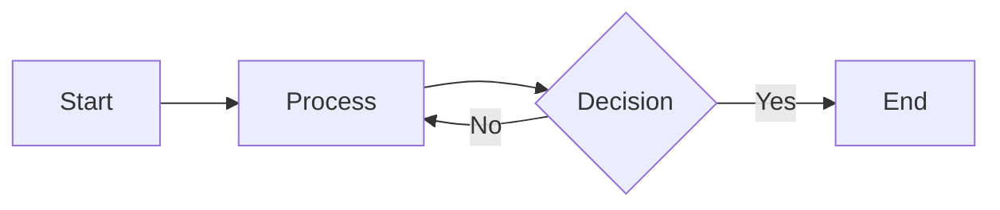
```

**יתרונות:**
- משתלב ב-Markdown
- נתמך ב-GitHub, GitLab, Notion
- קל לעדכון בקוד
- Version control friendly

### 2. PlantUML
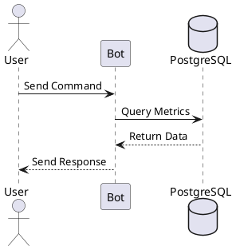

### 3. Draw.io / Diagrams.net
- ממשק גרפי
- ייצוא ל-PNG/SVG
- אינטגרציה עם Google Drive

### 4. Excalidraw
- סגנון "hand-drawn"
- מצוין לסקיצות מהירות
- שיתופי

## 📝 Best Practices לדיאגרמות

### 1. **פשטות**
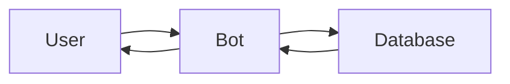

במקום:
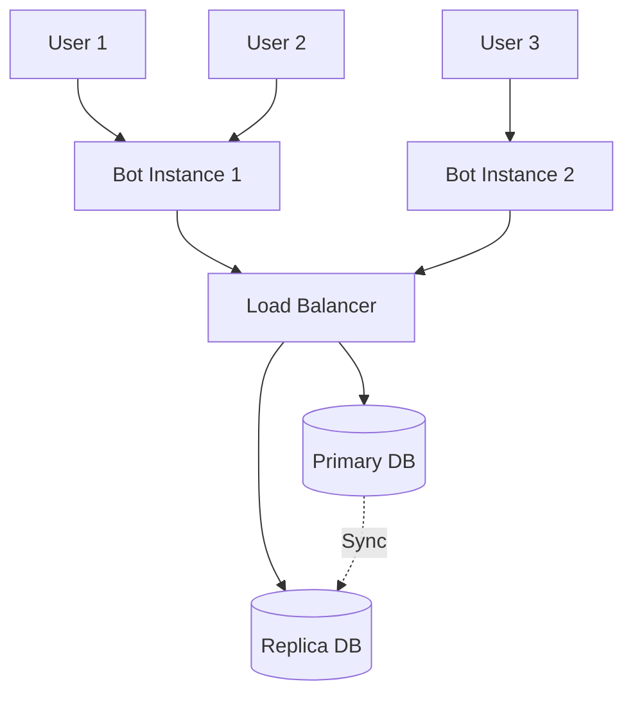

### 2. **עקביות בסימונים**
```mermaid
graph TD
    %% השתמש בסימונים עקביים
    A[Process] %% מלבן = תהליך
    B{Decision} %% מעוין = החלטה
    C[(Database)] %% גליל = מסד נתונים
    D((Event)) %% עיגול = אירוע
    E[/Input/] %% מקבילית = קלט/פלט
```

### 3. **צבעים משמעותיים**
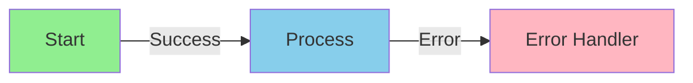

### 4. **תיוג ברור**
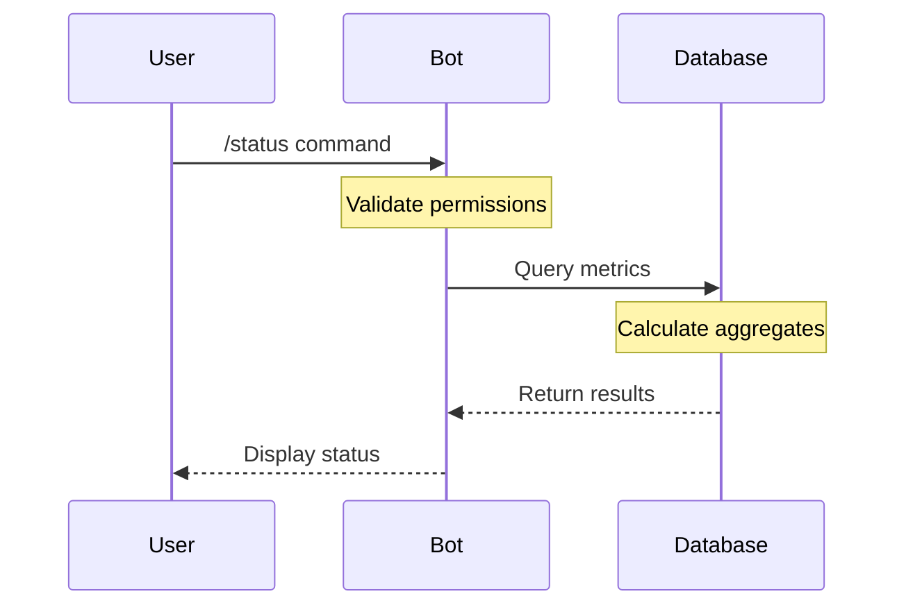

## 🎨 דוגמאות לדיאגרמות נפוצות

### State Diagram - מצבי המערכת
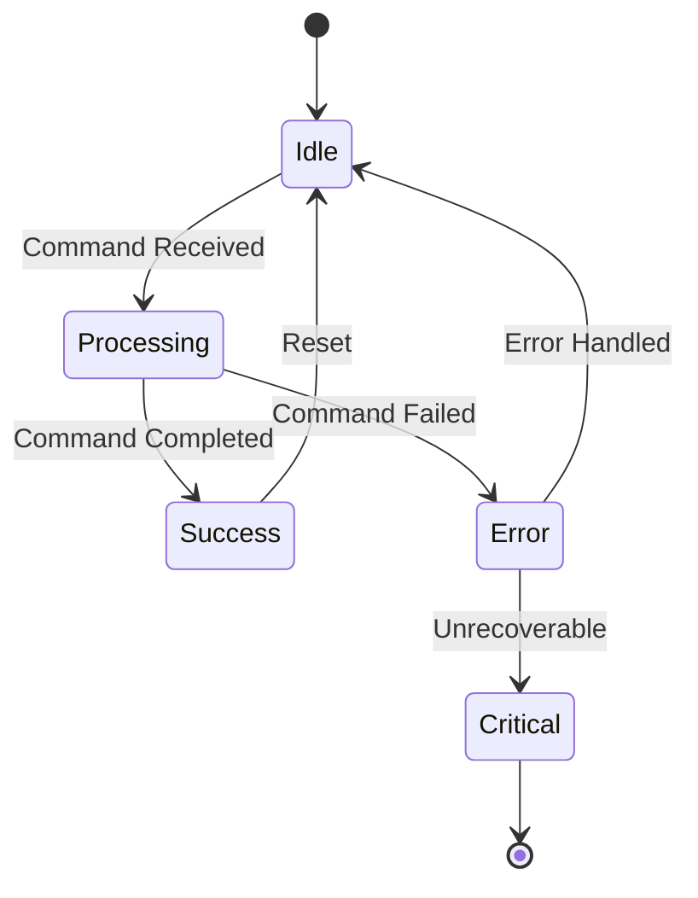

### Gantt Chart - תכנון זמנים
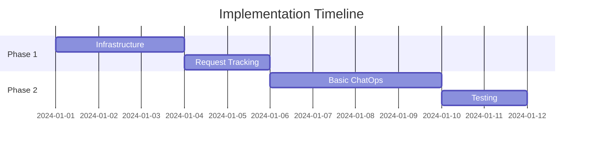

### Pie Chart - התפלגות
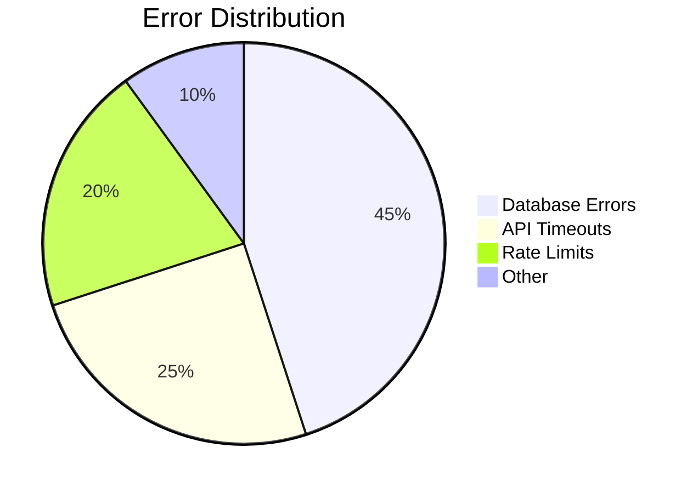

### Git Flow
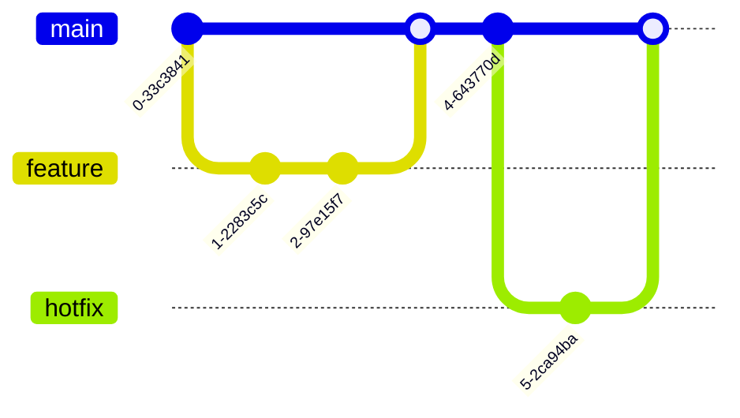

## 🚀 טיפים למימוש

### 1. **התחל בדיאגרמה פשוטה**
קודם צייר את ה-happy path, אחר כך הוסף edge cases.

### 2. **בדוק את הדיאגרמות**
העתק ל-[Mermaid Live Editor](https://mermaid.live) לבדיקה מהירה.

### 3. **שמור גרסאות**
```bash
docs/
├── diagrams/
│   ├── v1/
│   │   └── architecture.mmd
│   └── v2/
│       └── architecture.mmd
```

### 4. **הוסף הסברים**
```markdown
## System Architecture

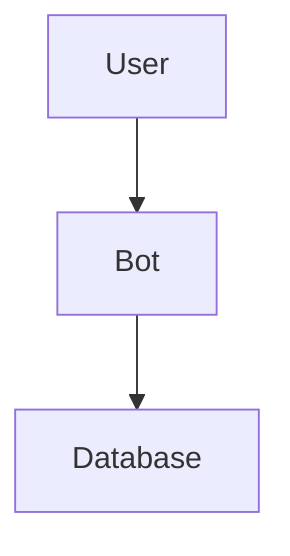

**הסבר:**
- **User**: המשתמש הסופי שמפעיל פקודות
- **Bot**: שרת הבוט שמעבד את הבקשות
- **Database**: PostgreSQL לשמירת מטריקות
```

## 📚 משאבים נוספים

### Mermaid
- [תיעוד רשמי](https://mermaid-js.github.io/mermaid/)
- [Live Editor](https://mermaid.live)
- [דוגמאות](https://github.com/mermaid-js/mermaid/tree/main/demos)

### PlantUML
- [תיעוד](https://plantuml.com/)
- [Online Server](http://www.plantuml.com/plantuml/)

### Draw.io
- [אפליקציה](https://app.diagrams.net/)
- [תבניות](https://www.diagrams.net/example-diagrams.html)

## 💡 דוגמה מלאה - מערכת ChatOps

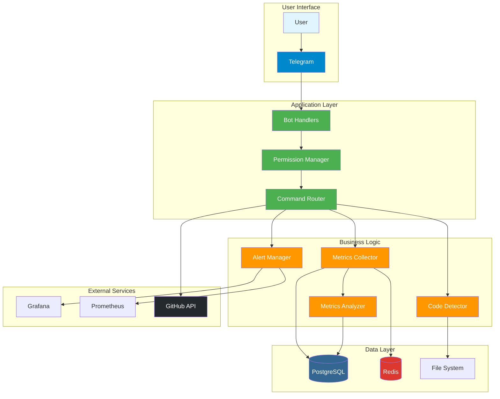

## ✅ Checklist לדיאגרמות טובות

- [ ] האם הדיאגרמה ברורה במבט ראשון?
- [ ] האם יש מקרא לסימונים?
- [ ] האם הכיוונים לוגיים? (למעלה→למטה, שמאל→ימין)
- [ ] האם הצבעים עקביים ומשמעותיים?
- [ ] האם התוויות ברורות וקצרות?
- [ ] האם אפשר להדפיס בשחור-לבן ועדיין להבין?
- [ ] האם הדיאגרמה מתאימה לקהל היעד?

---

**טיפ אחרון:** דיאגרמה טובה היא כזו שמסבירה את עצמה. אם צריך הסבר ארוך, כנראה שהדיאגרמה מסובכת מדי! 🎯