## 🎨 דיאגרמות ארכיטקטורה

### 1. זרימת פקודה בסיסית - Command Flow
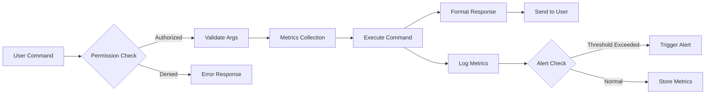

### 2. ארכיטקטורת המערכת הכללית - System Architecture
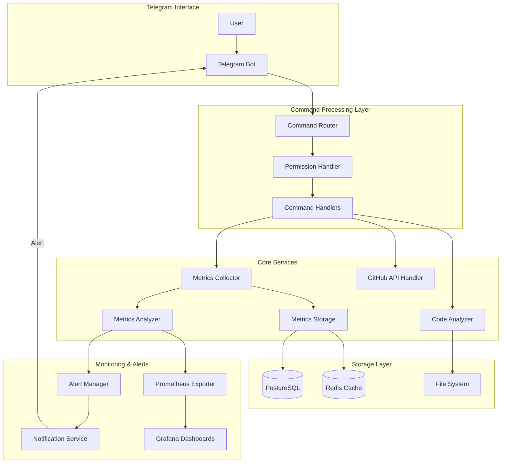

### 3. זרימת איסוף מטריקות - Metrics Collection Flow
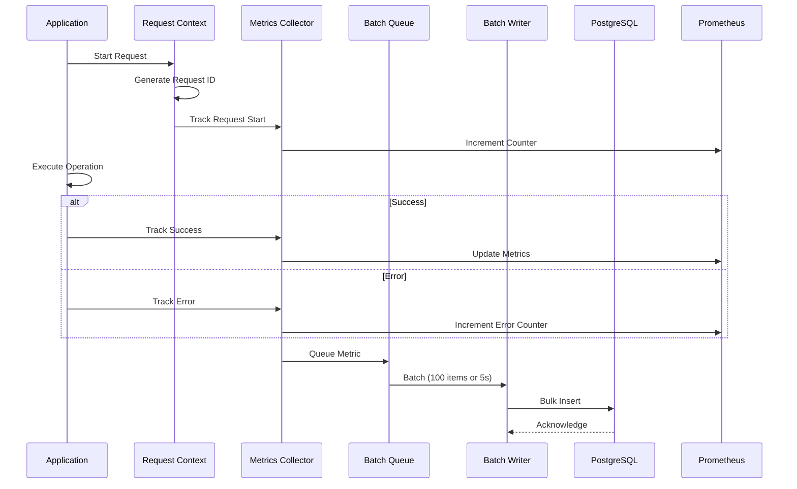

### 4. מערכת התראות חכמות - Smart Alert System
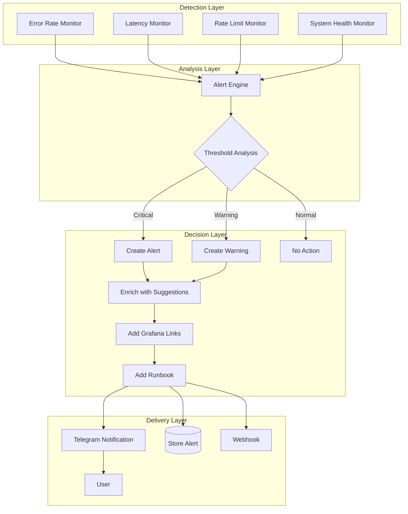

### 5. זיהוי כפילויות קוד - Duplicate Detection Pipeline
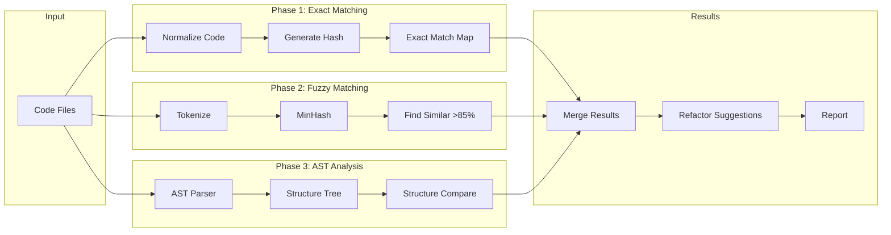

### 6. Triage Investigation Flow
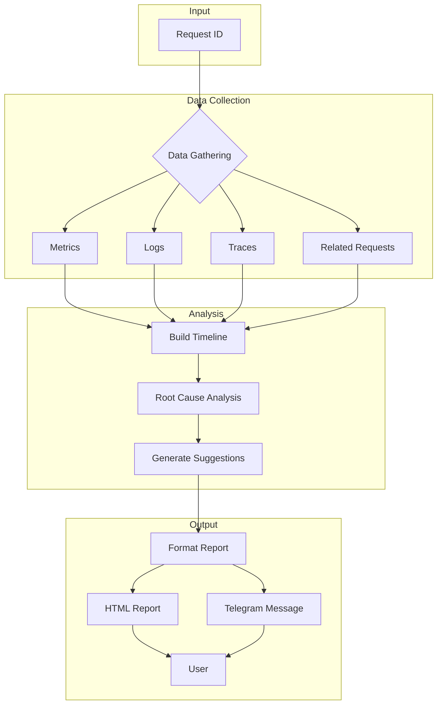

### 7. Database Schema Relationships
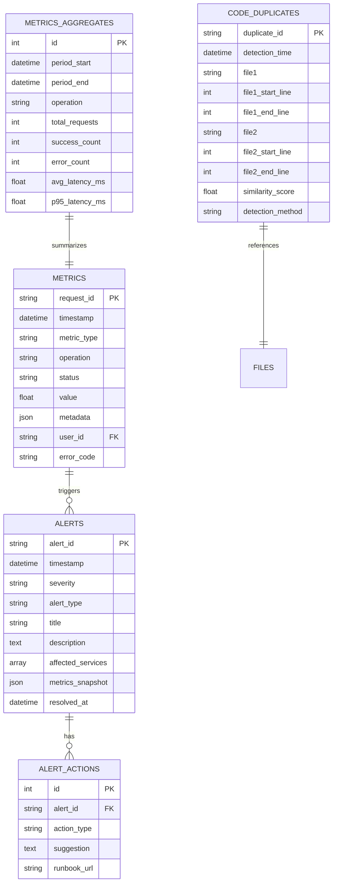

### 8. Command Handler Architecture
```mermaid
graph TB
    subgraph "Bot Interface"
        U[User Input] --> DP[Dispatcher]
    end
    
    subgraph "Command Handlers"
        DP --> SH[/status Handler]
        DP --> EH[/errors Handler]
        DP --> LH[/latency Handler]
        DP --> RH[/rate_limit Handler]
        DP --> TH[/triage Handler]
        DP --> DH[/dashboard Handler]
    end
    
    subgraph "Services Layer"
        SH --> HS[Health Service]
        EH --> MS[Metrics Service]
        LH --> MS
        RH --> GS[GitHub Service]
        TH --> IS[Investigation Service]
        DH --> AS[Aggregation Service]
    end
    
    subgraph "Data Layer"
        HS --> DB[(Database)]
        MS --> DB
        MS --> RC[(Redis)]
        GS --> GA[GitHub API]
        IS --> DB
        IS --> ES[Elastic/Logs]
        AS --> DB
    end
```

### 9. Performance Optimization Flow
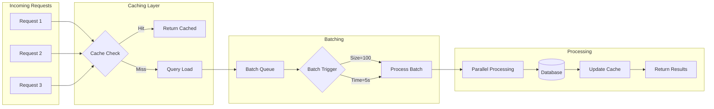

### 10. Rate Limiting and Backoff Strategy
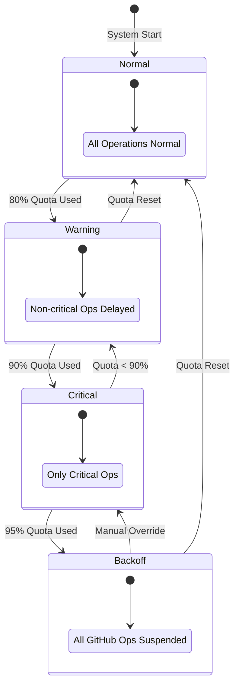

### 11. Real-time Dashboard Data Flow
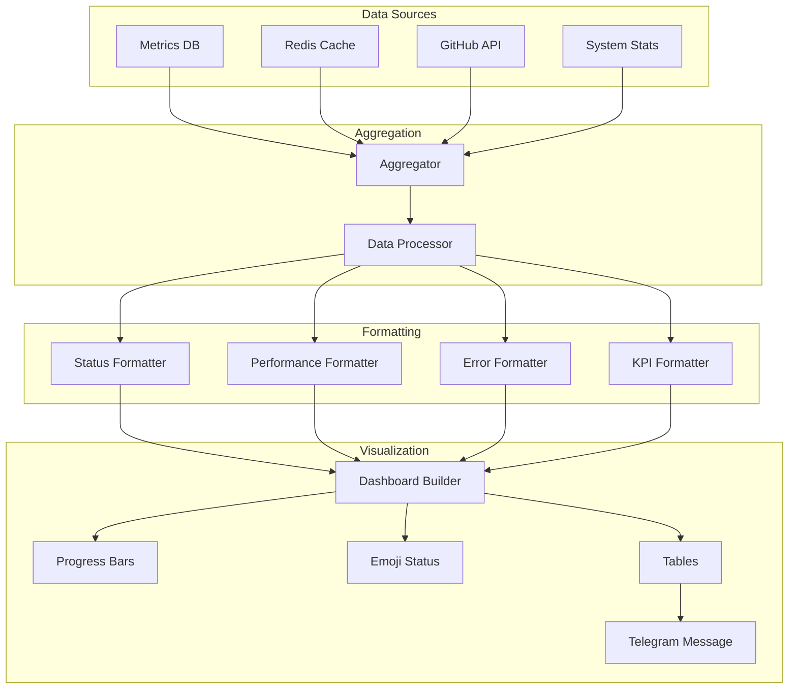

### 12. Error Handling and Recovery
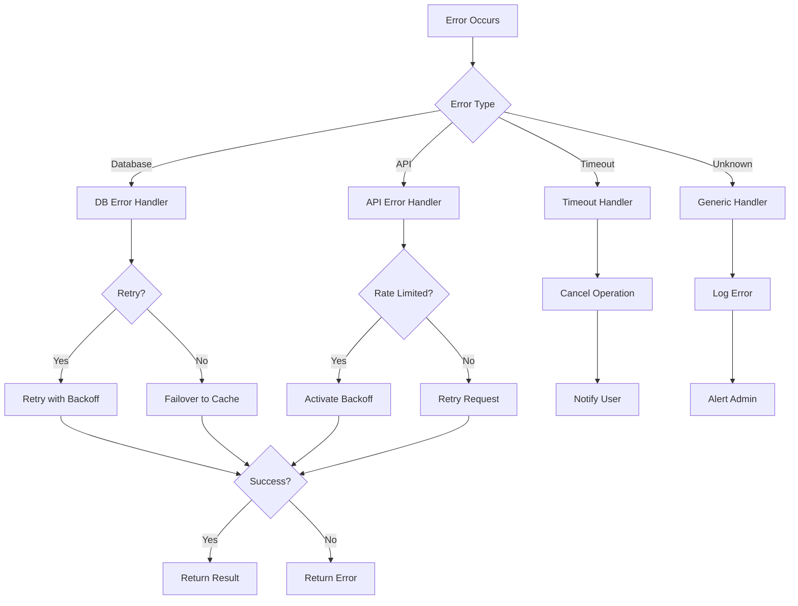

### 13. CI/CD Pipeline for Monitoring Features
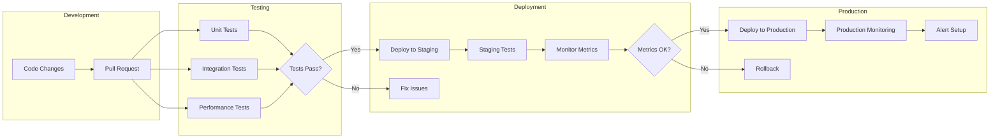
