# מדריך Mermaid בקבצי Markdown 📊

> **תיאור**: מדריך מלא להטמעת דיאגרמות Mermaid בקבצי Markdown בפרויקט Code Keeper Bot.
>
> התמיכה קיימת בשני הקשרים:
> 1. **Webapp** – תצוגת קבצי Markdown בדפדפן (`md_preview.html`)
> 2. **Sphinx/RTD** – תיעוד הפרויקט (`docs/`)

---

## תוכן עניינים

- [סקירה כללית](#סקירה-כללית)
- [Webapp – תצוגת Markdown](#webapp--תצוגת-markdown)
  - [סינטקס בסיסי](#סינטקס-בסיסי)
  - [איך זה עובד מאחורי הקלעים](#איך-זה-עובד-מאחורי-הקלעים)
  - [דיאגרמות נתמכות](#דיאגרמות-נתמכות)
  - [הגדרות אבטחה](#הגדרות-אבטחה)
- [Sphinx/RTD – תיעוד](#sphinxrtd--תיעוד)
  - [תלויות](#תלויות)
  - [סינטקס RST](#סינטקס-rst)
  - [סינטקס MyST (Markdown)](#סינטקס-myst-markdown)
- [דוגמאות מהפרויקט](#דוגמאות-מהפרויקט)
- [Best Practices](#best-practices)
- [פתרון בעיות](#פתרון-בעיות)

---

## סקירה כללית

[Mermaid](https://mermaid.js.org/) היא ספרייה ליצירת דיאגרמות מקוד טקסטואלי. הפרויקט תומך ב-Mermaid בשני הקשרים עיקריים:

| הקשר | טכנולוגיה | סינטקס |
|------|-----------|--------|
| Webapp (דפדפן) | `mermaid` JS library | ` ```mermaid` fenced block |
| Sphinx/RTD | `sphinxcontrib-mermaid` | `.. mermaid::` או MyST |

---

## Webapp – תצוגת Markdown

### סינטקס בסיסי

השתמש ב-fenced code block עם שפה `mermaid`:

````markdown
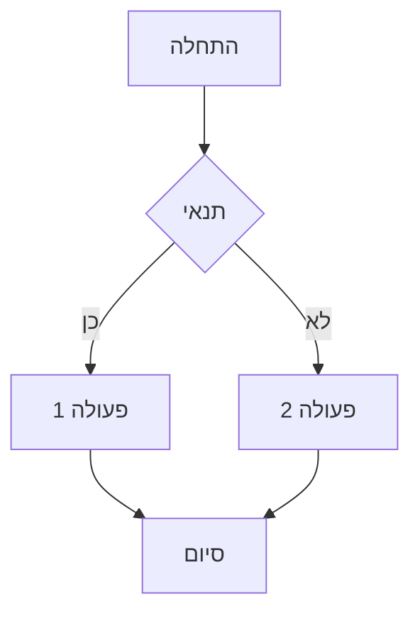
````

**תוצאה**: הדיאגרמה תרונדר אוטומטית כ-SVG בתצוגת Markdown.

### איך זה עובד מאחורי הקלעים

הרינדור מתבצע בצד הלקוח ב-`webapp/templates/md_preview.html`:

```javascript
// מתוך md_preview.html (שורות 2327-2346)
// Mermaid: רנדר דיאגרמות בקוד fence ```mermaid
try {
  if (!window.mermaid) throw new Error('mermaid missing');
  window.mermaid.initialize({ startOnLoad: false, securityLevel: 'strict' });
  const blocks = container.querySelectorAll('code.language-mermaid, pre code.language-mermaid');
  let i=0;
  for (const el of blocks) {
    const parent = el.closest('pre') || el.parentElement;
    const svgId = 'mmd_' + (++i);
    const code = el.textContent;
    const wrapper = document.createElement('div');
    parent.replaceWith(wrapper);
    try {
      const { svg } = await window.mermaid.render(svgId, code);
      wrapper.innerHTML = svg;
    } catch(e) {
      wrapper.innerHTML = '<div class="alert alert-warning">Mermaid render failed</div>';
    }
  }
} catch(_){ }
```

**תהליך**:
1. הספרייה נטענת מה-bundle (`webapp/static/js/md_preview.bundle.js`)
2. Mermaid מאותחל עם `securityLevel: 'strict'`
3. כל בלוקי קוד עם `language-mermaid` נסרקים
4. כל בלוק מומר ל-SVG עם מזהה ייחודי
5. אם הרינדור נכשל – מוצגת הודעת שגיאה

### דיאגרמות נתמכות

Mermaid תומך בסוגי דיאגרמות רבים:

#### 1. Flowchart (תרשים זרימה)

````markdown
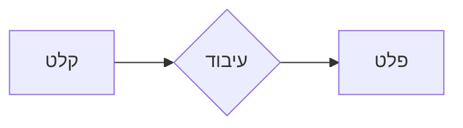
````

#### 2. Sequence Diagram (דיאגרמת רצף)

````markdown
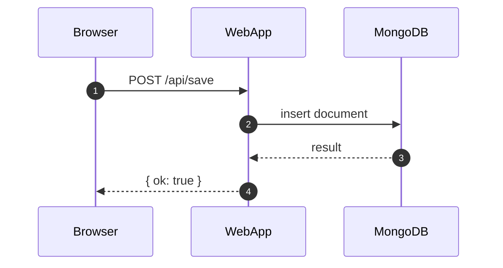
````

#### 3. Class Diagram (דיאגרמת מחלקות)

````markdown
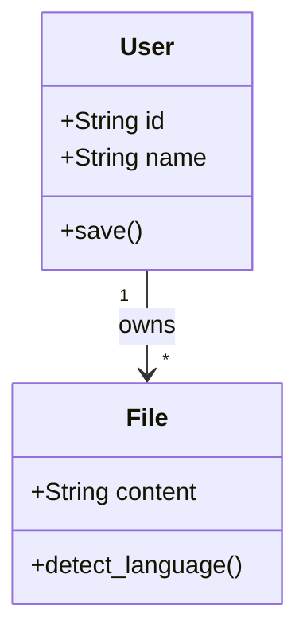
````

#### 4. State Diagram (דיאגרמת מצבים)

````markdown
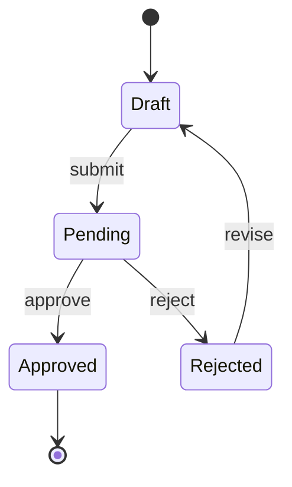
````

#### 5. Entity Relationship (ER)

````markdown
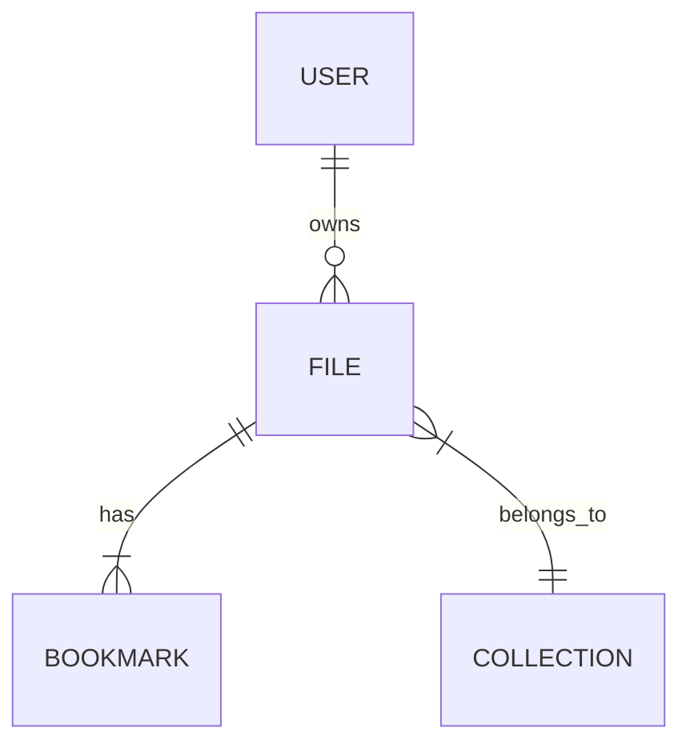
````

#### 6. Gantt Chart (גאנט)

````markdown
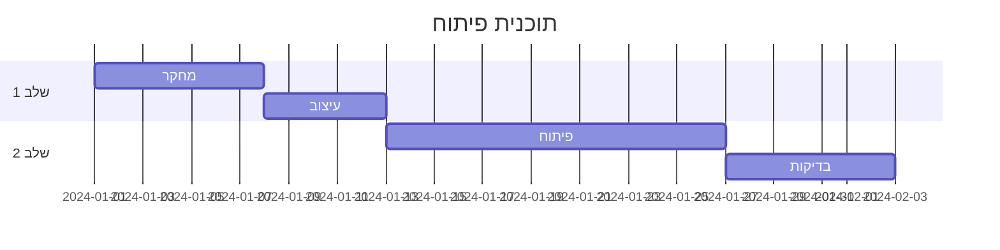
````

#### 7. Pie Chart (עוגה)

````markdown
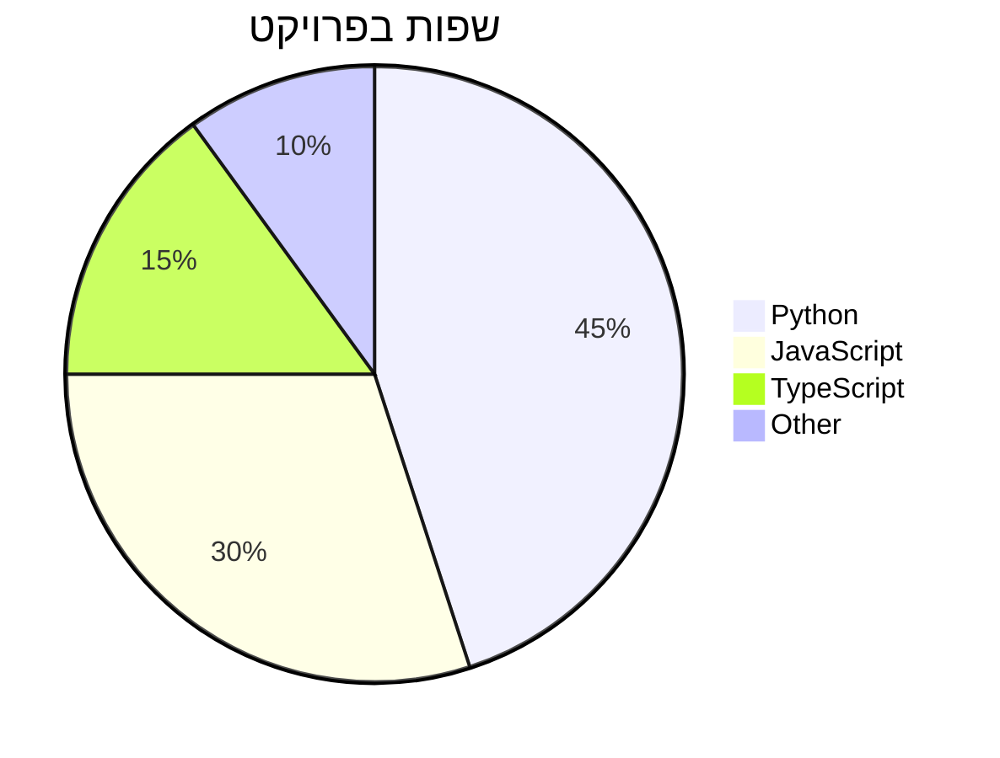
````

#### 8. Git Graph

````markdown
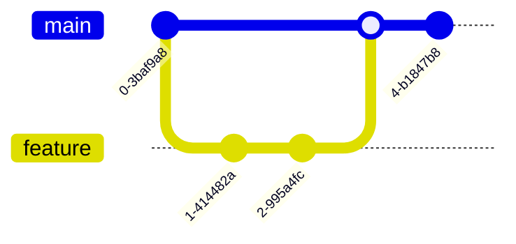
````

### הגדרות אבטחה

הפרויקט משתמש ב-`securityLevel: 'strict'` שמונע:
- הרצת JavaScript בתוך הדיאגרמה
- קישורים חיצוניים מסוכנים
- תגיות HTML זדוניות

זה חשוב כי קבצי Markdown יכולים להגיע מהמשתמשים.

---

## Sphinx/RTD – תיעוד

### תלויות

התמיכה מוגדרת ב-`docs/conf.py`:

```python
extensions = [
    # ...
    'sphinxcontrib.mermaid',  # תמיכה ב-Mermaid
    'myst_parser',            # תמיכה ב-Markdown
]
```

גרסאות (`docs/requirements.txt`):
```
sphinxcontrib-mermaid==1.0.0
myst-parser==4.0.1
```

### סינטקס RST

בקבצי `.rst` השתמש ב-directive:

```rst
.. mermaid::

   sequenceDiagram
       participant User
       participant Bot
       User->>Bot: /save
       Bot-->>User: ✅ נשמר
```

**עם אפשרויות**:

```rst
.. mermaid::
   :caption: זרימת שמירה
   :align: center

   graph TD
       A --> B --> C
```

### סינטקס MyST (Markdown)

בקבצי `.md` תחת `docs/` (למשל `docs/chatops/*.md`):

**אפשרות 1 – Fenced block עם directive**:

````markdown
```{mermaid}
sequenceDiagram
    A->>B: Hello
    B-->>A: Hi!
```
````

**אפשרות 2 – Colon fence** (מופעל ב-`conf.py`):

```markdown
:::{mermaid}
graph LR
    A --> B
:::
```

> **הערה**: הגדרת `myst_enable_extensions = ['colon_fence', ...]` ב-`conf.py` מאפשרת את הסינטקס עם `:::`.

---

## דוגמאות מהפרויקט

### דוגמה 1: Sequence Diagram מ-`docs/sequence_diagrams.md`

```markdown
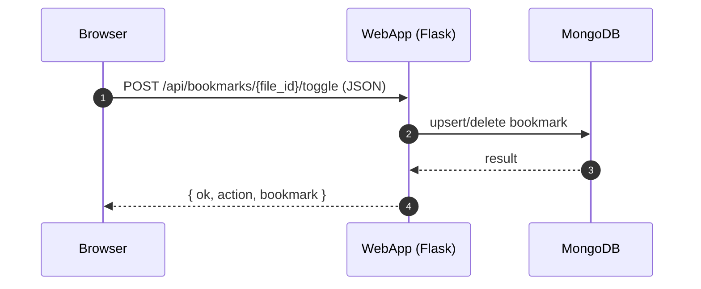
```

### דוגמה 2: Architecture מ-`docs/architecture.rst`

```rst
.. mermaid::

   graph TD
       subgraph "Frontend"
           TG[Telegram Bot]
           WA[Web Application]
       end
       subgraph "Backend"
           PY[Python Services]
           MDB[(MongoDB)]
           RD[(Redis Cache)]
       end
       TG --> PY
       WA --> PY
       PY --> MDB
       PY --> RD
```

### דוגמה 3: Workflow מ-`docs/workflows/save-flow.rst`

```rst
.. mermaid::

   sequenceDiagram
       participant U as User
       participant B as Bot
       participant S as SaveService
       participant DB as MongoDB

       U->>B: שליחת קוד/קובץ
       B->>S: handle_save()
       S->>S: detect_language()
       S->>DB: insert(file_doc)
       DB-->>S: ObjectId
       S-->>B: success
       B-->>U: ✅ נשמר בהצלחה
```

---

## Best Practices

### 1. שמור על פשטות

❌ **לא מומלץ** – דיאגרמה צפופה מדי:
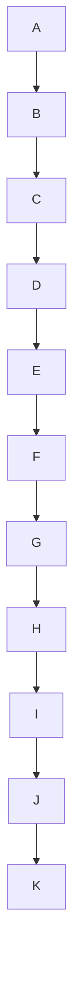

✅ **מומלץ** – חלק לתת-דיאגרמות:
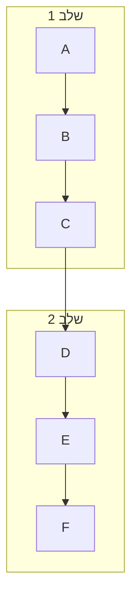

### 2. השתמש ב-autonumber לרצפים

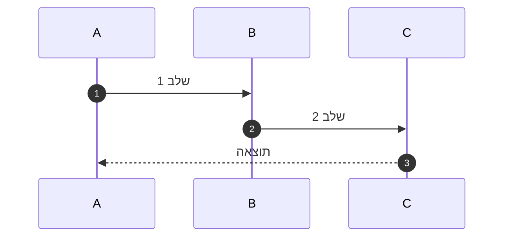

### 3. הוסף aliases לשחקנים

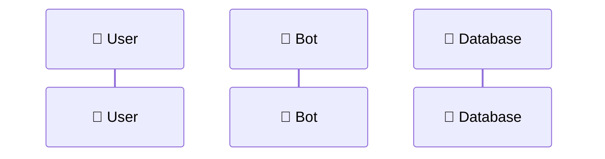

### 4. בדוק תקינות לפני commit

השתמש ב-[Mermaid Live Editor](https://mermaid.live/) לבדיקת הדיאגרמה.

### 5. טיפול ב-RTL

Mermaid תומך בטקסט עברי, אבל כיוון הדיאגרמה עצמה נשאר LTR.
לתיאורים בעברית – השתמש ב-`graph RL` במקום `graph LR`:

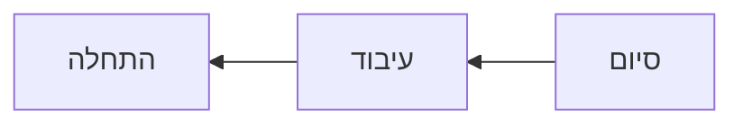

---

## פתרון בעיות

### 1. "Mermaid render failed"

**בעיה**: הדיאגרמה לא מתרנדרת ומוצגת הודעת שגיאה.

**פתרונות**:
- בדוק סינטקס ב-[Mermaid Live Editor](https://mermaid.live/)
- ודא שאין תווים מיוחדים לא נתמכים
- הסר רווחים/טאבים מיותרים

### 2. הדיאגרמה מוצגת כקוד

**בעיה**: במקום SVG רואים את הטקסט הגולמי.

**פתרונות**:
- ודא שהשפה היא בדיוק `mermaid` (לא `Mermaid` או `MERMAID`)
- רענן את הדף (Ctrl+Shift+R)
- בדוק שה-bundle נטען (בדוק Console בדפדפן)

### 3. בעיות ב-Sphinx build

**בעיה**: `sphinxcontrib.mermaid` לא נמצא.

**פתרון**:
```bash
pip install -r docs/requirements.txt
```

**בעיה**: "Unknown directive type 'mermaid'" בקובץ `.md`.

**פתרון**: ודא שהסינטקס הוא `{mermaid}` ולא `mermaid`:

````markdown
```{mermaid}
graph TD
    A --> B
```
````

### 4. הדיאגרמה חתוכה

**בעיה**: חלק מהדיאגרמה לא נראה.

**פתרון**: הוסף padding או הקטן את הדיאגרמה:

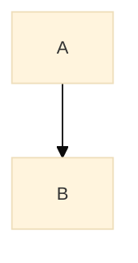

---

## קבצים רלוונטיים בפרויקט

| קובץ | תיאור |
|------|-------|
| `webapp/templates/md_preview.html` | רינדור Mermaid בצד לקוח |
| `webapp/static_build/md-preview-entry.js` | ייבוא ספריית Mermaid |
| `docs/conf.py` | הגדרת `sphinxcontrib.mermaid` |
| `docs/requirements.txt` | גרסאות תלויות |
| `docs/sequence_diagrams.md` | דוגמאות לדיאגרמות |
| `docs/architecture.rst` | דיאגרמות ארכיטקטורה |

---

## קישורים שימושיים

- [Mermaid Official Docs](https://mermaid.js.org/intro/)
- [Mermaid Live Editor](https://mermaid.live/)
- [sphinxcontrib-mermaid](https://sphinxcontrib-mermaid-demo.readthedocs.io/)
- [MyST Parser](https://myst-parser.readthedocs.io/)
- [תיעוד הפרויקט](https://amirbiron.github.io/CodeBot/)
