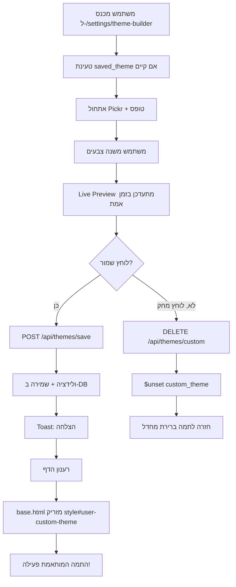

# Theme Builder – מדריך התחלה מהירה

> **זמן הערכה:** 4-6 שעות פיתוח  
> **רמת קושי:** בינונית  
> **דרישות מוקדמות:** היכרות עם Flask, MongoDB, JavaScript, CSS Variables

---

## מה כבר קיים? ✅

הפרויקט כבר כולל את התשתית הבסיסית:

### 1. מערכת טוקנים מלאה
- **מיקום:** `webapp/templates/base.html` (בתוך `<style>`)
- **תמות:** 8 ערכות (classic, ocean, forest, dark, dim, nebula, rose-pine-dawn, high-contrast)
- **טוקנים:** כל הטוקנים שה-Theme Builder צריך כבר מוגדרים

### 2. API להעדפות משתמש
- **Endpoint:** `/api/ui_prefs` (POST)
- **תומך ב:** `theme`, `font_scale`, `editor`, `work_state`
- **מיקום:** `webapp/app.py` (שורה ~9113)

### 3. תיעוד מפורט
- **קובץ:** `docs/webapp/theming_and_css.rst`
- **תוכן:** ארכיטקטורת טוקנים, שכבות, הנחיות למפתחים

### 4. דף הגדרות
- **נתיב:** `/settings`
- **תכונות:** בחירת תמה קיימת, גודל גופן, חיבור קבוע

---

## מה צריך להוסיף? 🆕

### שלב 1: Backend (2-3 שעות)

#### 1.1 נתיב חדש לדף Builder

**קובץ:** `webapp/app.py`

```python
@app.route('/settings/theme-builder')
@login_required
def theme_builder():
    """דף Theme Builder"""
    user_id = session['user_id']
    db = get_db()
    user_doc = db.users.find_one({"user_id": user_id}, {"custom_theme": 1})
    saved_theme = user_doc.get("custom_theme") if user_doc else None
    
    return render_template(
        'settings/theme_builder.html',
        saved_theme=saved_theme,
        static_version=_STATIC_VERSION
    )
```

#### 1.2 API לשמירת Theme

**קובץ:** `webapp/app.py`

```python
VALID_COLOR_REGEX = r'^(#[0-9a-fA-F]{6}|rgba?\(.+\))$'
MAX_THEME_NAME_LENGTH = 50

@app.route('/api/themes/save', methods=['POST'])
@login_required
def save_custom_theme():
    """שמירת Theme מותאם"""
    # ראה קוד מלא במדריך הראשי
    pass
```

#### 1.3 API למחיקת Theme

**קובץ:** `webapp/app.py`

```python
@app.route('/api/themes/custom', methods=['DELETE'])
@login_required
def delete_custom_theme():
    """מחיקת Theme מותאם"""
    db = get_db()
    user_id = session['user_id']
    
    db.users.update_one(
        {"user_id": user_id},
        {
            "$unset": {"custom_theme": ""},
            "$set": {"ui_prefs.theme": "classic"}
        }
    )
    
    return jsonify({"ok": True})
```

#### 1.4 הוספת "custom" לתמות מותרות

**קובץ:** `webapp/app.py` (בתחילת הקובץ)

```python
ALLOWED_UI_THEMES = {
    "classic", "ocean", "forest", "high-contrast", 
    "dark", "dim", "rose-pine-dawn", "nebula",
    "custom"  # ← הוסף
}
```

#### 1.5 Context Processor ל-DB

**קובץ:** `webapp/app.py`

```python
@app.context_processor
def inject_db():
    """הזרקת db לכל התבניות"""
    return dict(db=get_db())
```

---

### שלב 2: Frontend (2-3 שעות)

#### 2.1 יצירת תבנית Theme Builder

**קובץ חדש:** `webapp/templates/settings/theme_builder.html`

תבנית מלאה עם:
- פאנל Controls (שמאל): טפסים, Pickr, סליידרים
- פאנל Preview (ימין): דוגמאות חיות (Navbar, Card, Button, Code)
- JavaScript: אתחול Pickr, עדכון Live Preview, שמירה/מחיקה

**ראה הקוד המלא במדריך הראשי.**

#### 2.2 הזרקת custom_theme ב-base.html

**קובץ:** `webapp/templates/base.html`

הוסף בתוך `<head>`, אחרי הגדרת הטוקנים:

```html
<!-- Custom User Theme -->



<style id="user-custom-theme">
    :root[data-theme="custom"] {
        
        {{ token }}: {{ value }};
        
    }
</style>
<script>
    (function() {
        try {
            document.documentElement.setAttribute('data-theme', 'custom');
            localStorage.setItem('dark_mode_preference', 'custom');
        } catch(_) {}
    })();
</script>


```

#### 2.3 הוספת לינק בדף ההגדרות

**קובץ:** `webapp/templates/settings.html`

הוסף קטע חדש:

```html
<div class="glass-card">
  <h2 class="section-title">
    <i class="fas fa-palette"></i>
    בונה ערכות נושא
  </h2>
  <div class="glass-card" style="background: rgba(255, 255, 255, 0.05)">
    <div style="display: flex; align-items: center; justify-content: space-between; gap: 1rem;">
      <div style="display: flex; align-items: center; gap: 1rem;">
        <i class="fas fa-paint-brush" style="font-size: 1.5rem;"></i>
        <div>
          <div style="font-weight: 600;">יצירת תמה מותאמת אישית</div>
          <div style="opacity: 0.8; font-size: 0.95rem;">
            בנה ערכת צבעים ייחודית עם בקרה מלאה
          </div>
        </div>
      </div>
      <a href="/settings/theme-builder" class="btn btn-primary btn-icon">
        <i class="fas fa-arrow-left"></i>
        פתח את הבונה
      </a>
    </div>
  </div>
</div>
```

---

## מבנה המסמך ב-MongoDB

```json
{
  "user_id": 123,
  "ui_prefs": {
    "theme": "custom",
    "font_scale": 1.0
  },
  "custom_theme": {
    "name": "My Dark Theme",
    "description": "תמה כהה עם סגול",
    "is_active": true,
    "updated_at": "2024-12-12T10:00:00Z",
    "variables": {
      "--bg-primary": "#1a1a2e",
      "--bg-secondary": "#16213e",
      "--card-bg": "rgba(255,255,255,0.08)",
      "--primary": "#667eea",
      "--secondary": "#764ba2",
      "--text-primary": "#f5f5f5",
      "--text-secondary": "rgba(255,255,255,0.8)",
      "--glass": "rgba(255,255,255,0.1)",
      "--glass-border": "rgba(255,255,255,0.2)",
      "--glass-hover": "rgba(255,255,255,0.15)",
      "--glass-blur": "20px",
      "--md-surface": "#1b1e24",
      "--md-text": "#f0f0f0"
    }
  }
}
```

---

## זרימת עבודה



---

## טיפים לפיתוח

### 1. התחל עם Backend
- צור את ה-endpoints קודם
- בדוק עם `curl` או Postman
- וודא שהולידציה עובדת

### 2. בנה את ה-UI בשלבים
- התחל עם HTML סטטי
- הוסף Pickr לשדה אחד
- הרחב לכל השדות
- הוסף Live Preview בסוף

### 3. דבאג עם Console
```javascript
console.log('Saving theme:', data);
console.log('Pickr color:', pickers.primary.getColor().toRGBA().toString());
```

### 4. בדיקות מקומיות
- פתח DevTools → Elements → Inspect `#livePreview`
- ראה ש-`style="--bg-primary: #xxx"` מתעדכן
- בדוק ב-Network שה-POST/DELETE עובדים

---

## בדיקות חובה

### פונקציונליות
- [ ] דף Builder נטען
- [ ] Pickr פותח ובוחר צבעים
- [ ] Live Preview מתעדכן מיד
- [ ] שמירה מצליחה
- [ ] מחיקה מצליחה
- [ ] רענון מציג את התמה החדשה

### נגישות
- [ ] ניגודיות ≥ 4.5:1
- [ ] Labels + aria-describedby
- [ ] Tab navigation
- [ ] Toast עם role="alert"

### תאימות דפדפנים
- [ ] Chrome/Edge
- [ ] Firefox
- [ ] Safari
- [ ] Mobile (iOS/Android)

---

## שאלות נפוצות

**ש: כמה זמן ייקח לפתח?**  
ת: 4-6 שעות לפיתוח מלא, עוד 2-3 שעות לבדיקות.

**ש: האם צריך לדעת CSS Variables?**  
ת: כן, אבל המדריך מסביר הכל.

**ש: מה אם אני תקוע?**  
ת: ראה את המדריך המלא (`THEME_BUILDER_IMPLEMENTATION_GUIDE.md`) או פנה לצוות.

---

## משאבים נוספים

- **מדריך מלא:** `/workspace/GUIDES/THEME_BUILDER_IMPLEMENTATION_GUIDE.md`
- **תיעוד טוכנים:** `docs/webapp/theming_and_css.rst`
- **Pickr Docs:** https://github.com/Simonwep/pickr
- **Issue #2097:** הספציפיקציה המלאה

---

**בהצלחה! 🎨**
