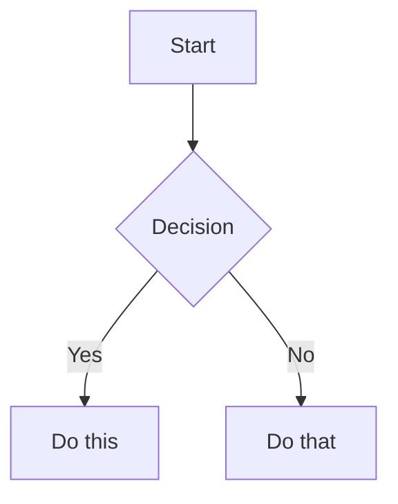

# 📝 תמיכת Markdown מתקדמת ב-Code Keeper WebApp

## 🎯 סקירה כללית

ה-WebApp של Code Keeper Bot כולל כעת תמיכה מלאה ומתקדמת בתצוגת Markdown, הכוללת את כל התכונות של GitHub Flavored Markdown (GFM) ועוד!

## ✨ תכונות עיקריות

### 1. **Markdown סטנדרטי** ✅
- כותרות (H1-H6)
- טקסט מודגש (**bold**), נטוי (*italic*), ~~מחוק~~
- רשימות ממוספרות ולא ממוספרות
- ציטוטים (blockquotes)
- קישורים ותמונות
- קוד inline ובלוקי קוד

### 2. **Task Lists אינטראקטיביות** ✅
```markdown
- [ ] משימה לביצוע
- [x] משימה שהושלמה
```
- Checkboxes אינטראקטיביים - ניתן לסמן/לבטל סימון
- שמירת מצב ב-localStorage
- עדכון אוטומטי של הטקסט בעורך

### 3. **GitHub Flavored Markdown (GFM)** ✅
- טבלאות עם יישור מותאם
- Strikethrough (~~טקסט מחוק~~)
- Autolinks - המרה אוטומטית של URLs לקישורים
- Emoji shortcuts (:smile: → 😄)

### 4. **נוסחאות מתמטיות (KaTeX)** ✅
- Inline math: `$E = mc^2$`
- Display math: `$$\int_{-\infty}^{\infty} e^{-x^2} dx = \sqrt{\pi}$$`
- תמיכה מלאה ב-LaTeX syntax

### 5. **תרשימי Mermaid** ✅

- תרשימי זרימה (flowcharts)
- תרשימי רצף (sequence diagrams)
- תרשימי עוגה ועוד

### 6. **הדגשת תחביר (Prism.js)** ✅
- תמיכה בעשרות שפות תכנות
- הדגשה אוטומטית לפי סוג השפה
- ערכות נושא מותאמות

## 🚀 שיפורי ביצועים

### Debouncing
- עדכון תצוגה מקדימה עם השהיה של 500ms
- מניעת עיבוד מיותר בזמן הקלדה

### Lazy Loading
- טעינת תמונות רק כשהן נכנסות לתצוגה
- שיפור משמעותי בזמני טעינה

### Virtual Scrolling
- תמיכה בקבצים גדולים (1000+ שורות)
- ביצועים אופטימליים גם בקבצים כבדים

## 🎨 ממשק משתמש

### תצוגת קובץ
- **כפתור 🌐** - תצוגת דפדפן מעוצבת לקבצי .md
- מעבר מהיר בין תצוגה מעוצבת לקוד מקור
- תוכן עניינים אוטומטי עם גלילה חכמה

### עורך קוד
- תצוגה מפוצלת: עורך + תצוגה מקדימה
- מצבי תצוגה: עורך בלבד / תצוגה מקדימה בלבד / מפוצל
- מצב מסך מלא לעריכה נוחה
- עדכון תצוגה מקדימה בזמן אמת

## ⚙️ קונפיגורציה

```python
{
    'breaks': True,        # הפיכת שורות חדשות ל-<br>
    'linkify': True,       # URLs הופכים ללינקים אוטומטיים
    'typographer': True,   # טיפוגרפיה חכמה (מירכאות, מקפים)
    'html': False,         # חסימת HTML גולמי לאבטחה
    'highlight': True,     # הדגשת תחביר בבלוקי קוד
    'mermaid': True,       # תמיכה בתרשימי Mermaid
    'math': True,          # תמיכה בנוסחאות מתמטיות
    'task_lists': True,    # תמיכה ב-Task Lists
    'emoji': True,         # תמיכה ב-emoji shortcuts
}
```

## 📱 תאימות

- ✅ דפדפנים מודרניים (Chrome, Firefox, Safari, Edge)
- ✅ מובייל (iOS, Android)
- ✅ Telegram Mini App
- ✅ PWA Ready

## 🔧 API Endpoints

### `/api/render_markdown` (POST)
עיבוד Markdown בזמן אמת:
```json
{
    "text": "# Your Markdown Here"
}
```

Response:
```json
{
    "html": "<h1>Your Markdown Here</h1>",
    "has_math": false,
    "has_mermaid": false,
    "has_tasks": false,
    "error": null
}
```

## 📦 תלויות

```txt
markdown-it-py==3.0.0     # מעבד Markdown מתקדם
mdit-py-plugins==0.4.0    # תוספים ל-markdown-it
python-markdown==3.5.1    # Fallback processor
bleach==6.1.0            # ניקוי HTML לאבטחה
```

### CDN Dependencies
- KaTeX 0.16.9 - נוסחאות מתמטיות
- Prism.js 1.29.0 - הדגשת תחביר
- Mermaid 10.6.1 - תרשימים

## ⌨️ קיצורי מקלדת

| קיצור | פעולה |
|--------|--------|
| `Ctrl+M` | החלפה בין תצוגה מעוצבת לקוד מקור |
| `Ctrl+S` | שמירת קובץ (בעורך) |
| `Ctrl+Shift+P` | החלפת מצב תצוגה בעורך |
| `F11` | מסך מלא |
| `Escape` | יציאה ממסך מלא / חזרה |
| `Ctrl+C` | העתקת קוד |
| `Ctrl+E` | עריכת קובץ |
| `Ctrl+D` | הורדת קובץ |

## 🔒 אבטחה

- חסימת HTML גולמי למניעת XSS
- ניקוי תוכן עם Bleach
- Content Security Policy בתצוגת iframe
- Sandboxing לתוכן לא מהימן

## 📈 שימוש לדוגמה

### יצירת קובץ Markdown
1. העלה קובץ חדש עם סיומת `.md`
2. השתמש בעורך עם תצוגה מקדימה בזמן אמת
3. שמור ותהנה מתצוגה מעוצבת

### עריכת קובץ קיים
1. לחץ על "ערוך" בקובץ Markdown
2. העורך יזהה אוטומטית ויציג תצוגה מקדימה
3. ערוך עם עדכון מיידי של התצוגה

### תצוגת דפדפן
1. לחץ על כפתור 🌐 "תצוגת דפדפן"
2. הקובץ יוצג כ-HTML מעוצב
3. כולל את כל התכונות המתקדמות

## 🎉 דוגמה חיה

ניתן לראות דוגמה מלאה בקובץ `/webapp/static/markdown_demo.md` שמדגים את כל היכולות.

## 📝 הערות

- התכונה זמינה אוטומטית לכל קבצי `.md` ו-`.markdown`
- ניתן לשנות שפה ל-`markdown` בכל קובץ לקבלת התכונות
- Task lists נשמרות locally בדפדפן
- תרשימי Mermaid מעובדים בצד הלקוח

## 🚧 תכונות עתידיות

- [ ] תמיכה ב-PlantUML
- [ ] ייצוא ל-PDF
- [ ] תבניות Markdown מוכנות
- [ ] סנכרון Task lists עם השרת
- [ ] תמיכה ב-footnotes
- [ ] תמיכה ב-definition lists
- [ ] Markdown extensions נוספות

---

**נוצר עם ❤️ על ידי Code Keeper Bot**