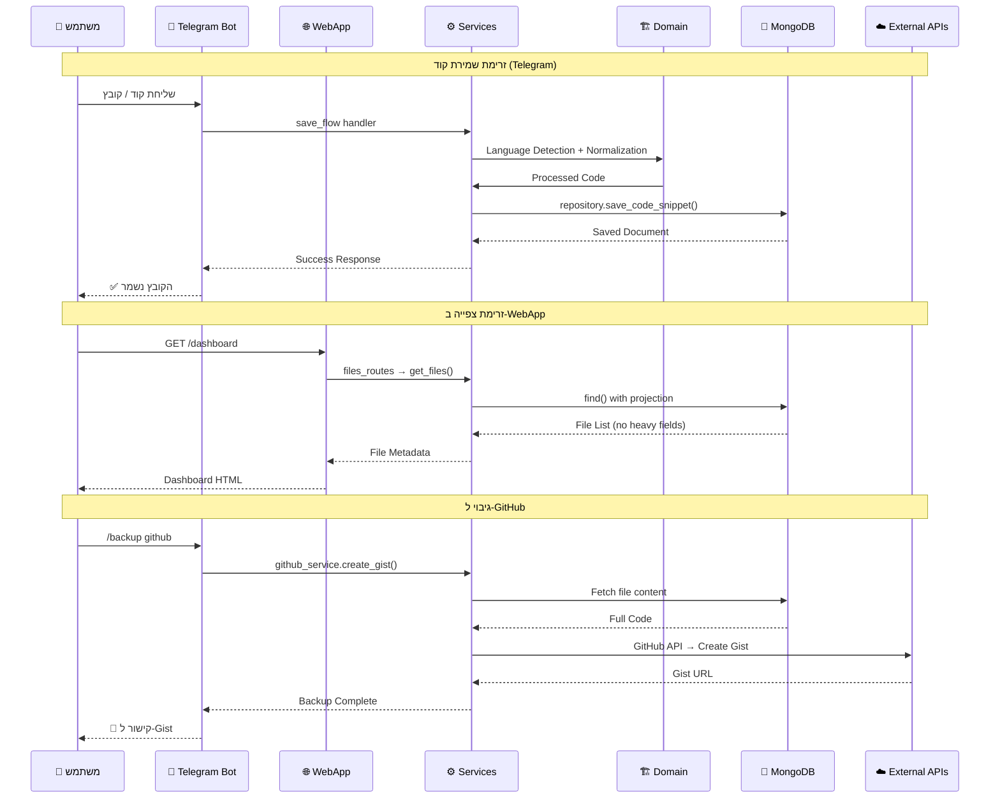
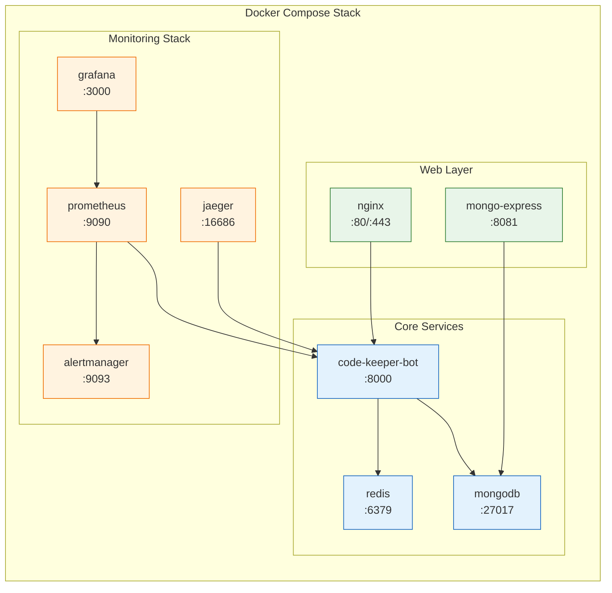

# System Overview – CodeBot

## תרשים ארכיטקטורה כללי

```mermaid
graph TB
    subgraph Clients["👤 לקוחות"]
        TG["Telegram Client"]
        Browser["Web Browser"]
    end

    subgraph TelegramBot["🤖 Telegram Bot Layer"]
        Main["main.py<br/>Entry Point"]
        Handlers["handlers/<br/>Conversation Flows"]
        ConvHandlers["conversation_handlers.py<br/>Multi-step Interactions"]
        BotHandlers["bot_handlers.py<br/>Command Handlers"]
    end

    subgraph WebApp["🌐 Flask WebApp"]
        FlaskApp["webapp/app.py<br/>Flask Application"]

        subgraph Routes["Routes"]
            AuthRoutes["auth_routes.py"]
            DashRoutes["dashboard_routes.py"]
            FilesRoutes["files_routes.py"]
            RepoRoutes["repo_browser.py"]
            SettingsRoutes["settings_routes.py"]
        end

        subgraph APIs["REST APIs"]
            CollAPI["collections_api.py"]
            BookAPI["bookmarks_api.py"]
            BackupAPI["backup_api.py"]
            CodeToolsAPI["code_tools_api.py"]
            ThemesAPI["themes_api.py"]
            SnippetAPI["snippet_library_api.py"]
            CommunityAPI["community_library_api.py"]
        end

        Templates["Jinja2 Templates"]
    end

    subgraph Services["⚙️ Services Layer"]
        subgraph CoreServices["שירותי ליבה"]
            AIExplain["ai_explain_service"]
            CodeFormat["code_formatter_service"]
            CodeExec["code_execution_service"]
            Embedding["embedding_service"]
        end

        subgraph IntegrationServices["שירותי אינטגרציה"]
            GitHubSvc["github_service"]
            GDriveSvc["google_drive_service"]
            RepoSync["repo_sync_service"]
            GitMirror["git_mirror_service"]
        end

        subgraph SearchServices["חיפוש וניתוח"]
            RepoSearch["repo_search_service"]
            CodeIndexer["code_indexer"]
            QueryProfiler["query_profiler_service"]
        end

        subgraph BackupServices["גיבוי ויצוא"]
            BackupSvc["backup_service"]
            PersonalBackup["personal_backup_service"]
        end
    end

    subgraph Domain["🏗️ Domain Layer – src/"]
        Entities["domain/entities/<br/>Snippet, CodeSnippet"]
        DomainSvc["domain/services/<br/>CodeNormalizer, LanguageDetector"]
        Interfaces["domain/interfaces/<br/>Repository Contracts"]
        AppSvc["application/services/<br/>SnippetService"]
        DTOs["application/dto/<br/>Data Transfer Objects"]
    end

    subgraph DataLayer["💾 Database Layer"]
        Repo["database/repository.py<br/>MongoDB Repository"]
        Models["database/models.py<br/>CodeSnippet, LargeFile, Snippet"]
        Manager["database/manager.py<br/>DatabaseManager (Singleton)"]
        CollMgr["collections_manager.py"]
        BookMgr["bookmarks_manager.py"]
    end

    subgraph External["☁️ שירותים חיצוניים"]
        MongoDB[("MongoDB<br/>Primary DB")]
        Redis[("Redis<br/>Cache")]
        GitHubAPI["GitHub API"]
        GDriveAPI["Google Drive API"]
        PastebinAPI["Pastebin API"]
        TelegramAPI["Telegram Bot API"]
    end

    subgraph Observability["📊 Observability Stack"]
        Sentry["Sentry<br/>Error Tracking"]
        Prometheus["Prometheus<br/>Metrics"]
        Grafana["Grafana<br/>Dashboards"]
        Jaeger["Jaeger<br/>Tracing"]
        OTel["OpenTelemetry"]
        AlertMgr["Alertmanager"]
    end

    subgraph Infra["🐳 Infrastructure"]
        Docker["Docker<br/>Multi-stage Build"]
        Nginx["Nginx<br/>Reverse Proxy"]
        Gunicorn["Gunicorn + Gevent<br/>WSGI Server"]
        CICD[".github/workflows/<br/>CI/CD Pipelines"]
    end

    %% Client connections
    TG -->|Messages & Commands| TelegramAPI
    TelegramAPI -->|Webhooks / Polling| Main
    Browser -->|HTTPS| Nginx
    Nginx -->|Proxy| Gunicorn
    Gunicorn --> FlaskApp

    %% Bot internal flow
    Main --> Handlers
    Main --> ConvHandlers
    Main --> BotHandlers
    Handlers --> Services
    ConvHandlers --> Services
    BotHandlers --> Services

    %% WebApp internal flow
    FlaskApp --> Routes
    FlaskApp --> APIs
    FlaskApp --> Templates
    Routes --> Services
    APIs --> Services

    %% Services to Domain
    CoreServices --> Domain
    SearchServices --> Domain

    %% Domain to Data
    AppSvc --> Interfaces
    Interfaces -.->|implements| Repo
    Domain --> DataLayer

    %% Services to Data
    Services --> DataLayer

    %% Data to External DB
    Repo --> MongoDB
    Manager --> MongoDB
    Manager --> Redis

    %% Services to External APIs
    GitHubSvc --> GitHubAPI
    GDriveSvc --> GDriveAPI
    IntegrationServices --> PastebinAPI

    %% Observability
    Main -.-> OTel
    FlaskApp -.-> OTel
    Services -.-> OTel
    OTel -.-> Prometheus
    OTel -.-> Jaeger
    Prometheus -.-> Grafana
    Prometheus -.-> AlertMgr
    Main -.-> Sentry
    FlaskApp -.-> Sentry

    %% Styling
    classDef client fill:#e1f5fe,stroke:#0288d1,stroke-width:2px
    classDef bot fill:#fff3e0,stroke:#f57c00,stroke-width:2px
    classDef web fill:#e8f5e9,stroke:#388e3c,stroke-width:2px
    classDef service fill:#f3e5f5,stroke:#7b1fa2,stroke-width:2px
    classDef domain fill:#fce4ec,stroke:#c62828,stroke-width:2px
    classDef data fill:#fff8e1,stroke:#f9a825,stroke-width:2px
    classDef external fill:#e0f2f1,stroke:#00695c,stroke-width:2px
    classDef observe fill:#f1f8e9,stroke:#558b2f,stroke-width:2px
    classDef infra fill:#eceff1,stroke:#455a64,stroke-width:2px

    class TG,Browser client
    class Main,Handlers,ConvHandlers,BotHandlers bot
    class FlaskApp,AuthRoutes,DashRoutes,FilesRoutes,RepoRoutes,SettingsRoutes,CollAPI,BookAPI,BackupAPI,CodeToolsAPI,ThemesAPI,SnippetAPI,CommunityAPI,Templates web
    class AIExplain,CodeFormat,CodeExec,Embedding,GitHubSvc,GDriveSvc,RepoSync,GitMirror,RepoSearch,CodeIndexer,QueryProfiler,BackupSvc,PersonalBackup service
    class Entities,DomainSvc,Interfaces,AppSvc,DTOs domain
    class Repo,Models,Manager,CollMgr,BookMgr data
    class MongoDB,Redis,GitHubAPI,GDriveAPI,PastebinAPI,TelegramAPI external
    class Sentry,Prometheus,Grafana,Jaeger,OTel,AlertMgr observe
    class Docker,Nginx,Gunicorn,CICD infra
```

---

## זרימת נתונים עיקרית

---

## מבנה Docker Compose

---

## טכנולוגיות עיקריות

| שכבה | טכנולוגיה | תפקיד |
|------|-----------|--------|
| **Bot** | python-telegram-bot 22.5 | ממשק Telegram |
| **Web** | Flask 3.1.2 + Gunicorn + Gevent | שרת Web |
| **Templates** | Jinja2 | תבניות HTML |
| **Database** | MongoDB (PyMongo 4.15 / Motor 3.7) | אחסון נתונים |
| **Cache** | Redis 7.0 | שכבת מטמון |
| **Integrations** | PyGithub, Google Drive API, aiohttp | שירותים חיצוניים |
| **Observability** | Sentry, Prometheus, OpenTelemetry, Jaeger | ניטור וזיהוי תקלות |
| **Code Tools** | Pygments, Black, langdetect | עיבוד קוד |
| **Infrastructure** | Docker, Nginx, GitHub Actions | תשתית ו-CI/CD |
