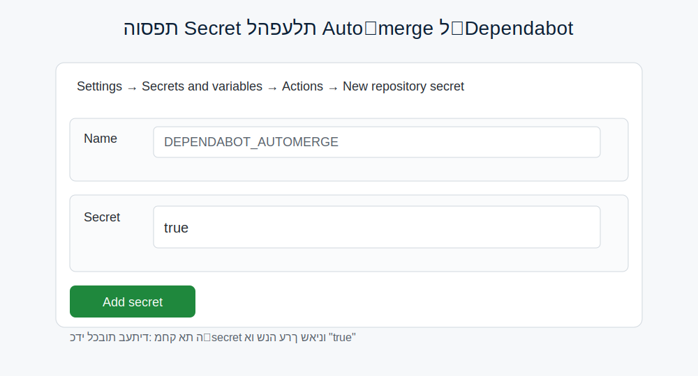

## מדריך: עדכוני תלויות אוטומטיים ומיזוג אוטומטי

מדריך זה מסביר איך הוגדרו עדכוני תלות אוטומטיים (Dependabot), איך מפעילים/מכבים מיזוג אוטומטי אחרי בדיקות ירוקות, ואיך להימנע מפריסה לא צפויה בזמן עבודה.

### מה קיים בריפו
- Dependabot: `.github/dependabot.yml`
  - אקוסיסטם: pip
  - תיקייה: `/` (קובץ `requirements.txt`)
  - תדירות: weekly

- וורקפלואו למיזוג אוטומטי לעדכוני patch של Dependabot: `.github/workflows/dependabot-auto-merge.yml`
  - מוגבל ל־patch בלבד (`version-update:semver-patch`).
  - מאופשר רק כשה־Secret `DEPENDABOT_AUTOMERGE` מוגדר לערך `true`.
  - משתמש ב־"Allow auto-merge" של גיטהאב ובכללי Branch protection.

- CI ל־PRים ב־`.github/workflows/ci.yml`:
  - "🔍 Code Quality & Security" (לינטים/סטייל/בדיקות אבטחה קלות)
  - "🧪 Unit Tests (3.9|3.10|3.11)" (מטריצת פייתון)
  - ג׳ובים משלימים (hadolint, gitleaks, semgrep, yamllint, lychee, alembic אם קיים)

- פריסה/Build ב־`.github/workflows/deploy.yml`:
  - רץ על push ל־main/develop, על tags (v*), או ידנית (workflow_dispatch)
  - אינו רץ על Pull Request – מונע עיכובים וכפילויות ב־PRים

### שלבי הגדרה (UI בלבד)
1) פתיחת PR כ־Draft כדי להפעיל CI
   - Pull requests → New pull request
   - base: `main`, compare: הענף שלך
   - Create draft pull request
   - המתן שהריצה תסתיים (הבדיקות ירוקות)

   

2) הגדרת Branch protection ל־`main`
   - Repo → Settings → Branches → Add rule (או עריכת כלל קיים)
   - Branch name pattern: `main`
   - סמן:
     - Require a pull request before merging
     - Require status checks to pass before merging
       - בחר את הסטטוסים שמגיעים מ־ci.yml:
         - "🧪 Unit Tests (3.9)"
         - "🧪 Unit Tests (3.10)"
         - "🧪 Unit Tests (3.11)"
         - "🔍 Code Quality & Security"
       - מומלץ: Require branches to be up to date before merging
     - Require conversation resolution before merging (מומלץ)
   
   
   - השאר Require approvals כבוי אם רוצים שמיזוג Dependabot יהיה אוטומטי.

3) הפעלת Auto‑merge הכללי בגיטהאב
   - Settings → General → Pull requests → Enable "Allow auto‑merge"

   

4) הפעלה/כיבוי של מיזוג אוטומטי ל‑Dependabot
   - Repo → Settings → Secrets and variables → Actions → New repository secret
   - Name: `DEPENDABOT_AUTOMERGE`
   - Secret: `true`
   - כדי לכבות בכל עת: מחיקה או שינוי לערך שאינו `true`.

   

### איך זה עובד בפועל
- Dependabot יפתח Pull Requests לעדכוני pip פעם בשבוע.
- ה־PR יריץ CI. אם כל הבדיקות ירוקות וכללי ההגנה מתקיימים, וה־Secret `DEPENDABOT_AUTOMERGE`=true – ה־workflow יאשר ויפעיל Auto‑merge (Squash) לעדכוני patch בלבד.

### זהירות לגבי פריסה (Render)
- בקובץ `render.yaml` מוגדר `autoDeploy: true` לשירות הראשי.
- מיזוג ל־`main` ב־GitHub עלול לגרום ל־Render לבצע Deploy ולבצע ריסטארט קצר לשירות (עלול לנתק שיחה פעילה).
- כדי להימנע מפריסה לא צפויה בזמן עבודה:
  - השאר PR כ־Draft עד לזמן מתאים.
  - או כבה זמנית Auto Deploy ב־Render (Service → Settings → Auto Deploy: Off), מזג, ואז החזר ל־On.
  - או מזג בשעות שקטות.

### הרחבות אופציונליות
- מיזוג גם ל־minor (במקום patch בלבד):
  - עדכון תנאי הוורקפלואו שיאפשר גם `version-update:semver-minor`.
  - מומלץ להשאיר approvals כבוי אם רוצים לשמור על אוטומציה מלאה.

### פתרון תקלות
- "No checks have been added" בכללי ההגנה:
  - ודא שיש לפחות ריצה אחת של ה־CI על PR (גם Draft מספיק).
  - רענן את העמוד ואז בחר את 4 הסטטוסים מרשימת ה־checks (Unit Tests 3 גרסאות + Code Quality).

- "There isn’t anything to compare" כשפותחים PR:
  - ודא שה־base הוא `main` וה־compare הוא הענף שלך.
  - נסה "switch base & compare" אם צריך.

- Auto‑merge לא קורה:
  - בדוק ש־"Allow auto‑merge" מופעל בהגדרות הרפו.
  - ודא ש־`DEPENDABOT_AUTOMERGE`=true כסוד ריפוזיטורי.
  - בדוק שכל הבדיקות ירוקות וכללי ההגנה מתקיימים.

  

### צ'ק־ליסט מהיר
- [ ] הגדרת Branch protection ל־`main` עם 4 הסטטוסים מ־ci.yml
- [ ] הפעלת "Allow auto‑merge" (Settings → General → Pull requests)
- [ ] הוספת Secret: `DEPENDABOT_AUTOMERGE`=true (כשרוצים אוטומרג׳ ל־patch)
- [ ] לשקול כיבוי זמני של Auto Deploy ב־Render לפני מיזוגים ל־`main`

אם צריך, אפשר להרחיב/לצמצם את האוטומציה לפי מדיניות הצוות (לדוגמה, לאפשר minor, לדרוש approvals, או להוסיף חריגות).

