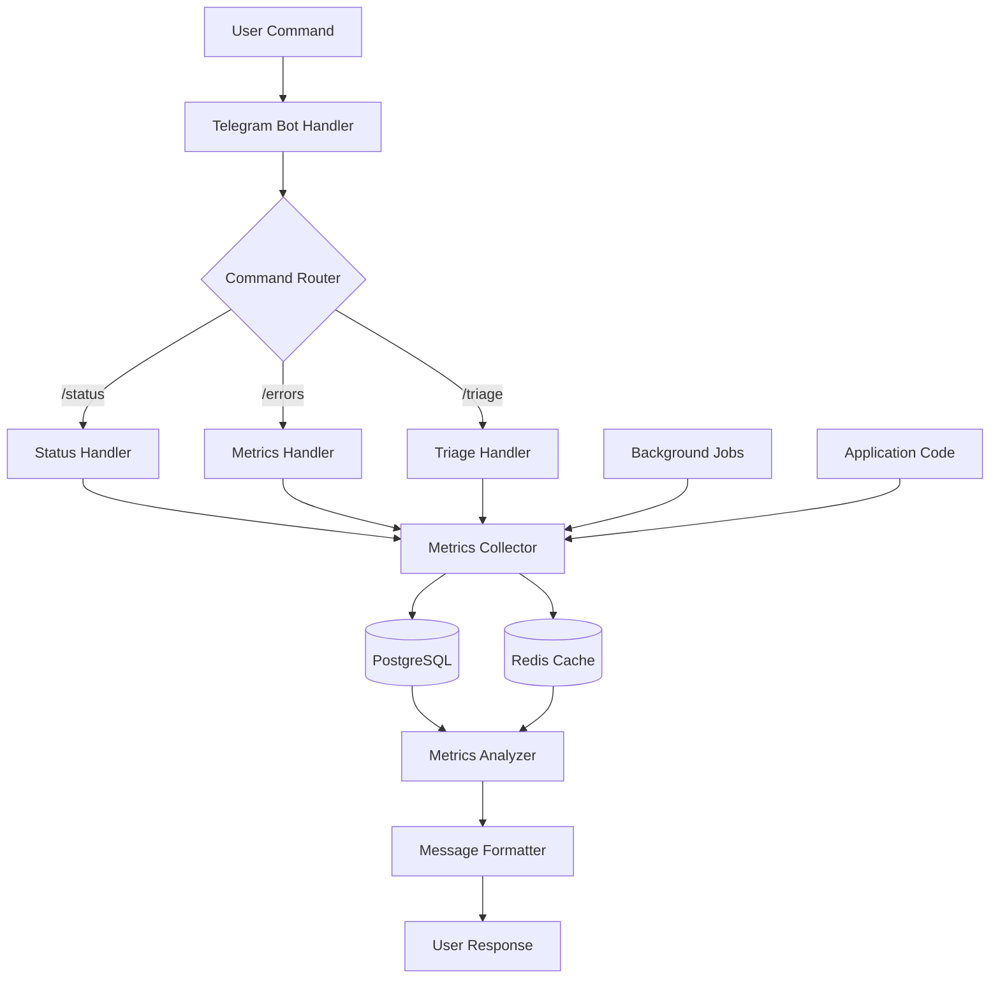

# 📋 מדריך מימוש מלא - ChatOps ומעקב ביצועים לבוט CodeBot

## 📑 תוכן עניינים
1. [סקירה כללית](#סקירה-כללית)
2. [דרישות מוקדמות](#דרישות-מוקדמות)
3. [ארכיטקטורה טכנית](#ארכיטקטורה-טכנית)
4. [מבני נתונים ו-APIs](#מבני-נתונים-ו-apis)
5. [תוכנית מימוש מדורגת](#תוכנית-מימוש-מדורגת)
6. [מימוש מפורט לכל רכיב](#מימוש-מפורט-לכל-רכיב)
7. [בדיקות ו-QA](#בדיקות-ו-qa)
8. [אבטחה ו-Best Practices](#אבטחה-ו-best-practices)
9. [ניטור ותחזוקה](#ניטור-ותחזוקה)

---

## 📌 סקירה כללית

### מטרת הפרויקט
הוספת יכולות ChatOps מתקדמות לבוט CodeBot, כולל:
- 🔍 ניטור ביצועים בזמן אמת דרך הצ'אט
- 📊 מעקב אחר מטריקות ו-KPIs
- 🚨 התראות חכמות עם המלצות לפתרון
- 🔎 זיהוי כפילויות בקוד
- 🛠️ כלי triage לחקירת תקלות

### יעדים עיקריים
1. **שיפור זמן תגובה לתקלות** - מ-30 דקות ל-5 דקות
2. **הפחתת כפילויות קוד** - זיהוי וצמצום של 20% מהכפילויות
3. **שיפור חווית משתמש** - גישה מהירה למידע קריטי
4. **אוטומציה** - הפחתת 50% מהזמן הנדרש לחקירת תקלות

---

## ⚙️ דרישות מוקדמות

### תשתית נדרשת
```yaml
requirements:
  python: ">=3.11"
  telegram_bot: "python-telegram-bot>=20.0"
  database: "PostgreSQL >= 14"
  monitoring: 
    - prometheus_client
    - grafana (optional, for dashboards)
  
dependencies:
  - aiohttp  # For async HTTP requests
  - asyncpg  # For async PostgreSQL
  - redis    # For caching and rate limiting
  - structlog  # For structured logging
  - pydantic  # For data validation
```

### הכנות בקוד הקיים
- [ ] **Request ID Tracking** - הוספת מזהה ייחודי לכל פעולה
- [ ] **Structured Logging** - מעבר ללוגים מובנים עם metadata
- [ ] **Metrics Collection** - הטמעת prometheus_client
- [ ] **Error Tracking** - קודי שגיאה סטנדרטיים

### דוגמת הטמעת Request ID:
```python
# src/core/request_context.py
import uuid
from contextvars import ContextVar
from typing import Optional

request_id_var: ContextVar[Optional[str]] = ContextVar('request_id', default=None)

class RequestContext:
    @staticmethod
    def set_request_id(request_id: Optional[str] = None) -> str:
        """Set or generate request ID for current context"""
        if request_id is None:
            request_id = f"req-{uuid.uuid4().hex[:8]}"
        request_id_var.set(request_id)
        return request_id
    
    @staticmethod
    def get_request_id() -> Optional[str]:
        """Get current request ID"""
        return request_id_var.get()

# Decorator for automatic request tracking
def track_request(func):
    async def wrapper(*args, **kwargs):
        request_id = RequestContext.set_request_id()
        logger.info("request_started", request_id=request_id, operation=func.__name__)
        try:
            result = await func(*args, **kwargs)
            logger.info("request_completed", request_id=request_id)
            return result
        except Exception as e:
            logger.error("request_failed", request_id=request_id, error=str(e))
            raise
    return wrapper
```

---

## 🏗️ ארכיטקטורה טכנית

### מבנה המודולים
```
src/
├── monitoring/
│   ├── __init__.py
│   ├── metrics_collector.py      # איסוף מטריקות
│   ├── metrics_storage.py        # שמירה ב-DB/Redis
│   ├── metrics_analyzer.py       # ניתוח וחישובים
│   └── alerts_manager.py         # ניהול התראות
│
├── chatops/
│   ├── __init__.py
│   ├── handlers/
│   │   ├── status_handler.py     # /status, /health
│   │   ├── metrics_handler.py    # /errors, /latency, /kpis
│   │   ├── github_handler.py     # /rate_limit
│   │   ├── triage_handler.py     # /triage
│   │   └── dashboard_handler.py  # /dashboard
│   ├── formatters/
│   │   ├── message_formatter.py  # עיצוב הודעות
│   │   └── chart_generator.py    # יצירת גרפים
│   └── permissions.py            # הרשאות ואבטחה
│
├── code_analysis/
│   ├── __init__.py
│   ├── duplicate_detector.py     # זיהוי כפילויות
│   ├── similarity_analyzer.py    # ניתוח דמיון
│   └── ast_parser.py            # ניתוח AST
│
└── integrations/
    ├── prometheus_exporter.py    # חשיפת מטריקות
    ├── grafana_client.py         # יצירת לינקים לדשבורדים
    └── sentry_client.py          # אינטגרציה עם Sentry
```

### ארכיטקטורת זרימת נתונים


---

## 📊 מבני נתונים ו-APIs

### 1. מבנה מטריקה בסיסית
```python
from datetime import datetime
from typing import Optional, Dict, Any
from pydantic import BaseModel, Field
from enum import Enum

class MetricType(Enum):
    COUNTER = "counter"
    GAUGE = "gauge"
    HISTOGRAM = "histogram"
    SUMMARY = "summary"

class OperationType(Enum):
    SEARCH = "search"
    GITHUB_SYNC = "github_sync"
    FILE_SAVE = "file_save"
    DB_QUERY = "db_query"
    API_CALL = "api_call"

class MetricStatus(Enum):
    SUCCESS = "success"
    ERROR = "error"
    TIMEOUT = "timeout"
    RATE_LIMITED = "rate_limited"

class Metric(BaseModel):
    """Base metric model"""
    request_id: str = Field(..., description="Unique request identifier")
    timestamp: datetime = Field(default_factory=datetime.utcnow)
    metric_type: MetricType
    operation: OperationType
    status: MetricStatus
    value: float = Field(..., description="Metric value (ms for latency, count for errors)")
    metadata: Dict[str, Any] = Field(default_factory=dict)
    user_id: Optional[str] = None
    error_code: Optional[str] = None
    error_message: Optional[str] = None
    
    class Config:
        json_encoders = {
            datetime: lambda v: v.isoformat()
        }

# דוגמה לשימוש
metric = Metric(
    request_id="req-abc123",
    metric_type=MetricType.HISTOGRAM,
    operation=OperationType.GITHUB_SYNC,
    status=MetricStatus.SUCCESS,
    value=1250.5,  # milliseconds
    metadata={
        "repo": "amirbiron/CodeBot",
        "files_synced": 42,
        "branch": "main"
    },
    user_id="user_123"
)
```

### 2. מבנה התראה חכמה
```python
class AlertSeverity(Enum):
    INFO = "info"
    WARNING = "warning"
    ERROR = "error"
    CRITICAL = "critical"

class AlertType(Enum):
    HIGH_ERROR_RATE = "high_error_rate"
    SLOW_RESPONSE = "slow_response"
    RATE_LIMIT_WARNING = "rate_limit_warning"
    DB_CONNECTION_ISSUE = "db_connection_issue"
    JOB_FAILURE = "job_failure"

class SmartAlert(BaseModel):
    """Enhanced alert with remediation suggestions"""
    alert_id: str = Field(default_factory=lambda: f"alert-{uuid.uuid4().hex[:8]}")
    timestamp: datetime = Field(default_factory=datetime.utcnow)
    severity: AlertSeverity
    alert_type: AlertType
    title: str
    description: str
    affected_services: List[str]
    metrics_snapshot: Dict[str, Any]
    
    # Enhanced fields
    grafana_links: List[str] = Field(default_factory=list)
    suggested_actions: List[str] = Field(default_factory=list)
    runbook_url: Optional[str] = None
    related_alerts: List[str] = Field(default_factory=list)
    auto_resolve_after: Optional[int] = None  # minutes
    
    def format_telegram_message(self) -> str:
        """Format alert for Telegram"""
        severity_emoji = {
            AlertSeverity.INFO: "ℹ️",
            AlertSeverity.WARNING: "⚠️",
            AlertSeverity.ERROR: "🚨",
            AlertSeverity.CRITICAL: "🔴"
        }
        
        message = f"{severity_emoji[self.severity]} **{self.title}**\n\n"
        message += f"📝 {self.description}\n\n"
        
        if self.affected_services:
            message += f"🎯 **Affected Services:**\n"
            for service in self.affected_services:
                message += f"  • {service}\n"
            message += "\n"
        
        if self.suggested_actions:
            message += f"💡 **Suggested Actions:**\n"
            for i, action in enumerate(self.suggested_actions, 1):
                message += f"  {i}. {action}\n"
            message += "\n"
        
        if self.grafana_links:
            message += f"📊 **Dashboards:**\n"
            for link in self.grafana_links:
                message += f"  • [View Dashboard]({link})\n"
        
        if self.runbook_url:
            message += f"\n📖 [Runbook]({self.runbook_url})"
        
        return message
```

### 3. מבנה לזיהוי כפילויות
```python
class CodeDuplicate(BaseModel):
    """Code duplication finding"""
    duplicate_id: str = Field(default_factory=lambda: f"dup-{uuid.uuid4().hex[:8]}")
    detection_time: datetime = Field(default_factory=datetime.utcnow)
    
    # Location info
    file1: str
    file1_lines: Tuple[int, int]  # (start_line, end_line)
    file2: str
    file2_lines: Tuple[int, int]
    
    # Similarity metrics
    similarity_score: float = Field(..., ge=0, le=1)  # 0-1
    lines_duplicated: int
    tokens_duplicated: int
    
    # Detection method
    detection_method: Literal["exact", "fuzzy", "ast"]
    code_snippet: Optional[str] = None
    
    # Suggestions
    refactoring_suggestion: Optional[str] = None
    estimated_savings: Optional[int] = None  # lines of code
```

### 4. Database Schema
```sql
-- מטריקות
CREATE TABLE metrics (
    id SERIAL PRIMARY KEY,
    request_id VARCHAR(50) NOT NULL,
    timestamp TIMESTAMP NOT NULL DEFAULT NOW(),
    metric_type VARCHAR(20) NOT NULL,
    operation VARCHAR(50) NOT NULL,
    status VARCHAR(20) NOT NULL,
    value FLOAT NOT NULL,
    metadata JSONB,
    user_id VARCHAR(50),
    error_code VARCHAR(50),
    error_message TEXT,
    
    -- Indexes for quick queries
    INDEX idx_timestamp (timestamp),
    INDEX idx_request_id (request_id),
    INDEX idx_operation_status (operation, status),
    INDEX idx_user_id (user_id)
);

-- התראות
CREATE TABLE alerts (
    id SERIAL PRIMARY KEY,
    alert_id VARCHAR(50) UNIQUE NOT NULL,
    timestamp TIMESTAMP NOT NULL DEFAULT NOW(),
    severity VARCHAR(20) NOT NULL,
    alert_type VARCHAR(50) NOT NULL,
    title VARCHAR(255) NOT NULL,
    description TEXT,
    affected_services TEXT[],
    metrics_snapshot JSONB,
    grafana_links TEXT[],
    suggested_actions TEXT[],
    runbook_url TEXT,
    resolved_at TIMESTAMP,
    resolved_by VARCHAR(50),
    
    INDEX idx_alert_timestamp (timestamp),
    INDEX idx_alert_severity (severity),
    INDEX idx_alert_type (alert_type)
);

-- כפילויות קוד
CREATE TABLE code_duplicates (
    id SERIAL PRIMARY KEY,
    duplicate_id VARCHAR(50) UNIQUE NOT NULL,
    detection_time TIMESTAMP NOT NULL DEFAULT NOW(),
    file1 TEXT NOT NULL,
    file1_start_line INT NOT NULL,
    file1_end_line INT NOT NULL,
    file2 TEXT NOT NULL,
    file2_start_line INT NOT NULL,
    file2_end_line INT NOT NULL,
    similarity_score FLOAT NOT NULL,
    lines_duplicated INT NOT NULL,
    detection_method VARCHAR(20) NOT NULL,
    code_snippet TEXT,
    refactoring_suggestion TEXT,
    is_resolved BOOLEAN DEFAULT FALSE,
    resolved_at TIMESTAMP,
    
    INDEX idx_detection_time (detection_time),
    INDEX idx_similarity (similarity_score),
    INDEX idx_files (file1, file2)
);

-- Cache for aggregated metrics (for performance)
CREATE TABLE metrics_aggregates (
    id SERIAL PRIMARY KEY,
    period_start TIMESTAMP NOT NULL,
    period_end TIMESTAMP NOT NULL,
    operation VARCHAR(50) NOT NULL,
    total_requests INT NOT NULL,
    success_count INT NOT NULL,
    error_count INT NOT NULL,
    avg_latency_ms FLOAT,
    p50_latency_ms FLOAT,
    p95_latency_ms FLOAT,
    p99_latency_ms FLOAT,
    
    UNIQUE(period_start, period_end, operation),
    INDEX idx_period (period_start, period_end)
);
```

---

## 📅 תוכנית מימוש מדורגת

### Phase 1: תשתית בסיסית (3-4 ימים)

#### יום 1-2: Request Tracking & Structured Logging
```python
# Tasks:
tasks = [
    "הטמעת RequestContext בכל הפעולות המרכזיות",
    "מעבר ל-structlog עם metadata",
    "הוספת decorators לטראקינג אוטומטי",
    "יצירת טבלאות DB למטריקות"
]

# Deliverables:
- [ ] מודול request_context.py
- [ ] מודול structured_logger.py
- [ ] Migration scripts ל-DB
- [ ] Unit tests
```

#### יום 3-4: Metrics Collection Infrastructure
```python
# Implementation checklist:
- [ ] MetricsCollector class עם singleton pattern
- [ ] Prometheus metrics exposure (/metrics endpoint)
- [ ] Background task לשמירת מטריקות ב-DB
- [ ] Redis connection pool לקאשינג
- [ ] Health check endpoint
```

### Phase 2: ChatOps בסיסי (4-5 ימים)

#### יום 5-6: פקודות Status & Health
```python
# Commands to implement:
commands = {
    "/status": "בדיקת בריאות כללית של המערכת",
    "/health": "בדיקת קומפוננטים ספציפיים",
    "/uptime": "זמן פעילות ויציבות"
}

# Code example:
@track_request
async def handle_status_command(update: Update, context: ContextTypes.DEFAULT_TYPE):
    """Handle /status command"""
    health_checks = await perform_health_checks()
    
    message = format_status_message(health_checks)
    
    await update.message.reply_text(
        message,
        parse_mode=ParseMode.HTML,
        reply_markup=get_status_keyboard()
    )

async def perform_health_checks():
    """Run all health checks in parallel"""
    checks = await asyncio.gather(
        check_database_connection(),
        check_redis_connection(),
        check_github_api(),
        check_disk_space(),
        return_exceptions=True
    )
    
    return {
        "database": checks[0],
        "redis": checks[1],
        "github_api": checks[2],
        "disk_space": checks[3]
    }
```

#### יום 7-8: פקודות Metrics & Errors
```python
# Implementation for /errors command:
class ErrorsHandler:
    def __init__(self, metrics_storage: MetricsStorage):
        self.storage = metrics_storage
    
    async def handle_errors_command(
        self, 
        update: Update, 
        context: ContextTypes.DEFAULT_TYPE
    ):
        """Show recent errors with analysis"""
        # Parse time range from args
        time_range = self._parse_time_range(context.args)
        
        # Fetch errors from storage
        errors = await self.storage.get_recent_errors(
            since=time_range,
            limit=100
        )
        
        # Analyze and group errors
        analysis = self._analyze_errors(errors)
        
        # Format message with inline buttons
        message = self._format_error_report(analysis)
        keyboard = self._create_error_keyboard(analysis)
        
        await update.message.reply_text(
            message,
            parse_mode=ParseMode.HTML,
            reply_markup=keyboard
        )
    
    def _analyze_errors(self, errors: List[Metric]) -> Dict:
        """Analyze errors and find patterns"""
        return {
            "total_count": len(errors),
            "by_type": self._group_by_error_code(errors),
            "by_operation": self._group_by_operation(errors),
            "top_errors": self._get_top_errors(errors, limit=5),
            "error_rate": self._calculate_error_rate(errors),
            "trending": self._find_trending_errors(errors)
        }
```

#### יום 9: GitHub Rate Limit Monitoring
```python
class GitHubMonitor:
    async def check_rate_limit(self) -> Dict:
        """Check GitHub API rate limit status"""
        async with aiohttp.ClientSession() as session:
            headers = {"Authorization": f"token {self.github_token}"}
            async with session.get(
                "https://api.github.com/rate_limit",
                headers=headers
            ) as response:
                data = await response.json()
                
        return {
            "core": {
                "limit": data["resources"]["core"]["limit"],
                "remaining": data["resources"]["core"]["remaining"],
                "reset": datetime.fromtimestamp(
                    data["resources"]["core"]["reset"]
                ),
                "used_percentage": self._calculate_usage_percentage(
                    data["resources"]["core"]
                )
            },
            "search": data["resources"]["search"],
            "graphql": data["resources"]["graphql"]
        }
    
    async def handle_rate_limit_command(self, update, context):
        """Display GitHub rate limit status"""
        status = await self.check_rate_limit()
        
        # Create visual representation
        message = self._format_rate_limit_message(status)
        
        # Add warning if approaching limit
        if status["core"]["used_percentage"] > 80:
            message += "\n\n⚠️ **Warning:** Approaching rate limit!"
            message += "\nConsider enabling backoff mode: /enable_backoff"
        
        await update.message.reply_text(message, parse_mode=ParseMode.HTML)
```

### Phase 3: Advanced Features (5-6 ימים)

#### יום 10-11: Duplicate Detection System
```python
class DuplicateDetector:
    def __init__(self):
        self.exact_matcher = ExactMatcher()
        self.fuzzy_matcher = FuzzyMatcher()
        self.ast_analyzer = ASTAnalyzer()
    
    async def scan_codebase(self, path: str) -> List[CodeDuplicate]:
        """Scan codebase for duplicates"""
        # Collect all Python files
        files = self._collect_python_files(path)
        
        # Phase 1: Exact matching
        exact_duplicates = await self.exact_matcher.find_duplicates(files)
        
        # Phase 2: Fuzzy matching (MinHash)
        fuzzy_duplicates = await self.fuzzy_matcher.find_near_duplicates(
            files, 
            threshold=0.85
        )
        
        # Phase 3: AST-based analysis
        ast_duplicates = await self.ast_analyzer.find_structural_duplicates(files)
        
        # Merge and deduplicate results
        all_duplicates = self._merge_results(
            exact_duplicates, 
            fuzzy_duplicates, 
            ast_duplicates
        )
        
        # Calculate refactoring suggestions
        for duplicate in all_duplicates:
            duplicate.refactoring_suggestion = self._suggest_refactoring(duplicate)
        
        return all_duplicates

class ExactMatcher:
    async def find_duplicates(self, files: List[Path]) -> List[CodeDuplicate]:
        """Find exact code duplicates"""
        # Create hash map of code blocks
        hash_map = defaultdict(list)
        
        for file_path in files:
            content = await self._read_file(file_path)
            blocks = self._extract_code_blocks(content, min_lines=5)
            
            for block in blocks:
                # Normalize whitespace and comments
                normalized = self._normalize_code(block.content)
                block_hash = hashlib.sha256(normalized.encode()).hexdigest()
                
                hash_map[block_hash].append({
                    "file": file_path,
                    "lines": block.lines,
                    "content": block.content
                })
        
        # Find duplicates
        duplicates = []
        for block_hash, occurrences in hash_map.items():
            if len(occurrences) > 1:
                # Create duplicate entries for each pair
                for i in range(len(occurrences)):
                    for j in range(i + 1, len(occurrences)):
                        duplicates.append(
                            CodeDuplicate(
                                file1=occurrences[i]["file"],
                                file1_lines=occurrences[i]["lines"],
                                file2=occurrences[j]["file"],
                                file2_lines=occurrences[j]["lines"],
                                similarity_score=1.0,
                                lines_duplicated=len(occurrences[i]["content"].splitlines()),
                                detection_method="exact",
                                code_snippet=occurrences[i]["content"][:500]
                            )
                        )
        
        return duplicates
```

#### יום 12-13: Triage System
```python
class TriageHandler:
    async def handle_triage_command(self, update, context):
        """Deep dive into a specific request"""
        if not context.args:
            await update.message.reply_text(
                "Usage: /triage <request_id>\n"
                "Example: /triage req-abc123"
            )
            return
        
        request_id = context.args[0]
        
        # Gather all data about this request
        investigation = await self._investigate_request(request_id)
        
        if not investigation["found"]:
            await update.message.reply_text(
                f"❌ Request {request_id} not found in logs"
            )
            return
        
        # Generate comprehensive report
        report = self._generate_triage_report(investigation)
        
        # Send as HTML file if too long
        if len(report) > 4096:
            file_path = await self._save_report_as_html(report, request_id)
            await update.message.reply_document(
                document=file_path,
                caption=f"📋 Triage Report for {request_id}"
            )
        else:
            await update.message.reply_text(
                report,
                parse_mode=ParseMode.HTML,
                disable_web_page_preview=True
            )
    
    async def _investigate_request(self, request_id: str) -> Dict:
        """Gather all information about a request"""
        # Parallel data gathering
        results = await asyncio.gather(
            self._get_metrics(request_id),
            self._get_logs(request_id),
            self._get_traces(request_id),
            self._get_related_requests(request_id),
            return_exceptions=True
        )
        
        return {
            "found": any(r for r in results if r),
            "metrics": results[0] or [],
            "logs": results[1] or [],
            "traces": results[2] or [],
            "related": results[3] or [],
            "timeline": self._build_timeline(results),
            "root_cause": self._analyze_root_cause(results),
            "suggestions": self._generate_suggestions(results)
        }
```

#### יום 14-15: Dashboard & Visualizations
```python
class DashboardGenerator:
    async def generate_dashboard(self, time_range: str = "1h") -> str:
        """Generate comprehensive dashboard"""
        # Gather all metrics in parallel
        data = await asyncio.gather(
            self._get_system_status(),
            self._get_performance_metrics(time_range),
            self._get_error_metrics(time_range),
            self._get_business_kpis(time_range),
            self._get_github_status()
        )
        
        dashboard = self._format_dashboard(data)
        return dashboard
    
    def _format_dashboard(self, data: List) -> str:
        """Format dashboard with visual elements"""
        status, perf, errors, kpis, github = data
        
        # Create status indicator
        status_emoji = "🟢" if status["healthy"] else "🔴"
        
        dashboard = f"""
📊 **CodeBot Dashboard**
{'─' * 30}

{status_emoji} **System Status:** {status["status"]}
⏱ **Uptime:** {status["uptime"]}
🔄 **Last Check:** {status["last_check"]}

**Performance (last {perf["time_range"]}):**
├─ 🔍 Search: {self._format_latency(perf["search"])}
├─ 📁 File Ops: {self._format_latency(perf["file_ops"])}
├─ 🔄 GitHub Sync: {self._format_latency(perf["github"])}
└─ 💾 Database: {self._format_latency(perf["database"])}

**Activity:**
├─ 📊 Requests: {kpis["total_requests"]:,}
├─ ✅ Success Rate: {kpis["success_rate"]:.1f}%
├─ 📝 Files Saved: {kpis["files_saved"]:,}
└─ 🔍 Searches: {kpis["searches"]:,}

**Errors (last hour):**
{self._format_error_summary(errors)}

**GitHub API:**
├─ 📊 Remaining: {github["remaining"]:,}/{github["limit"]:,}
├─ 📈 Usage: {self._create_progress_bar(github["used_percentage"])}
└─ 🔄 Reset: {github["reset_in"]}

**Quick Actions:**
/errors - View recent errors
/triage <id> - Investigate request
/metrics - Detailed metrics
"""
        return dashboard
    
    def _create_progress_bar(self, percentage: float, width: int = 20) -> str:
        """Create text-based progress bar"""
        filled = int(width * percentage / 100)
        bar = "█" * filled + "░" * (width - filled)
        color = "🟢" if percentage < 60 else "🟡" if percentage < 80 else "🔴"
        return f"{color} [{bar}] {percentage:.0f}%"
```

### Phase 4: Integration & Testing (3-4 ימים)

#### יום 16-17: Integration Tests
```python
# tests/test_chatops_integration.py
import pytest
from unittest.mock import AsyncMock, patch
import asyncio

class TestChatOpsIntegration:
    @pytest.fixture
    async def bot_context(self):
        """Create test bot context"""
        return {
            "metrics_collector": MetricsCollector(),
            "storage": AsyncMock(),
            "handlers": {}
        }
    
    @pytest.mark.asyncio
    async def test_status_command_full_flow(self, bot_context):
        """Test full flow of status command"""
        # Setup mock data
        bot_context["storage"].get_health_status.return_value = {
            "database": "healthy",
            "redis": "healthy",
            "github": "rate_limited"
        }
        
        # Create handler
        handler = StatusHandler(bot_context)
        
        # Create mock update
        update = create_mock_update("/status")
        
        # Execute command
        await handler.handle_status_command(update, None)
        
        # Verify response
        update.message.reply_text.assert_called_once()
        response = update.message.reply_text.call_args[0][0]
        
        assert "🟢" in response  # Healthy indicators
        assert "⚠️" in response  # Warning for rate limit
        assert "Database" in response
    
    @pytest.mark.asyncio
    async def test_concurrent_metrics_collection(self, bot_context):
        """Test that metrics are collected concurrently"""
        collector = bot_context["metrics_collector"]
        
        # Add delay to simulate slow operations
        async def slow_operation():
            await asyncio.sleep(0.1)
            return {"status": "ok"}
        
        # Measure concurrent execution
        start = asyncio.get_event_loop().time()
        
        results = await asyncio.gather(
            collector.collect_metric("op1", slow_operation),
            collector.collect_metric("op2", slow_operation),
            collector.collect_metric("op3", slow_operation)
        )
        
        elapsed = asyncio.get_event_loop().time() - start
        
        # Should complete in ~0.1s, not 0.3s
        assert elapsed < 0.15
        assert len(results) == 3
```

#### יום 18: Load Testing
```python
# tests/load_test.py
import asyncio
import aiohttp
import time
from typing import List, Dict

class LoadTester:
    def __init__(self, base_url: str, num_users: int = 10):
        self.base_url = base_url
        self.num_users = num_users
        self.results = []
    
    async def simulate_user(self, user_id: int):
        """Simulate single user making requests"""
        commands = [
            "/status",
            "/errors",
            "/latency",
            "/dashboard",
            f"/triage req-test{user_id}"
        ]
        
        async with aiohttp.ClientSession() as session:
            for command in commands:
                start = time.time()
                try:
                    async with session.post(
                        f"{self.base_url}/webhook",
                        json={"message": {"text": command}}
                    ) as response:
                        await response.text()
                        latency = (time.time() - start) * 1000
                        
                        self.results.append({
                            "user_id": user_id,
                            "command": command,
                            "latency_ms": latency,
                            "status": response.status
                        })
                except Exception as e:
                    self.results.append({
                        "user_id": user_id,
                        "command": command,
                        "error": str(e)
                    })
                
                # Small delay between commands
                await asyncio.sleep(0.5)
    
    async def run_test(self):
        """Run load test with multiple users"""
        print(f"Starting load test with {self.num_users} users...")
        
        tasks = [
            self.simulate_user(i) 
            for i in range(self.num_users)
        ]
        
        start = time.time()
        await asyncio.gather(*tasks)
        total_time = time.time() - start
        
        # Analyze results
        self._print_results(total_time)
    
    def _print_results(self, total_time: float):
        """Print test results"""
        successful = [r for r in self.results if "error" not in r]
        failed = [r for r in self.results if "error" in r]
        
        if successful:
            latencies = [r["latency_ms"] for r in successful]
            avg_latency = sum(latencies) / len(latencies)
            p95_latency = sorted(latencies)[int(len(latencies) * 0.95)]
            
            print(f"""
Load Test Results:
─────────────────
Total Time: {total_time:.2f}s
Total Requests: {len(self.results)}
Successful: {len(successful)}
Failed: {len(failed)}

Latency Stats:
  Average: {avg_latency:.2f}ms
  P95: {p95_latency:.2f}ms
  Max: {max(latencies):.2f}ms
  Min: {min(latencies):.2f}ms

Success Rate: {len(successful)/len(self.results)*100:.1f}%
""")

# Run test
if __name__ == "__main__":
    tester = LoadTester("http://localhost:8080", num_users=20)
    asyncio.run(tester.run_test())
```

---

## 🔧 מימוש מפורט לכל רכיב

### 1. Metrics Collector Implementation
```python
# src/monitoring/metrics_collector.py
import asyncio
from typing import Optional, Dict, Any, List
from datetime import datetime, timedelta
from prometheus_client import Counter, Histogram, Gauge, generate_latest
import structlog
from contextlib import asynccontextmanager

logger = structlog.get_logger()

class MetricsCollector:
    """Centralized metrics collection system"""
    
    # Prometheus metrics
    request_counter = Counter(
        'codebot_requests_total', 
        'Total requests',
        ['operation', 'status']
    )
    
    request_duration = Histogram(
        'codebot_request_duration_seconds',
        'Request duration',
        ['operation'],
        buckets=[0.1, 0.25, 0.5, 1.0, 2.5, 5.0, 10.0]
    )
    
    active_requests = Gauge(
        'codebot_active_requests',
        'Currently active requests',
        ['operation']
    )
    
    error_counter = Counter(
        'codebot_errors_total',
        'Total errors',
        ['operation', 'error_code']
    )
    
    def __init__(self, storage: MetricsStorage):
        self.storage = storage
        self._batch_queue = asyncio.Queue(maxsize=1000)
        self._batch_task = None
        
    async def start(self):
        """Start background tasks"""
        self._batch_task = asyncio.create_task(self._batch_writer())
        logger.info("metrics_collector_started")
    
    async def stop(self):
        """Stop background tasks"""
        if self._batch_task:
            self._batch_task.cancel()
            await asyncio.gather(self._batch_task, return_exceptions=True)
        logger.info("metrics_collector_stopped")
    
    @asynccontextmanager
    async def track_request(
        self, 
        operation: str, 
        request_id: Optional[str] = None
    ):
        """Context manager for tracking requests"""
        if not request_id:
            request_id = RequestContext.get_request_id()
        
        # Increment active requests
        self.active_requests.labels(operation=operation).inc()
        
        start_time = asyncio.get_event_loop().time()
        status = MetricStatus.SUCCESS
        error_code = None
        error_message = None
        
        try:
            yield
        except Exception as e:
            status = MetricStatus.ERROR
            error_code = getattr(e, 'error_code', 'unknown')
            error_message = str(e)
            
            # Track error
            self.error_counter.labels(
                operation=operation,
                error_code=error_code
            ).inc()
            
            logger.error(
                "request_failed",
                request_id=request_id,
                operation=operation,
                error=error_message
            )
            raise
        finally:
            # Calculate duration
            duration = asyncio.get_event_loop().time() - start_time
            
            # Update Prometheus metrics
            self.request_counter.labels(
                operation=operation,
                status=status.value
            ).inc()
            
            self.request_duration.labels(
                operation=operation
            ).observe(duration)
            
            self.active_requests.labels(
                operation=operation
            ).dec()
            
            # Create metric record
            metric = Metric(
                request_id=request_id,
                metric_type=MetricType.HISTOGRAM,
                operation=operation,
                status=status,
                value=duration * 1000,  # Convert to ms
                error_code=error_code,
                error_message=error_message
            )
            
            # Queue for batch writing
            await self._batch_queue.put(metric)
    
    async def _batch_writer(self):
        """Write metrics in batches for performance"""
        batch = []
        last_write = asyncio.get_event_loop().time()
        
        while True:
            try:
                # Wait for metric with timeout
                timeout = 5.0 - (asyncio.get_event_loop().time() - last_write)
                metric = await asyncio.wait_for(
                    self._batch_queue.get(),
                    timeout=max(0.1, timeout)
                )
                batch.append(metric)
                
                # Write batch if size or time threshold reached
                should_write = (
                    len(batch) >= 100 or
                    asyncio.get_event_loop().time() - last_write > 5.0
                )
                
                if should_write and batch:
                    await self.storage.write_metrics(batch)
                    batch = []
                    last_write = asyncio.get_event_loop().time()
                    
            except asyncio.TimeoutError:
                # Timeout reached, write if we have data
                if batch:
                    await self.storage.write_metrics(batch)
                    batch = []
                    last_write = asyncio.get_event_loop().time()
            except asyncio.CancelledError:
                # Shutdown, write remaining
                if batch:
                    await self.storage.write_metrics(batch)
                raise
            except Exception as e:
                logger.error("batch_writer_error", error=str(e))
                await asyncio.sleep(1)
    
    async def get_metrics_summary(
        self, 
        time_range: timedelta = timedelta(hours=1)
    ) -> Dict[str, Any]:
        """Get summary of recent metrics"""
        since = datetime.utcnow() - time_range
        metrics = await self.storage.get_metrics(since=since)
        
        # Calculate summaries
        summary = {
            "time_range": str(time_range),
            "total_requests": len(metrics),
            "operations": {}
        }
        
        # Group by operation
        from collections import defaultdict
        by_operation = defaultdict(list)
        
        for metric in metrics:
            by_operation[metric.operation].append(metric)
        
        # Calculate stats per operation
        for operation, op_metrics in by_operation.items():
            latencies = [m.value for m in op_metrics if m.status == MetricStatus.SUCCESS]
            errors = [m for m in op_metrics if m.status == MetricStatus.ERROR]
            
            summary["operations"][operation] = {
                "count": len(op_metrics),
                "success_count": len(latencies),
                "error_count": len(errors),
                "success_rate": len(latencies) / len(op_metrics) * 100 if op_metrics else 0,
                "latency": {
                    "avg": sum(latencies) / len(latencies) if latencies else 0,
                    "p50": self._percentile(latencies, 50),
                    "p95": self._percentile(latencies, 95),
                    "p99": self._percentile(latencies, 99),
                    "max": max(latencies) if latencies else 0
                },
                "top_errors": self._get_top_errors(errors, limit=3)
            }
        
        return summary
    
    def _percentile(self, values: List[float], p: int) -> float:
        """Calculate percentile"""
        if not values:
            return 0
        values_sorted = sorted(values)
        index = int(len(values_sorted) * p / 100)
        return values_sorted[min(index, len(values_sorted) - 1)]
    
    def _get_top_errors(self, errors: List[Metric], limit: int) -> List[Dict]:
        """Get most common errors"""
        from collections import Counter
        
        error_counts = Counter(e.error_code for e in errors)
        
        return [
            {"code": code, "count": count}
            for code, count in error_counts.most_common(limit)
        ]
    
    def export_prometheus_metrics(self) -> bytes:
        """Export metrics in Prometheus format"""
        return generate_latest()
```

### 2. Smart Alerts Implementation
```python
# src/monitoring/alerts_manager.py
from typing import List, Optional, Dict, Any
import asyncio
from datetime import datetime, timedelta
import structlog

logger = structlog.get_logger()

class AlertsManager:
    """Intelligent alerting system with remediation suggestions"""
    
    # Alert thresholds configuration
    THRESHOLDS = {
        "error_rate": {
            "warning": 5.0,   # 5% error rate
            "critical": 10.0  # 10% error rate
        },
        "latency_p95": {
            "warning": 2000,   # 2 seconds
            "critical": 5000   # 5 seconds
        },
        "github_rate_limit": {
            "warning": 20,    # 20% remaining
            "critical": 10    # 10% remaining
        }
    }
    
    # Remediation playbooks
    PLAYBOOKS = {
        AlertType.HIGH_ERROR_RATE: [
            "Check application logs for stack traces",
            "Verify database connection status",
            "Check external API availability",
            "Consider enabling circuit breaker",
            "Review recent deployments"
        ],
        AlertType.SLOW_RESPONSE: [
            "Check database query performance",
            "Review database indexes",
            "Check CPU and memory usage",
            "Look for N+1 query patterns",
            "Consider enabling caching"
        ],
        AlertType.RATE_LIMIT_WARNING: [
            "Enable GitHub API backoff mode",
            "Reduce sync frequency temporarily",
            "Check for unnecessary API calls",
            "Consider using webhooks instead of polling"
        ],
        AlertType.DB_CONNECTION_ISSUE: [
            "Check database server status",
            "Verify connection pool settings",
            "Check for long-running transactions",
            "Review max_connections setting",
            "Check network connectivity"
        ]
    }
    
    def __init__(
        self, 
        metrics_collector: MetricsCollector,
        notification_service: NotificationService,
        storage: AlertStorage
    ):
        self.metrics = metrics_collector
        self.notifications = notification_service
        self.storage = storage
        self.active_alerts: Dict[str, SmartAlert] = {}
        self._monitoring_task = None
    
    async def start(self):
        """Start monitoring for alerts"""
        self._monitoring_task = asyncio.create_task(self._monitor_loop())
        logger.info("alerts_manager_started")
    
    async def stop(self):
        """Stop monitoring"""
        if self._monitoring_task:
            self._monitoring_task.cancel()
            await asyncio.gather(self._monitoring_task, return_exceptions=True)
    
    async def _monitor_loop(self):
        """Main monitoring loop"""
        while True:
            try:
                # Check various conditions
                await asyncio.gather(
                    self._check_error_rate(),
                    self._check_latency(),
                    self._check_github_rate_limit(),
                    self._check_system_health(),
                    return_exceptions=True
                )
                
                # Check for auto-resolve
                await self._check_auto_resolve()
                
                # Wait before next check
                await asyncio.sleep(30)  # Check every 30 seconds
                
            except asyncio.CancelledError:
                raise
            except Exception as e:
                logger.error("alert_monitoring_error", error=str(e))
                await asyncio.sleep(60)
    
    async def _check_error_rate(self):
        """Check error rate and create alert if needed"""
        # Get metrics for last 5 minutes
        summary = await self.metrics.get_metrics_summary(
            time_range=timedelta(minutes=5)
        )
        
        # Calculate overall error rate
        total = summary["total_requests"]
        if total == 0:
            return
        
        errors = sum(
            op["error_count"] 
            for op in summary["operations"].values()
        )
        error_rate = (errors / total) * 100
        
        # Determine severity
        severity = None
        if error_rate >= self.THRESHOLDS["error_rate"]["critical"]:
            severity = AlertSeverity.CRITICAL
        elif error_rate >= self.THRESHOLDS["error_rate"]["warning"]:
            severity = AlertSeverity.WARNING
        
        if severity:
            # Find top errors
            all_errors = []
            for op_data in summary["operations"].values():
                all_errors.extend(op_data.get("top_errors", []))
            
            # Create or update alert
            alert_key = "high_error_rate"
            
            if alert_key not in self.active_alerts:
                alert = SmartAlert(
                    severity=severity,
                    alert_type=AlertType.HIGH_ERROR_RATE,
                    title=f"High Error Rate: {error_rate:.1f}%",
                    description=f"Error rate is {error_rate:.1f}% in the last 5 minutes",
                    affected_services=list(summary["operations"].keys()),
                    metrics_snapshot={
                        "error_rate": error_rate,
                        "total_requests": total,
                        "total_errors": errors,
                        "top_errors": all_errors[:5]
                    }
                )
                
                # Add remediation suggestions
                alert.suggested_actions = self.PLAYBOOKS[AlertType.HIGH_ERROR_RATE]
                
                # Add Grafana links
                alert.grafana_links = [
                    self._create_grafana_link("errors", minutes=5),
                    self._create_grafana_link("latency", minutes=5)
                ]
                
                # Store and notify
                self.active_alerts[alert_key] = alert
                await self._send_alert(alert)
    
    async def _check_latency(self):
        """Check response times"""
        summary = await self.metrics.get_metrics_summary(
            time_range=timedelta(minutes=5)
        )
        
        # Check P95 latency for each operation
        slow_operations = []
        
        for op_name, op_data in summary["operations"].items():
            p95 = op_data["latency"]["p95"]
            
            if p95 > self.THRESHOLDS["latency_p95"]["critical"]:
                slow_operations.append({
                    "operation": op_name,
                    "p95": p95,
                    "severity": "critical"
                })
            elif p95 > self.THRESHOLDS["latency_p95"]["warning"]:
                slow_operations.append({
                    "operation": op_name,
                    "p95": p95,
                    "severity": "warning"
                })
        
        if slow_operations:
            # Determine overall severity
            severity = (
                AlertSeverity.CRITICAL 
                if any(op["severity"] == "critical" for op in slow_operations)
                else AlertSeverity.WARNING
            )
            
            alert = SmartAlert(
                severity=severity,
                alert_type=AlertType.SLOW_RESPONSE,
                title="Slow Response Times Detected",
                description=f"{len(slow_operations)} operations are responding slowly",
                affected_services=[op["operation"] for op in slow_operations],
                metrics_snapshot={"slow_operations": slow_operations},
                suggested_actions=self.PLAYBOOKS[AlertType.SLOW_RESPONSE],
                grafana_links=[
                    self._create_grafana_link("performance", minutes=15)
                ]
            )
            
            await self._send_alert(alert)
    
    async def _check_github_rate_limit(self):
        """Monitor GitHub API rate limit"""
        github_monitor = GitHubMonitor()
        status = await github_monitor.check_rate_limit()
        
        remaining_pct = status["core"]["used_percentage"]
        
        if remaining_pct > 90:
            severity = AlertSeverity.CRITICAL
        elif remaining_pct > 80:
            severity = AlertSeverity.WARNING
        else:
            return
        
        alert = SmartAlert(
            severity=severity,
            alert_type=AlertType.RATE_LIMIT_WARNING,
            title=f"GitHub API Rate Limit: {remaining_pct:.0f}% Used",
            description=(
                f"Only {status['core']['remaining']} requests remaining. "
                f"Resets at {status['core']['reset'].strftime('%H:%M')}"
            ),
            affected_services=["github_sync"],
            metrics_snapshot=status,
            suggested_actions=self.PLAYBOOKS[AlertType.RATE_LIMIT_WARNING],
            auto_resolve_after=30  # Auto-resolve after reset
        )
        
        await self._send_alert(alert)
    
    def _create_grafana_link(self, dashboard: str, minutes: int = 15) -> str:
        """Create pre-filtered Grafana link"""
        base_url = "https://grafana.example.com"
        from_time = f"now-{minutes}m"
        to_time = "now"
        
        dashboards = {
            "errors": "d/errors/error-analysis",
            "latency": "d/latency/performance-metrics",
            "performance": "d/perf/system-performance"
        }
        
        dashboard_path = dashboards.get(dashboard, "d/main/overview")
        
        return f"{base_url}/{dashboard_path}?from={from_time}&to={to_time}&refresh=10s"
    
    async def _send_alert(self, alert: SmartAlert):
        """Send alert via configured channels"""
        # Store in database
        await self.storage.save_alert(alert)
        
        # Send via Telegram
        message = alert.format_telegram_message()
        await self.notifications.send_telegram(message)
        
        # Log
        logger.warning(
            "alert_triggered",
            alert_id=alert.alert_id,
            type=alert.alert_type.value,
            severity=alert.severity.value
        )
    
    async def _check_auto_resolve(self):
        """Check if alerts can be auto-resolved"""
        current_time = datetime.utcnow()
        
        for alert_key, alert in list(self.active_alerts.items()):
            if alert.auto_resolve_after:
                age_minutes = (current_time - alert.timestamp).total_seconds() / 60
                
                if age_minutes > alert.auto_resolve_after:
                    # Auto-resolve
                    logger.info(
                        "alert_auto_resolved",
                        alert_id=alert.alert_id
                    )
                    
                    await self.storage.resolve_alert(
                        alert.alert_id,
                        resolved_by="auto"
                    )
                    
                    del self.active_alerts[alert_key]
```

---

## 🧪 בדיקות ו-QA

### Test Coverage Requirements
```yaml
test_coverage:
  unit_tests:
    target: 80%
    critical_paths: 95%
    
  integration_tests:
    - Database operations
    - Telegram bot handlers
    - Metrics collection pipeline
    - Alert triggering
    
  performance_tests:
    - Response time < 500ms for queries
    - Batch write performance > 1000 metrics/sec
    - Memory usage < 500MB
    
  load_tests:
    - 100 concurrent users
    - 1000 requests/minute
    - No memory leaks over 24h
```

### Critical Test Scenarios
```python
# tests/test_critical_paths.py

class TestCriticalPaths:
    """Test critical user paths"""
    
    @pytest.mark.critical
    async def test_error_detection_to_alert(self):
        """Test full flow from error to alert"""
        # 1. Generate errors
        for i in range(20):
            async with metrics.track_request("test_op"):
                if i % 4 == 0:  # 25% error rate
                    raise TestError("test_error")
        
        # 2. Wait for alert
        await asyncio.sleep(1)
        
        # 3. Verify alert created
        alerts = await storage.get_recent_alerts()
        assert len(alerts) > 0
        assert alerts[0].alert_type == AlertType.HIGH_ERROR_RATE
        
        # 4. Verify suggested actions
        assert len(alerts[0].suggested_actions) > 0
        
        # 5. Verify notification sent
        assert notification_service.send_telegram.called
    
    @pytest.mark.critical
    async def test_triage_investigation(self):
        """Test triage command with real request"""
        # 1. Create tracked request
        request_id = "req-test123"
        
        async with metrics.track_request("search", request_id):
            await asyncio.sleep(0.1)
            raise ValueError("Search failed")
        
        # 2. Run triage
        investigation = await triage.investigate_request(request_id)
        
        # 3. Verify investigation results
        assert investigation["found"]
        assert len(investigation["timeline"]) > 0
        assert investigation["root_cause"] is not None
        assert len(investigation["suggestions"]) > 0
```

---

## 🔒 אבטחה ו-Best Practices

### Security Checklist
```python
# src/chatops/permissions.py

class PermissionManager:
    """Manage command permissions"""
    
    # Command permission levels
    PERMISSIONS = {
        "/status": "user",
        "/health": "user",
        "/errors": "admin",
        "/triage": "admin",
        "/dashboard": "power_user",
        "/metrics": "admin"
    }
    
    def __init__(self, user_storage: UserStorage):
        self.user_storage = user_storage
    
    async def check_permission(
        self, 
        user_id: str, 
        command: str
    ) -> bool:
        """Check if user has permission for command"""
        # Get required permission
        required = self.PERMISSIONS.get(command, "admin")
        
        # Get user role
        user = await self.user_storage.get_user(user_id)
        if not user:
            return False
        
        # Check permission hierarchy
        hierarchy = ["user", "power_user", "admin"]
        
        user_level = hierarchy.index(user.role)
        required_level = hierarchy.index(required)
        
        return user_level >= required_level
    
    def require_permission(self, level: str = "user"):
        """Decorator for permission checking"""
        def decorator(func):
            async def wrapper(update, context):
                user_id = str(update.effective_user.id)
                command = update.message.text.split()[0]
                
                if not await self.check_permission(user_id, command):
                    await update.message.reply_text(
                        "❌ You don't have permission to use this command"
                    )
                    return
                
                return await func(update, context)
            return wrapper
        return decorator
```

### Data Protection
```python
class DataSanitizer:
    """Sanitize sensitive data in logs and responses"""
    
    SENSITIVE_PATTERNS = [
        (r'token["\']?\s*[:=]\s*["\']?[\w-]+', 'token=REDACTED'),
        (r'password["\']?\s*[:=]\s*["\']?[\w-]+', 'password=REDACTED'),
        (r'api[_-]key["\']?\s*[:=]\s*["\']?[\w-]+', 'api_key=REDACTED'),
        (r'\b\d{4}[\s-]?\d{4}[\s-]?\d{4}[\s-]?\d{4}\b', 'XXXX-XXXX-XXXX-XXXX'),
        (r'\b[\w.+-]+@[\w.-]+\.[a-zA-Z]{2,}\b', 'email@REDACTED')
    ]
    
    @classmethod
    def sanitize(cls, text: str) -> str:
        """Remove sensitive data from text"""
        import re
        
        for pattern, replacement in cls.SENSITIVE_PATTERNS:
            text = re.sub(pattern, replacement, text, flags=re.IGNORECASE)
        
        return text
```

---

## 📈 ניטור ותחזוקה

### Monitoring the Monitoring System
```yaml
self_monitoring:
  health_checks:
    - Metrics collection rate
    - Alert delivery success
    - Database connection pool
    - Redis cache hit rate
    
  performance_kpis:
    - Command response time < 500ms
    - Alert delivery time < 10s
    - Metrics batch write time < 100ms
    
  operational_metrics:
    - Daily active users
    - Commands per day
    - Alerts triggered/resolved
    - System resource usage
```

### Maintenance Tasks
```python
# src/monitoring/maintenance.py

class MaintenanceTasks:
    """Regular maintenance tasks"""
    
    async def cleanup_old_metrics(self, days: int = 30):
        """Remove metrics older than X days"""
        cutoff = datetime.utcnow() - timedelta(days=days)
        
        deleted = await self.storage.delete_metrics_before(cutoff)
        
        logger.info(
            "metrics_cleanup_completed",
            deleted_count=deleted,
            cutoff=cutoff
        )
        
        return deleted
    
    async def optimize_database(self):
        """Optimize database tables and indexes"""
        queries = [
            "VACUUM ANALYZE metrics;",
            "REINDEX TABLE metrics;",
            "REFRESH MATERIALIZED VIEW CONCURRENTLY metrics_hourly_summary;"
        ]
        
        for query in queries:
            await self.db.execute(query)
        
        logger.info("database_optimization_completed")
    
    async def aggregate_metrics(self):
        """Pre-aggregate metrics for faster queries"""
        # Aggregate hourly data
        await self.storage.aggregate_metrics(
            interval="1 hour",
            target_table="metrics_aggregates"
        )
```

---

## 📝 סיכום

### אבני דרך למימוש
1. ✅ **שבוע 1:** תשתית בסיסית ו-ChatOps פשוט
2. ✅ **שבוע 2:** מערכת התראות חכמות וזיהוי כפילויות
3. ✅ **שבוע 3:** Triage system ואינטגרציות
4. ✅ **שבוע 4:** בדיקות, אופטימיזציה ו-deployment

### KPIs להצלחה
- 📉 **הפחתת MTTR** (Mean Time To Resolution) ב-50%
- 📊 **שיפור ה-Observability** - 100% coverage לפעולות קריטיות
- 🎯 **דיוק התראות** - פחות מ-5% false positives
- ⚡ **ביצועים** - כל הפקודות מתחת ל-500ms

### Next Steps
1. Review והערות על המסמך
2. אישור prioritization
3. הקצאת משאבים
4. Kickoff meeting
5. Sprint planning

---

**המסמך מוכן למימוש! 🚀**

בהצלחה עם הפיתוח!