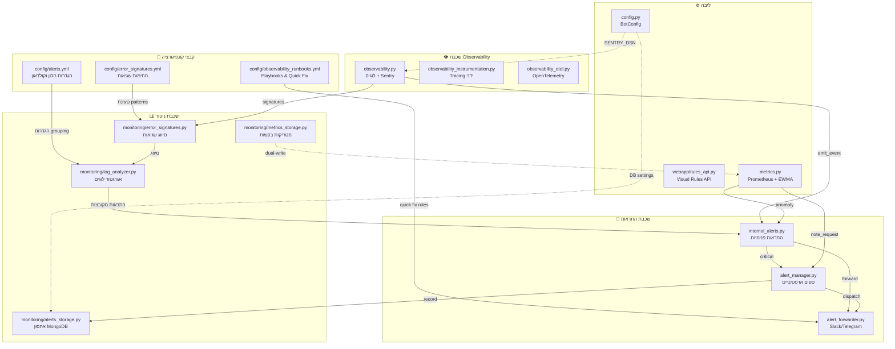
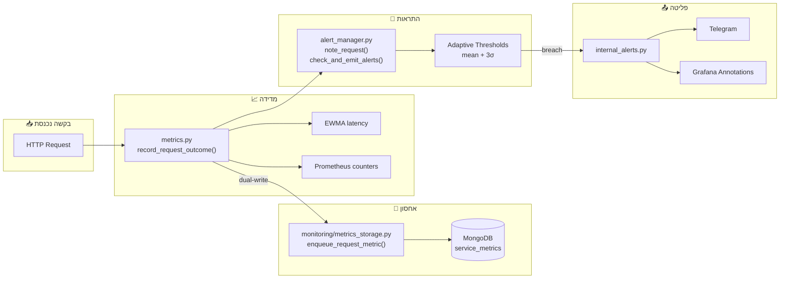
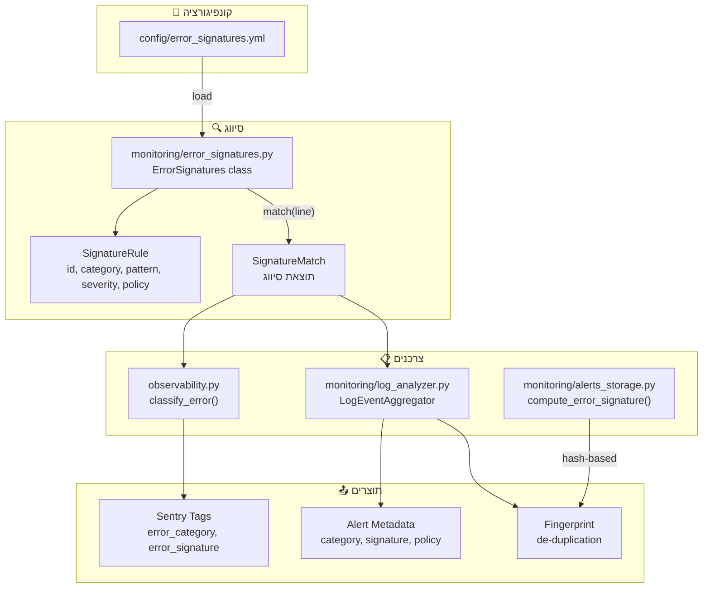
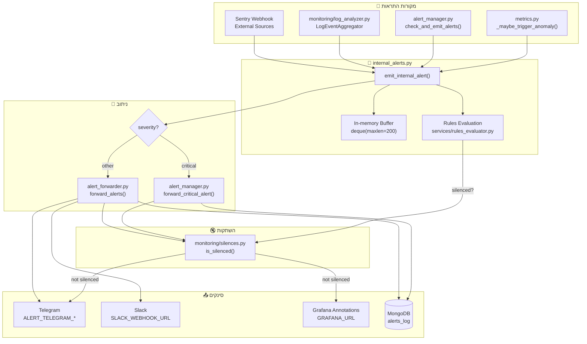
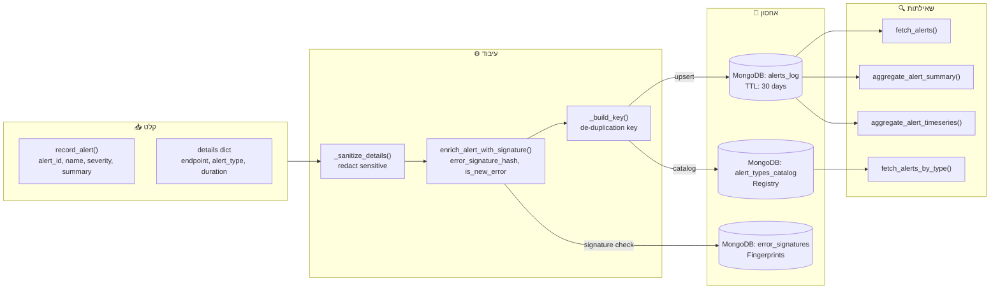
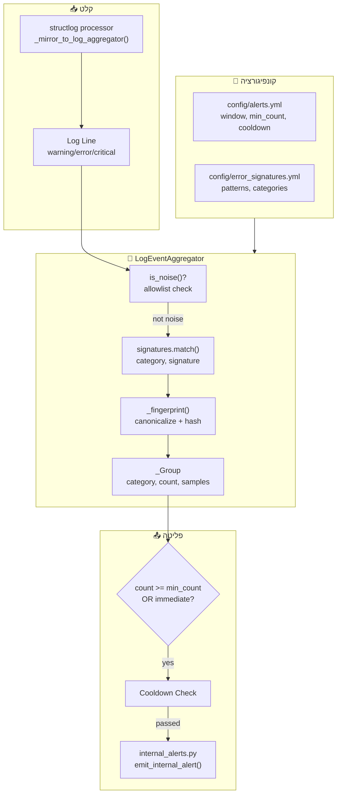
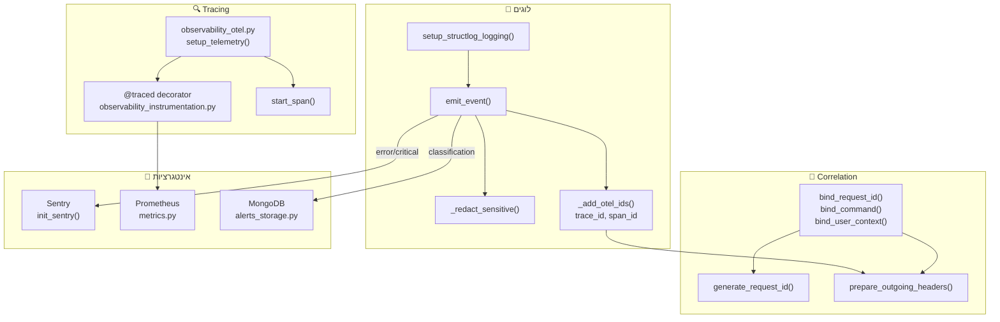
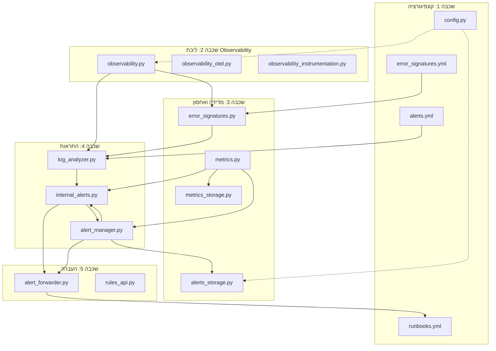

# דיאגרמות קשרים בין קבצי ה-Observability

## דיאגרמה 1: סקירה כללית - זרימת נתונים ותלויות עיקריות

---

## דיאגרמה 2: זרימת בקשה (Request Flow) ומדידת ביצועים

---

## דיאגרמה 3: מערכת סיווג שגיאות (Error Classification)

---

## דיאגרמה 4: זרימת התראות (Alert Flow)

---

## דיאגרמה 5: אחסון התראות ב-MongoDB

---

## דיאגרמה 6: אגרגטור לוגים (Log Analyzer)

---

## דיאגרמה 7: מערכת Observability מלאה

---

## דיאגרמה 8: תלויות בין מודולים (Module Dependencies)

---

## טבלת סיכום: קבצים ותפקידיהם

| קובץ | תפקיד עיקרי | תלויות עיקריות | צורך ב- |
|------|-------------|----------------|---------|
| `config/alerts.yml` | הגדרות window/cooldown | - | `log_analyzer.py` |
| `config/error_signatures.yml` | חתימות שגיאות | - | `error_signatures.py` |
| `config/observability_runbooks.yml` | Playbooks & Quick Fix | - | `alert_forwarder.py`, dashboard |
| `monitoring/alerts_storage.py` | אחסון התראות MongoDB | pymongo | `alert_manager.py`, dashboard |
| `monitoring/error_signatures.py` | סיווג שגיאות | yaml/json | `observability.py`, `log_analyzer.py` |
| `monitoring/metrics_storage.py` | אחסון מטריקות | pymongo | `metrics.py` |
| `monitoring/log_analyzer.py` | אגרגציית לוגים | `error_signatures.py` | `observability.py` |
| `internal_alerts.py` | התראות פנימיות | - | `metrics.py`, `alert_manager.py` |
| `alert_forwarder.py` | Slack/Telegram | requests | `internal_alerts.py` |
| `alert_manager.py` | ספים אדפטיביים | - | `metrics.py` |
| `config.py` | קונפיגורציה ראשית | pydantic | רוב המודולים |
| `metrics.py` | Prometheus + EWMA | prometheus_client | webapp, bot |
| `observability.py` | לוגים + Sentry | structlog, sentry_sdk | כל המודולים |
| `observability_instrumentation.py` | Tracing ידני | opentelemetry | handlers |
| `observability_otel.py` | OpenTelemetry setup | opentelemetry | webapp |
| `webapp/rules_api.py` | Visual Rules API | Flask | webapp |
