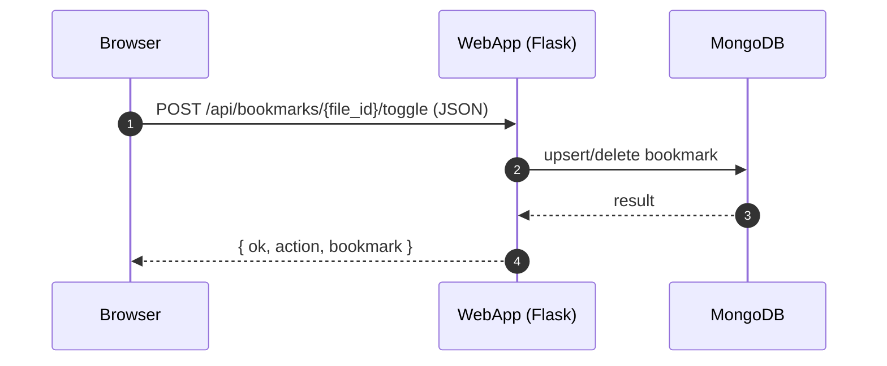
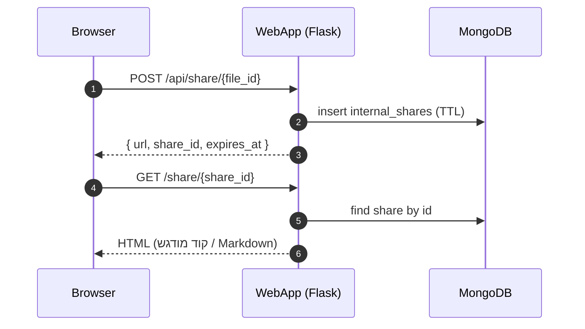
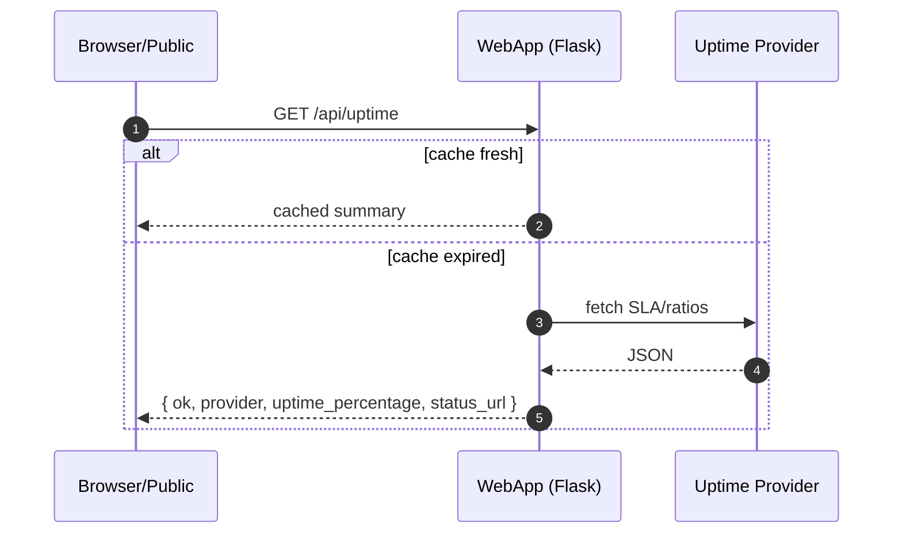

### דיאגרמות זרימה קצרות (Mermaid)

```mermaid
sequenceDiagram
  autonumber
  participant B as Browser
  participant W as WebApp (Flask)
  participant DB as MongoDB

  B->>W: POST /api/bookmarks/{file_id}/toggle (JSON)
  W->>DB: upsert/delete bookmark
  DB-->>W: result
  W-->>B: { ok, action, bookmark }
```

```mermaid
sequenceDiagram
  autonumber
  participant B as Browser
  participant W as WebApp (Flask)
  participant DB as MongoDB

  B->>W: POST /api/share/{file_id}
  W->>DB: insert internal_shares (TTL)
  W-->>B: { url, share_id, expires_at }
  B->>W: GET /share/{share_id}
  W->>DB: find share by id
  W-->>B: HTML (קוד מודגש / Markdown)
```

```mermaid
sequenceDiagram
  autonumber
  participant B as Browser/Public
  participant W as WebApp (Flask)
  participant U as Uptime Provider

  B->>W: GET /api/uptime
  alt cache fresh
    W-->>B: cached summary
  else cache expired
    W->>U: fetch SLA/ratios
    U-->>W: JSON
    W-->>B: { ok, provider, uptime_percentage, status_url }
  end
```
