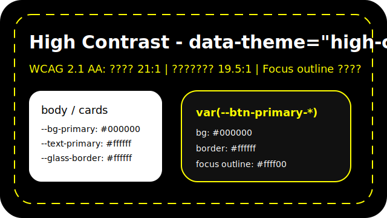

מערכת ערכות הנושא והטוקנים החדשה
=================================

הדף מרכז את כל הידע המעשי על ארכיטקטורת הצבעים, משתני ה‑CSS והבדיקות שנדרשות לשימור חוויית הממשק בכל שמונה הערכות. זהו מקור האמת עבור כל שינוי עתידי ב‑CSS של ה‑WebApp.

.. contents::
   :depth: 2
   :local:

רקע ומוטיבציה
-------------

- בריפקטור האחרון הוסרו צבעים ייחודיים מקבצים כגון ``global_search.css`` והופיעו באגים של *black/white zebra*, איבוד גרדיאנטים ולבן מסנוור ב‑Live Preview.  
- עדכוני Theme נקודתיים בעבר חזרו לצבעים קשיחים (HEX/RGB) ולכן נשברו ב‑Classic/Ocean/Forest שנוספו מאוחר יותר.  
- מטרת המערכת החדשה: ריכוז כל המשתנים ב‑שלוש שכבות, צמצום FOUC (קביעת ``data-theme`` עוד לפני טעינת ה‑CSS), שימור נגישות וייחודיות, והגדרה ברורה של מה חייב Override בכל Theme.  
- ההנחיות כאן מחליפות קוד קשיח ותלויות מערכת הפעלה (``prefers-color-scheme``) ומייצרות תשתית אחת עבור Theme Builder, Split View, Collections, Markdown Viewer ועוד.  

שכבות משתנים וטעינת ``data-theme``
-----------------------------------

**Level 1 – Primitives (:root ב‑``variables.css``)**  
קבועים לכולם ומרוכזים כיום ב‑``webapp/static/css/variables.css`` (הקובץ נטען מתוך ``base.html`` בתחילת ה‑`<head>`). כאן מגדירים צבעי מותג (`--primary`, `--secondary`), צבעי מצב (`--success` וכו'), טוקני סכנה (`--danger-bg`, `--danger-border`, `--text-on-warning`), ערכי markdown (`--md-surface`, `--md-text`), הגדרות כפתור ברירת מחדל וערכי גלאס (`--glass*`). אין להשתמש ב‑HEX מחוץ לקטע זה.

**Level 2 – Semantic Tokens per Theme**  
בלוקים של ``:root[data-theme="..."]`` ב‑``variables.css`` קובעים רקעים (`--bg-*`), טקסט (`--text-*`), כרטיסים (`--card-*`), צבעי קוד, כפתורים (`--btn-primary-*`) וטוקנים ל‑Split View (`--split-preview-*`). Ocean/Forest/Classic/Dim/Nebula/Rose Pine Dawn/High Contrast משתמשות בכל הטוקנים; Dark/Dim/Nebula גם בעבור קבצי CSS ב־``static/css/dark-mode.css`` שנשענים על אותם ערכים גלובליים.

**Level 3 – Component Tokens**  
נוצר רק כשיש צורכי עיצוב ייחודיים: `--search-card-shadow` ב‑``global_search.css``, `--bookmarks-panel-bg` ב‑``bookmarks.css``, משפחת `--split-*` ב‑``split-view.css``. את ערכי ברירת המחדל מגדירים ברכיב עצמו, אך מומלץ להוסיף הפניה ל‑``variables.css`` (או ל‑`:root[data-theme]`) כאשר הרכיב חוצה דפים, כדי למנוע חזרה לצבעים קשיחים.

**טעינת המערכת**  
``base.html`` קובע ``data-theme`` על `<html>` מתוך `localStorage` כבר ב‑`<head>` כדי למנוע FOUC, ולאחר מכן טוען את ``webapp/static/css/variables.css`` וכל שאר קבצי הרכיבים. כך הטוקנים זמינים עוד לפני טעינת ``dark-mode.css`` / ``high-contrast.css`` / קבצים ייעודיים. Theme Wizard ו‑Theme Builder מזריקים Overrides דינמיים ל‑``

- כאשר מבצעים Override לתמה קיימת (בידיים היום או דרך Theme Builder בעתיד), כתבו את הטוקנים בתוך ``:root[data-theme="ocean"]`` באותו `<style>` כך שהערכים הדינמיים יגברו על ברירת המחדל.
- טוקנים חובה ל‑Theme מותאם אישית (גם בעתיד כשה‑Builder יהיה פעיל): `--primary`, `--secondary`, `--bg-primary`, `--bg-secondary`, `--text-primary`, `--text-secondary`, `--btn-primary-bg`, `--btn-primary-color`, `--glass`, `--md-surface`, `--md-text`.
- **עדכון דצמבר 2025**: הוספה תמיכה מלאה ב‑``[data-theme="custom"]`` בקובץ ``dark-mode.css``. כעת כל הרכיבים (כרטיסים, כפתורים, navbar ועוד) משתמשים בטוקנים הנכונים גם עבור ערכות מותאמות. בנוסף, Theme Builder מייצר ``--glass*`` על בסיס צבע ``--card-bg`` (במקום לבן קבוע), מה שמתקן בעיות "רכיבים לבנים" בערכות בהירות.

בדיקות חובה לפני Merge
----------------------

- מעבר ידני על כל 8 הערכות דרך Theme Wizard + בדיקה מהירה של `localStorage`.
- בדיקת Split View + Markdown Preview (כולל לחצן "רקע לבן", מצבי Reader).
- בדיקת Live Preview / Sticky Notes / Smooth Scroll Debug / Login alert / RTL.
- בדיקת Collections, Bookmarks, אוספים משותפים וה‑Glass badges.
- בדיקת נגישות ב‑High Contrast (יחס ניגודיות 4.5:1, focus outline, קישורים).
- בדיקת שאין HEX קשיחים בקבצים שנגעתם בהם (`rg "#[0-9a-fA-F]{3,6}" webapp/static/css/<file>.css`).
- בדיקת WCAG ל‑Markdown Viewer (``bg-sepia`` ועוד) + ווידוא ש‑`--md-surface` לא הוחלף בטעות.
- מעבר בין Themes בזמן Live Preview כדי לוודא שאין FOUC (שימרו על setAttribute מוקדם).

שימושים נוספים וחריגים
----------------------

.. warning::

   ⚠️ **שים לב:** Sticky Notes, Reader Modes (`md_preview.html`) והקובץ ``theme_preview.html`` נשארים Hardcoded בכוונה לצורכי Preset/Brand. אין להמיר אותם ל‑``var()`` עד שתתועד חלופה רשמית, אחרת נשבור תצוגות קיימות.

- Collections (`webapp/static/css/collections.css`) עדיין מכיל צבעים קשיחים ישנים – כל שינוי חייב להמיר ל‑`var()` לפי טבלת הטוקנים.  
- Split View ו‑Markdown Enhanced משתמשים ב‑``--split-*`` ו‑``--md-*`` בהתאמה – הוסיפו טוקן לפני שמוסיפים Class חדש.  
- Sticky Notes, Reader Modes (`md_preview.html`) וה‑``theme_preview.html`` הם חריגים שנשארים Hardcoded כדי לשמור על תצוגת Preset.  
- `global_search.css` הינו דוגמה מצוינת לרכיב Component Tokens – כאשר מוסיפים תכונה חדשה (למשל badge נוסף) המשיכו את התבנית שם.  
- Collections / Split View / Markdown Enhanced מוזכרים בדף זה כדי שמפתחים ידעו להצליב בין הרכיבים ולזהות אילו טוקנים משותפים.

קישורים ונספחים
----------------

.. seealso::

   - ``webapp/FEATURE_SUGGESTIONS/css_refactor_plan.md`` – רשימות טוקנים מלאות לפי קובץ.
   - ``FEATURE_SUGGESTIONS/css_refactor_plan.md`` – תקציר עסקי ובדיקות QA.
   - ``FEATURE_SUGGESTIONS/theme_matrix.md`` – טבלת כיסוי טוקנים מקוצרת.
   - ``webapp/FEATURE_SUGGESTIONS/webapp_theme_palettes.md`` – פירוט צבעים וערכי Markdown.
   - ``webapp/static/css/variables.css`` – מקור כל ה‑Primitives ו‑``:root[data-theme]`` לפני קבצי הרכיבים.
   - ``webapp/templates/base.html`` – טעינת ``variables.css``, קביעת ``data-theme`` מוקדמת וה‑Theme Wizard.
   - ``webapp/static/css/dark-mode.css`` – שימוש בטוקנים עבור רכיבי Dark/Dim/Nebula.
   - ``webapp/static/css/high-contrast.css`` – Legacy לפוקוס/Outline; הדריסות עצמן ב‑``variables.css``.
   - ``webapp/static/css/global_search.css``, ``split-view.css``, ``bookmarks.css``, ``collections.css`` – דוגמאות מעשיות לטוקנים.
   - Issue #2097 – מפרט Theme Builder (טוקנים במיקוד, UI/Backend/API, נגישות ו‑Reset flow).

לשאלות תיעוד/Testing יש לפנות לערוץ Frontend או לפתוח Issue חדש עם קישור לדף זה. הקפידו לעיין גם ב‑`FEATURE_SUGGESTIONS/css_refactor_plan.md` לפני שינויים רוחביים בקוד.
