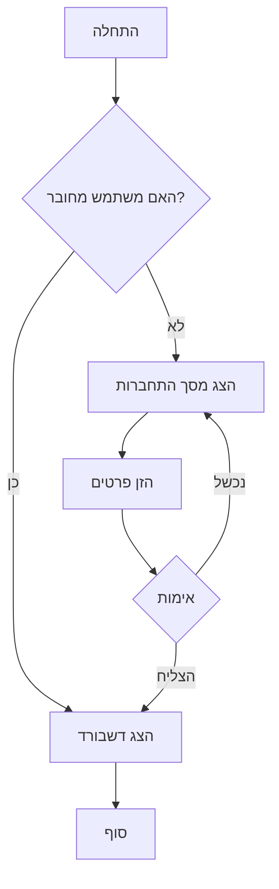
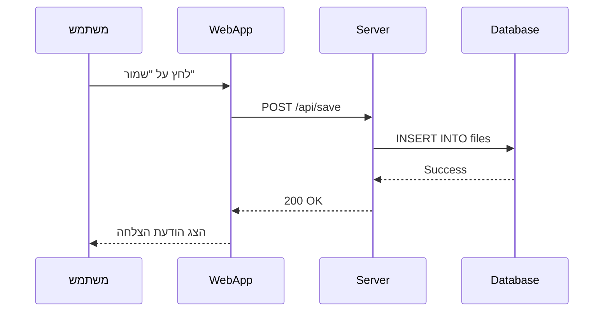
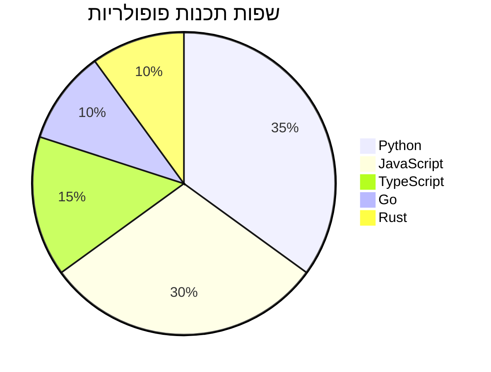

# 📝 דוגמת Markdown מתקדמת - Code Keeper Bot

ברוכים הבאים לתצוגת Markdown המתקדמת של **Code Keeper Bot**! 
דף זה מדגים את כל היכולות הנתמכות.

## 📚 תוכן עניינים

- [אלמנטים בסיסיים](#אלמנטים-בסיסיים)
- [Task Lists](#task-lists)
- [טבלאות](#טבלאות)
- [קוד והדגשת תחביר](#קוד-והדגשת-תחביר)
- [נוסחאות מתמטיות](#נוסחאות-מתמטיות)
- [תרשימי Mermaid](#תרשימי-mermaid)
- [Emoji ואייקונים](#emoji-ואייקונים)

---

## אלמנטים בסיסיים

### טקסט מעוצב

- **טקסט מודגש** עם `**כוכביות**`
- *טקסט נטוי* עם `*כוכבית אחת*`
- ***טקסט מודגש ונטוי*** עם `***שלוש כוכביות***`
- ~~טקסט מחוק~~ עם `~~טילדות~~`
- `קוד inline` עם backticks

### כותרות

# כותרת H1
## כותרת H2
### כותרת H3
#### כותרת H4
##### כותרת H5
###### כותרת H6

### רשימות

**רשימה לא ממוספרת:**
- פריט ראשון
- פריט שני
  - תת-פריט 2.1
  - תת-פריט 2.2
    - תת-תת-פריט
- פריט שלישי

**רשימה ממוספרת:**
1. שלב ראשון
2. שלב שני
   1. תת-שלב 2.1
   2. תת-שלב 2.2
3. שלב שלישי

### ציטוטים

> זהו ציטוט. ניתן להשתמש בו להדגשת טקסט חשוב.
> 
> ציטוטים יכולים להכיל **עיצוב** ו[קישורים](https://github.com).

### קישורים ותמונות

- [קישור לגיטהאב](https://github.com)
- [קישור עם כותרת](https://google.com "Google Search")
- קישור אוטומטי: https://example.com


---

## Task Lists

רשימות משימות אינטראקטיביות - אפשר לסמן ולבטל סימון!

### משימות לביצוע:
- [x] התקנת ספריות Markdown
- [x] יצירת parser מתקדם
- [x] הוספת תמיכה ב-GFM
- [ ] הוספת תמיכה ב-plugins נוספים
- [ ] אופטימיזציות ביצועים
- [x] בדיקות ואינטגרציה

### רשימת קניות:
- [ ] חלב
- [x] לחם
- [ ] ביצים
- [x] גבינה
- [ ] ירקות

---

## טבלאות

טבלאות עם יישור מותאם:

| שם המוצר | מחיר | כמות | סה"כ |
|----------|------|------|------|
| מחשב נייד | ₪3,500 | 2 | ₪7,000 |
| עכבר | ₪150 | 5 | ₪750 |
| מקלדת | ₪250 | 3 | ₪750 |
| **סה"כ** | | | **₪8,500** |

### טבלה עם יישור:

| ימין | מרכז | שמאל |
|-----:|:----:|:-----|
| טקסט | טקסט | טקסט |
| 123 | 456 | 789 |
| א | ב | ג |

---

## קוד והדגשת תחביר

### Python
```python
def fibonacci(n):
    """חישוב סדרת פיבונאצ'י"""
    if n <= 1:
        return n
    return fibonacci(n-1) + fibonacci(n-2)

# דוגמה לשימוש
for i in range(10):
    print(f"F({i}) = {fibonacci(i)}")
```

### JavaScript
```javascript
// React Component
const MarkdownViewer = ({ content }) => {
    const [html, setHtml] = useState('');
    
    useEffect(() => {
        const rendered = markdownToHtml(content);
        setHtml(rendered);
    }, [content]);
    
    return (
        <div 
            className="markdown-content"
            dangerouslySetInnerHTML={{ __html: html }}
        />
    );
};
```

### SQL
```sql
SELECT 
    u.username,
    COUNT(f.id) as file_count,
    SUM(LENGTH(f.content)) as total_size
FROM users u
LEFT JOIN files f ON u.id = f.user_id
GROUP BY u.id
ORDER BY file_count DESC
LIMIT 10;
```

### Bash
```bash
#!/bin/bash

# Backup script
backup_dir="/backup/$(date +%Y%m%d)"
mkdir -p "$backup_dir"

# Backup database
mongodump --uri="$MONGODB_URL" --out="$backup_dir/db"

# Compress
tar -czf "$backup_dir.tar.gz" "$backup_dir"
rm -rf "$backup_dir"

echo "✅ Backup completed!"
```

---

## נוסחאות מתמטיות

### נוסחאות Inline
הנוסחה המפורסמת של איינשטיין: $E = mc^2$

משוואה ריבועית: $x = \frac{-b \pm \sqrt{b^2 - 4ac}}{2a}$

### נוסחאות Display

$$
\int_{-\infty}^{\infty} e^{-x^2} dx = \sqrt{\pi}
$$

$$
\sum_{n=1}^{\infty} \frac{1}{n^2} = \frac{\pi^2}{6}
$$

### מטריצה

$$
\begin{bmatrix}
a_{11} & a_{12} & a_{13} \\
a_{21} & a_{22} & a_{23} \\
a_{31} & a_{32} & a_{33}
\end{bmatrix}
\times
\begin{bmatrix}
x_1 \\ x_2 \\ x_3
\end{bmatrix}
=
\begin{bmatrix}
b_1 \\ b_2 \\ b_3
\end{bmatrix}
$$

---

## תרשימי Mermaid

### תרשים זרימה



### תרשים רצף



### תרשים עוגה



---

## Emoji ואייקונים

### Emoji Shortcuts
- :smile: = 😄
- :heart: = ❤️
- :star: = ⭐
- :fire: = 🔥
- :rocket: = 🚀
- :100: = 💯
- :tada: = 🎉
- :thumbsup: = 👍
- :coffee: = ☕
- :pizza: = 🍕

### שימוש באמוג'י בכותרות
#### 🚀 פיתוח מהיר
#### 🔒 אבטחה מתקדמת
#### 📊 ניתוח נתונים
#### 🎨 עיצוב מודרני

---

## קווים אופקיים

שלושה סוגים של קווים מפרידים:

---
***
___

---

## סיכום

WebApp של **Code Keeper Bot** תומך בכל התכונות המתקדמות של Markdown:

✅ **Markdown סטנדרטי** - כל האלמנטים הבסיסיים
✅ **GitHub Flavored Markdown** - טבלאות, strikethrough, autolinks
✅ **Task Lists** - רשימות משימות אינטראקטיביות
✅ **נוסחאות מתמטיות** - עם KaTeX
✅ **תרשימי Mermaid** - תרשימי זרימה ועוד
✅ **הדגשת תחביר** - עם Prism.js
✅ **Emoji shortcuts** - המרה אוטומטית
✅ **ביצועים מעולים** - debouncing ו-lazy loading

---

> 💡 **טיפ:** השתמש ב-`Ctrl+M` כדי להחליף בין תצוגה מעוצבת לקוד מקור!

---

*נוצר עם ❤️ על ידי Code Keeper Bot*